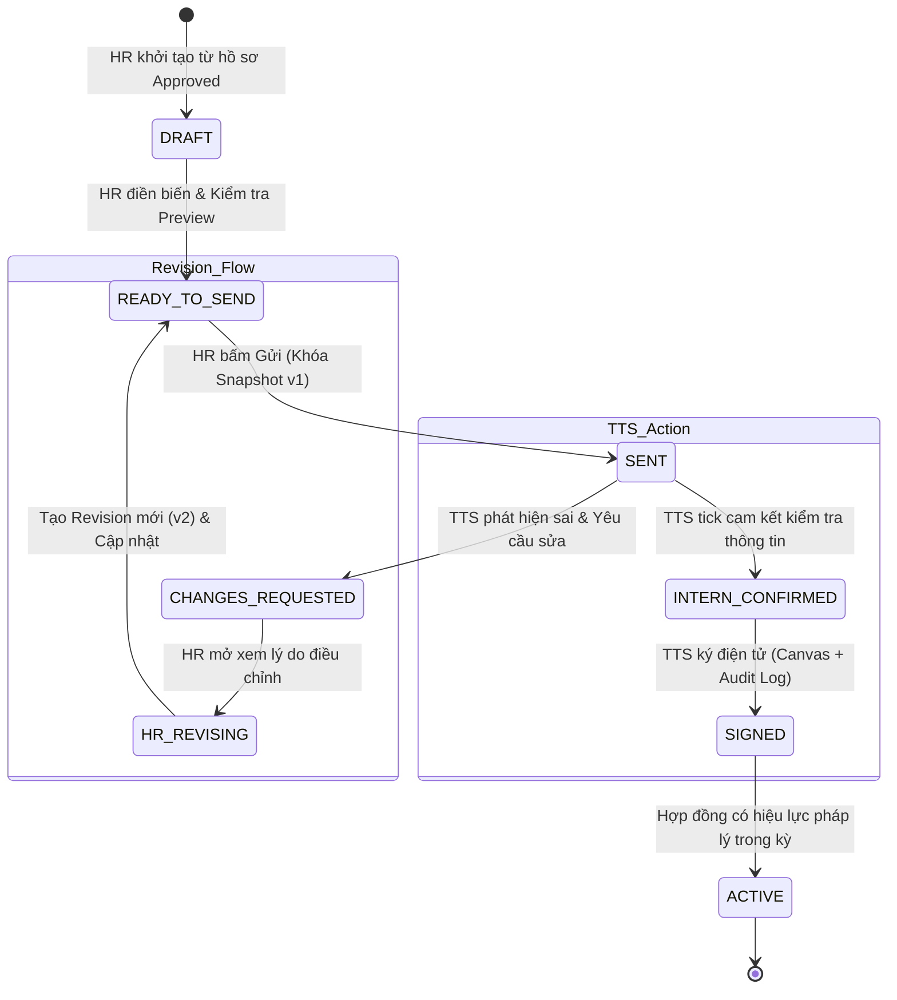

# ĐẶC TẢ NGHIỆP VỤ & KIẾN TRÚC: HỆ THỐNG HỢP ĐỒNG ĐIỆN TỬ ĐỘNG (DYNAMIC CONTRACT & E-SIGNATURE)
**Dự án:** InternHub  
**Tài liệu tham chiếu:** `/brain-to-docs`, `/idea-refine`, `/interview-me`  
**Ngày hoàn thiện:** 07/10/2026  
**Độ tin cậy thiết kế (Confidence):** 100% (Đã chốt qua 3 vòng phỏng vấn chuyên sâu)

---

## 1. TỔNG QUAN & MỤC TIÊU (EXECUTIVE SUMMARY)
Thay thế hoàn toàn cơ chế upload file hợp đồng tĩnh thủ công bằng **Hệ thống Hợp đồng Điện tử Động (Dynamic Structured Template & E-Signature)** chuẩn Enterprise:
- **HR quản lý Template**: Tạo và biên soạn mẫu hợp đồng HTML/Rich Text có các placeholder (`{{intern_name}}`, `{{cccd}}`, `{{university}}`, `{{allowance}}`, `{{start_date}}`,...).
- **Tự động điền & Tùy biến**: Hệ thống tự động merge dữ liệu ứng viên; HR xem trước và bổ sung các biến nghiệp vụ cụ thể.
- **Bất biến & Lưu trữ phiên bản (Immutable Versioned Snapshot)**: Khi HR phát hành (Send), hệ thống đóng băng toàn bộ nội dung thành một snapshot độc lập, tách biệt khỏi các thay đổi sau này của template gốc.
- **Phân tách 2 giai đoạn minh bạch**: Tách biệt rõ ràng giữa **"Xác nhận thông tin"** (Kiểm tra dữ liệu) và **"Ký hợp đồng"** (Ký số Canvas + Re-auth + Audit Trail).
- **Quy trình điều chỉnh (Change Request Flow)**: Cho phép TTS gửi yêu cầu sửa đổi nếu phát hiện sai lệch mà không phá vỡ tính bất biến của hợp đồng; HR là người duy nhất chỉnh sửa và phát hành Revision mới.

---

## 2. STATE MACHINE (VÒNG ĐỜI TRẠNG THÁI HỢP ĐỒNG)



### Bảng Mã Trạng Thái (`ContractStatus`):
| Trạng thái | Mô tả chi tiết | Quyền hạn tương tác |
| :--- | :--- | :--- |
| `DRAFT` | Bản nháp khởi tạo, đang biên soạn các biến nghiệp vụ. | HR chỉnh sửa tự do. |
| `READY_TO_SEND` | Đã điền đủ biến, đã xem qua Preview nội bộ của HR. | HR có thể bấm Send hoặc quay lại sửa. |
| `SENT` | Đã khóa Snapshot và phát hành cho TTS. Bắn Notification & Email. | TTS có quyền mở xem và phản hồi. |
| `CHANGES_REQUESTED` | TTS báo sai thông tin kèm ghi chú lý do. | HR nhận thông báo, mở vào xem xét. |
| `HR_REVISING` | HR đang chỉnh sửa dữ liệu để chuẩn bị snapshot mới. | Snapshot cũ được lưu trữ lịch sử, không ghi đè. |
| `INTERN_CONFIRMED` | TTS đã đọc và tích xác nhận tính chính xác của dữ liệu. | TTS chuẩn bị mở bảng ký tên điện tử. |
| `SIGNED` | TTS đã ký tên trên Canvas thành công, đã lưu Audit Trail. | Khóa toàn diện (`IMMUTABLE`), xuất bản PDF. |
| `ACTIVE` | Hợp đồng chính thức vận hành trong suốt kỳ thực tập. | Hệ thống sử dụng để tính công & trợ cấp. |

---

## 3. THIẾT KẾ CƠ SỞ DỮ LIỆU & ENTITY (DATABASE SCHEMA)

### 3.1. Bảng `contract_templates` (Mẫu hợp đồng gốc của HR)
- `id` (BIGINT, PK, Auto Increment)
- `title` (VARCHAR 255): Tên mẫu hợp đồng (ví dụ: *Hợp đồng thực tập sinh Kỹ thuật 2026*)
- `code` (VARCHAR 50, UNIQUE): Mã nhận diện (ví dụ: `TEMPLATE_TECH_INTERN`)
- `current_version` (INT): Phiên bản hiện tại (ví dụ: 1, 2, 3...)
- `content_template` (LONGTEXT): Nội dung HTML chứa các placeholder mustache `{{...}}`
- `description` (TEXT): Ghi chú phạm vi áp dụng
- `is_active` (BOOLEAN): Trạng thái kích hoạt
- `created_by`, `created_at`, `updated_at`

### 3.2. Bảng `contract_instances` (Bản hợp đồng cụ thể của từng TTS)
- `id` (BIGINT, PK, Auto Increment)
- `contract_number` (VARCHAR 100, UNIQUE): Số hợp đồng (ví dụ: `HDTT-2026-10-0012`)
- `intern_id` (BIGINT, FK -> `intern_profiles.id`)
- `program_id` (BIGINT, FK -> `programs.id`)
- `template_id` (BIGINT, FK -> `contract_templates.id`)
- `revision_number` (INT): Số thứ tự lần phát hành (v1, v2,...)
- `status` (VARCHAR 30): `DRAFT`, `SENT`, `CHANGES_REQUESTED`, `INTERN_CONFIRMED`, `SIGNED`, `ACTIVE`
- `variables_payload` (JSON): Dữ liệu các biến đã điền (allowance, position, startDate,...)
- `snapshot_content` (LONGTEXT): **Nội dung HTML hoàn chỉnh tại thời điểm Send** (đã thay thế hết placeholder, không bao giờ thay đổi).
- `change_request_reason` (TEXT): Lý do TTS yêu cầu chỉnh sửa (nếu có).
- `created_by` (BIGINT): HR tạo hợp đồng
- `created_at`, `updated_at`

### 3.3. Bảng `contract_signatures` & `contract_audit_logs` (Bằng chứng pháp lý)
- `id` (BIGINT, PK)
- `contract_instance_id` (BIGINT, FK)
- `signer_user_id` (BIGINT): ID tài khoản TTS ký
- `signature_svg_or_base64` (LONGTEXT): Vector ảnh nét ký Canvas của TTS
- `signed_at` (TIMESTAMP): Thời gian ký chính xác
- `ip_address` (VARCHAR 45): Địa chỉ IP của TTS khi nhấn ký
- `user_agent` (VARCHAR 500): Thiết bị / Trình duyệt của TTS
- `auth_method` (VARCHAR 50): `JWT_SESSION` hoặc `RE_AUTH_OTP`
- `checksum_hash` (VARCHAR 64): SHA-256 hash của `snapshot_content` để phát hiện nếu ai cố tình can thiệp vào DB.

---

## 4. CHI TIẾT LUỒNG TRẢI NGHIỆM NGƯỜI DÙNG (UX/UI FLOW)

### 4.1. Phía HR (Tạo & Phát hành)
1. **Danh sách ứng viên trúng tuyển (Approved):** HR thấy danh sách TTS chưa có hợp đồng kèm nút **"Tạo Hợp Đồng"**.
2. **Modal Soạn Thảo & Cấu Hình Biến:**
   - Chọn mẫu Template phù hợp (mặc định chọn bản mới nhất).
   - Hệ thống tự load Họ tên, Ngày sinh, CCCD, Trường, Email từ hồ sơ TTS.
   - HR điền: Mức phụ cấp (VND), Ngày bắt đầu - kết thúc, Vị trí thực tập, Phòng ban, Người hướng dẫn.
3. **Màn hình HR Preview:** Hiển thị trang văn bản A4 trực quan. HR kiểm tra xem nội dung đã đúng chuẩn chưa.
4. **Hành động Send:** HR bấm **"Phát hành & Gửi cho TTS"**. Hệ thống khóa Snapshot v1 và gửi Notification/Email cho TTS.

### 4.2. Phía Thực Tập Sinh (Preview, Xác Nhận & Ký Canvas)
1. **Thông báo:** TTS nhận thông báo *"Bạn có hợp đồng thực tập mới cần xác nhận và ký kết"*.
2. **Màn hình Xem trước Hợp đồng (Contract Viewer):**
   - Đọc từng trang văn bản hợp đồng với đầy đủ điều khoản và thông tin cá nhân.
   - Có thanh trạng thái và 2 nút hành động chính ở dưới cùng:
     - 🔴 **"Yêu cầu điều chỉnh thông tin"**: Mở modal nhập lý do (ví dụ: *"Số CCCD bị sai số cuối", "Mức phụ cấp trao đổi khi phỏng vấn là 3.5M"*).
     - 🟢 **"Xác nhận & Tiến hành Ký"**: Mở sang bước cam kết.
3. **Bước 1 - Xác nhận thông tin:** TTS tick checkbox: *"Tôi đã đọc kỹ toàn bộ điều khoản và xác nhận thông tin trên là hoàn toàn chính xác."*
4. **Bước 2 - Bảng Ký Điện Tử (Canvas Signature Pad):**
   - Hộp vẽ chữ ký trực tiếp bằng chuột/cảm ứng có nút "Ký lại" (Clear).
   - Re-auth xác thực mật khẩu/OTP để đảm bảo chính chủ.
   - Bấm **"Hoàn tất Ký hợp đồng"**.
5. **Sau khi ký:** Màn hình chuyển sang trạng thái `SIGNED`. Cung cấp nút **"Tải bản PDF hợp đồng"** để TTS lưu trữ về máy.

---

## 5. KẾ HOẠCH BÀN GIAO & CÁC BƯỚC TRIỂN KHAI TIẾP THEO

1. **Giai đoạn 1 (Backend - Intern & Program Service):**
   - Tạo các Entity: `ContractTemplate`, `ContractInstance`, `ContractSignature`.
   - Viết Service render HTML template với Mustache/Thymeleaf engine và thuật toán SHA-256 Checksum.
   - Tạo REST API cho HR (`createDraft`, `sendContract`, `reviewChangeRequest`) và cho TTS (`getMyContract`, `requestChanges`, `confirmAndSign`).
2. **Giai đoạn 2 (Frontend - Web UI):**
   - Tạo component `SignatureCanvasPad` (sử dụng HTML5 Canvas hoặc thư viện canvas nhẹ).
   - Xây dựng giao diện HR Contract Builder & Preview.
   - Xây dựng trang TTS Contract Review & Signing Hub.
3. **Giai đoạn 3 (Xuất bản PDF & Tích hợp File Service):**
   - Tích hợp công cụ convert HTML snapshot sang PDF (Flying Saucer / OpenHTMLtoPDF hoặc Frontend jsPDF / html2canvas).
   - Lưu trữ bản PDF xuất khẩu lên MinIO/S3 thông qua `file-service`.

---

## 6. BUSINESS & ARCHITECTURE CONTRACT BẮT BUỘC (ENTERPRISE ENFORCEMENT)

### 6.1. Nguyên Tắc Cốt Lõi Về Phân Tách Entity
Bắt buộc tách bạch thực thể hợp đồng tổng quát và các phiên bản phát hành độc lập:
```text
Contract (Logical contract)
 ├── ContractRevision v1 (Immutable snapshot v1, hash, pdf, status)
 ├── ContractRevision v2 (Immutable snapshot v2, hash, pdf, status)
 └── ContractRevision v3 ...
```
Và đối với mẫu hợp đồng:
```text
ContractTemplate
 ├── ContractTemplateVersion v1
 ├── ContractTemplateVersion v2
 └── ContractTemplateVersion v3 ...
```
Mỗi `ContractRevision` bắt buộc tham chiếu tới `template_version_id` cụ thể, không chỉ tham chiếu `template_id`.

### 6.2. State Machine Chuẩn Hóa
```text
DRAFT -> READY_TO_SEND -> SENT -> [CHANGES_REQUESTED -> HR_REVISING -> READY_TO_SEND -> SENT] -> INTERN_CONFIRMED -> SIGNED -> WAITING_EFFECTIVE_DATE -> ACTIVE (Hỗ trợ thêm WITHDRAWN, EXPIRED)
```

### 6.3. Nguyên Tắc An Toàn & Pháp Lý
1. **Phân tách Xác nhận & Ký:** TTS phải xác nhận thông tin (`consent_text_snapshot`, `consent_text_version`) trước khi vẽ chữ ký điện tử Canvas.
2. **Snapshot Isolation & Hash Checksum:** Khi SENT, nội dung HTML canonical được freeze, tính `snapshot_hash` (SHA-256) và render PDF Server-side (`pdf_hash`). Dữ liệu profile sau này thay đổi không ảnh hưởng đến revision đã gửi/ký.
3. **XSS Sanitization & Placeholder Validation:** Toàn bộ HTML từ HR phải được sanitize. Validate cú pháp placeholder và trường dữ liệu schema trước khi activate template version.
4. **Bằng Chứng Ký (Signature Evidence):** Gắn trực tiếp vào `contract_revision_id`, lưu trữ nét vẽ Canvas (SVG/Base64), IP, User Agent, Timestamp, Auth Method (`JWT_SESSION` / `RE_AUTH_OTP`), Checksum Document. Tuyệt đối không gọi Canvas Signature là "chữ ký số có chứng thư số/qualified digital signature".
5. **Chống Concurrency & Double Sign:** Khóa lạc quan/bi quan và atomic state transition ngăn chặn double-click, duplicate submit hoặc 2 tab cùng ký.
6. **Audit Trail Append-Only:** Ghi nhận toàn bộ lifecycle (từ DRAFT đến ACTIVE/WITHDRAWN) vào bảng Audit Log bất biến.
