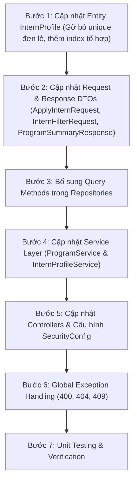

# 📋 Kế Hoạch Kỹ Thuật Backend (Backend Implementation Plan)
## Nâng Cấp TM-10: Liên Kết Chương Trình & Hỗ Trợ Nộp Đa Chương Trình

> **Tài liệu tham chiếu:** [`TM-10-register-account-and-apply-online-spec.md`](file:///d:/codegym_final_project/InternHub/docs/specs/TM-10-register-account-and-apply-online-spec.md)  
> **Cấp độ thay đổi (Change Level):** **L3**  
> **Quy chuẩn tuân thủ:** Tuân thủ 100% quy định tại [`.agents/`](file:///d:/codegym_final_project/InternHub/.agents/) (Bảo toàn database, phân rã Package-by-Feature 7 bước, tuyệt đối không can thiệp Frontend).

---

## 1. Mục Tiêu Kỹ Thuật Backend
1. **Public Catalog Endpoint (`GET /api/programs/open`):** Cung cấp API công khai cho ứng viên lấy danh sách các chương trình đang mở tuyển (`isRecruitmentOpen = true`, `status IN ('PLANNING', 'OPEN')`).
2. **Liên kết `programId` khi nộp hồ sơ (`POST /api/interns/apply`):** Nhận `programId` từ request, kiểm tra chương trình hợp lệ, gán trực tiếp quan hệ `@ManyToOne` với `InternshipProgram` ngay từ trạng thái `PENDING`.
3. **Hỗ trợ nộp Đa Chương Trình (Multi-program Applications):**
   - Cho phép 1 ứng viên (`userId` hoặc `email`/`phone`) nộp hồ sơ vào các chương trình khác nhau.
   - Gỡ bỏ `unique = true` đơn lẻ trên cột `email` và `phone` ở entity `InternProfile`.
   - Bổ sung cơ chế validate chống nộp trùng trong **CÙNG MỘT chương trình** (`existsByUserIdAndProgramIdAndStatusIn` và `existsByEmailAndProgramIdAndStatusIn`).
4. **Bộ lọc theo `programId` cho HR:** Cập nhật `InternFilterRequest` và `InternProfileSpecification` để hỗ trợ lọc danh sách hồ sơ theo `programId`.

---

## 2. Quy Trình 7 Bước Triển Khai Backend Chuẩn



---

### Bước 1: Entity Layer (`org.example.internservice.intern.entity`)

#### 1.1. Cập nhật `InternProfile.java`:
- **File:** [`intern/entity/InternProfile.java`](file:///d:/codegym_final_project/InternHub/intern-and-program-service/src/main/java/org/example/internservice/intern/entity/InternProfile.java)
- **Thay đổi:**
  - Gỡ bỏ thuộc tính `unique = true` tại `@Column(name = "email")` và `@Column(name = "phone")`.
  - Giữ nguyên `nullable = false`.
  - Thêm indexes tổ hợp tại annotation `@Table`:
    ```java
    @Table(name = "intern_profiles", indexes = {
            @Index(name = "idx_intern_user_program", columnList = "user_id, program_id"),
            @Index(name = "idx_intern_email_program", columnList = "email, program_id"),
            @Index(name = "idx_intern_code", columnList = "intern_code"),
            @Index(name = "idx_intern_status", columnList = "status")
    })
    ```

---

### Bước 2: Request & Response DTOs

#### 2.1. Cập nhật `ApplyInternRequest.java`:
- **File:** [`intern/dto/request/ApplyInternRequest.java`](file:///d:/codegym_final_project/InternHub/intern-and-program-service/src/main/java/org/example/internservice/intern/dto/request/ApplyInternRequest.java)
- **Thay đổi:**
  - Bổ sung trường bắt buộc:
    ```java
    @NotNull(message = "Vui lòng chọn chương trình thực tập ứng tuyển")
    private Long programId;
    ```
  - `startDate`: Giữ `@JsonFormat(pattern = "yyyy-MM-dd")`, nếu client không truyền thì lấy mặc định theo `program.getStartDate()`.

#### 2.2. Cập nhật `InternFilterRequest.java`:
- **File:** [`intern/dto/request/InternFilterRequest.java`](file:///d:/codegym_final_project/InternHub/intern-and-program-service/src/main/java/org/example/internservice/intern/dto/request/InternFilterRequest.java)
- **Thay đổi:** Bổ sung `private Long programId;` để phục vụ HR lọc danh sách ứng viên theo chương trình.

---

### Bước 3: Repository Layer

#### 3.1. Cập nhật `InternProfileRepository.java`:
- **File:** [`intern/repository/InternProfileRepository.java`](file:///d:/codegym_final_project/InternHub/intern-and-program-service/src/main/java/org/example/internservice/intern/repository/InternProfileRepository.java)
- **Bổ sung các query method:**
  ```java
  boolean existsByUserIdAndProgramIdAndStatusIn(Long userId, Long programId, List<InternStatus> statuses);

  boolean existsByEmailAndProgramIdAndStatusIn(String email, Long programId, List<InternStatus> statuses);

  boolean existsByPhoneAndProgramIdAndStatusIn(String phone, Long programId, List<InternStatus> statuses);

  List<InternProfile> findAllByUserId(Long userId);
  ```

#### 3.2. Cập nhật `InternProfileSpecification.java`:
- **File:** [`intern/repository/specification/InternProfileSpecification.java`](file:///d:/codegym_final_project/InternHub/intern-and-program-service/src/main/java/org/example/internservice/intern/repository/specification/InternProfileSpecification.java)
- **Bổ sung điều kiện lọc:**
  ```java
  // 6. Program filter (Exact match)
  if (request.getProgramId() != null) {
      predicates.add(criteriaBuilder.equal(root.get("program").get("id"), request.getProgramId()));
  }
  ```

---

### Bước 4: Service Layer

#### 4.1. Cập nhật `InternshipProgramService.java` & `InternshipProgramServiceImpl.java`:
- **File:** [`program/service/InternshipProgramService.java`](file:///d:/codegym_final_project/InternHub/intern-and-program-service/src/main/java/org/example/internservice/program/service/InternshipProgramService.java)
- **Khai báo method:** `List<ProgramSummaryResponse> getOpenPrograms();`
- **Triển khai tại `InternshipProgramServiceImpl`:**
  ```java
  @Override
  public List<ProgramSummaryResponse> getOpenPrograms() {
      log.info("Lấy danh sách các chương trình đang mở nhận hồ sơ tuyển sinh");
      Specification<InternshipProgram> spec = (root, query, cb) -> cb.and(
              cb.isTrue(root.get("isRecruitmentOpen")),
              root.get("status").in(List.of(ProgramStatus.PLANNING, ProgramStatus.OPEN))
      );
      Sort sort = Sort.by(Sort.Direction.ASC, "startDate");
      return programRepository.findAll(spec, sort).stream()
              .map(this::mapToSummaryResponse)
              .toList();
  }
  ```

#### 4.2. Cập nhật `InternProfileServiceImpl.java`:
- **File:** [`intern/service/impl/InternProfileServiceImpl.java`](file:///d:/codegym_final_project/InternHub/intern-and-program-service/src/main/java/org/example/internservice/intern/service/impl/InternProfileServiceImpl.java)
- **Trong `applyOnline(ApplyInternRequest request)`:**
  1. **Kiểm tra sự tồn tại của Chương trình:**
     ```java
     InternshipProgram program = programRepository.findById(request.getProgramId())
             .orElseThrow(() -> new ResourceNotFoundException("Chương trình thực tập không tồn tại"));
     ```
  2. **Kiểm tra trạng thái mở tuyển:**
     ```java
     if (Boolean.FALSE.equals(program.getIsRecruitmentOpen()) 
             || (program.getStatus() != ProgramStatus.PLANNING && program.getStatus() != ProgramStatus.OPEN)) {
         throw new BadRequestException("Chương trình thực tập hiện tại đang tạm dừng hoặc không còn mở nhận hồ sơ");
     }
     ```
  3. **Kiểm tra chống nộp trùng CÙNG MỘT chương trình:**
     ```java
     List<InternStatus> activeStatuses = List.of(InternStatus.PENDING, InternStatus.APPROVED, InternStatus.INTERNING);

     if (request.getUserId() != null) {
         if (internProfileRepository.existsByUserIdAndProgramIdAndStatusIn(request.getUserId(), program.getId(), activeStatuses)) {
             throw new BadRequestException("Bạn đã có một hồ sơ đang chờ xét duyệt hoặc đang thực tập trong chương trình này");
         }
     }

     if (internProfileRepository.existsByEmailAndProgramIdAndStatusIn(request.getEmail().trim(), program.getId(), activeStatuses)) {
         throw new BadRequestException("Hồ sơ với email '" + request.getEmail() + "' đã được nộp vào chương trình này và đang trong tiến trình xử lý");
     }

     if (internProfileRepository.existsByPhoneAndProgramIdAndStatusIn(request.getPhone().trim(), program.getId(), activeStatuses)) {
         throw new BadRequestException("Số điện thoại '" + request.getPhone() + "' đã có hồ sơ đang xử lý trong chương trình này");
     }
     ```
  4. **Gán quan hệ và lưu:**
     ```java
     String appliedPos = (request.getAppliedPosition() != null && !request.getAppliedPosition().isBlank()) 
             ? request.getAppliedPosition().trim() 
             : program.getName();

     LocalDate startDate = request.getStartDate() != null ? request.getStartDate() : program.getStartDate();
     LocalDate endDate = request.getEndDate() != null ? request.getEndDate() : program.getEndDate();

     InternProfile profile = InternProfile.builder()
             .userId(request.getUserId())
             .program(program)
             .internCode(internCode)
             .fullName(request.getFullName().trim())
             .email(request.getEmail().trim())
             .phone(request.getPhone().trim())
             .dateOfBirth(request.getDateOfBirth())
             .gender(request.getGender())
             .address(request.getAddress() != null ? request.getAddress().trim() : null)
             .university(request.getUniversity().trim())
             .major(request.getMajor().trim())
             .academicYear(request.getAcademicYear() != null ? request.getAcademicYear().trim() : null)
             .appliedPosition(appliedPos)
             .startDate(startDate)
             .endDate(endDate)
             .status(InternStatus.PENDING)
             .notes(request.getNotes() != null ? request.getNotes().trim() : null)
             .build();

     InternProfile savedProfile = internProfileRepository.save(profile);
     ```

---

### Bước 5: Controller, Phân Quyền (RBAC) & Cấu Hình Gateway

#### 5.1. Ma Trận Phân Quyền Chi Tiết (RBAC Matrix):

| API Endpoint | HTTP Method | Mục Đích | Quyền Truy Cập (RBAC) | Ghi Chú |
| :--- | :---: | :--- | :--- | :--- |
| `/api/programs/open` | `GET` | Lấy danh sách các chương trình đang mở nhận hồ sơ để render Card cho FE | **Public (`permitAll()`)** | Cả Khách chưa đăng nhập và Thực tập sinh (`ROLE_INTERN`) đều gọi được không cần token |
| `/api/programs/{id}` | `GET` | Xem chi tiết thông tin, quyền lợi, mô tả của một chương trình | **Public (`permitAll()`)** | Cho phép ứng viên và TTS xem chi tiết (trả về `ProgramSummaryResponse`) |
| `/api/programs` | `GET` | Quản trị danh sách toàn bộ chương trình cho HR (phân trang, lọc theo status) | **`hasAnyRole('HR', 'ADMIN', 'MENTOR')`** | Bảo vệ dữ liệu nội bộ và số liệu kiểm toán của HR |
| `/api/programs` | `POST` | Tạo mới chương trình thực tập | **`hasAnyRole('HR', 'ADMIN')`** | Chỉ HR và Admin có thẩm quyền tạo |
| `/api/programs/{id}` | `PUT` | Cập nhật thông tin chương trình | **`hasAnyRole('HR', 'ADMIN')`** | Chỉ HR và Admin có thẩm quyền cập nhật |
| `/api/programs/{id}/status` | `PATCH` | Chuyển đổi trạng thái vòng đời chương trình | **`hasAnyRole('HR', 'ADMIN')`** | Quản lý trạng thái theo State Machine |
| `/api/programs/{id}/recruitment-toggle` | `PATCH` | Đóng/mở cờ nhận hồ sơ tuyển sinh | **`hasAnyRole('HR', 'ADMIN')`** | HR chủ động tạm dừng nhận hồ sơ |
| `/api/programs/{id}` | `DELETE` | Xóa chương trình thực tập (khi chưa có TTS) | **`hasRole('ADMIN')`** | Chỉ Admin tối cao |

#### 5.2. Cập nhật `ProgramController.java`:
- **File:** [`program/controller/ProgramController.java`](file:///d:/codegym_final_project/InternHub/intern-and-program-service/src/main/java/org/example/internservice/program/controller/ProgramController.java)
- **Cập nhật:**
  1. Thêm endpoint `GET /api/programs/open` (không gắn `@PreAuthorize` hạn chế vai trò):
     ```java
     @Operation(summary = "Lấy danh sách chương trình đang mở tuyển (Dành cho Ứng viên/Public)")
     @GetMapping("/programs/open")
     public ResponseEntity<ApiResponse<List<ProgramSummaryResponse>>> getOpenPrograms() {
         List<ProgramSummaryResponse> response = programService.getOpenPrograms();
         return ResponseEntity.ok(ApiResponse.success(200, "Lấy danh sách chương trình mở tuyển thành công", response));
     }
     ```
  2. Cập nhật `@GetMapping("/programs/{id}")`:
     - Giữ nguyên cơ chế chiếu DTO linh hoạt: Nếu có quyền HR/ADMIN/MENTOR thì trả về `ProgramDetailResponse`; nếu là INTERN hoặc Guest thì trả về `ProgramSummaryResponse`.
     - Gỡ bỏ `@PreAuthorize("isAuthenticated()")` sang mở quyền đọc công khai thông tin khóa học.

#### 5.3. Cập nhật `SecurityConfig.java`:
- **File:** [`config/SecurityConfig.java`](file:///d:/codegym_final_project/InternHub/intern-and-program-service/src/main/java/org/example/internservice/config/SecurityConfig.java)
- **Cấp phép Public cho các endpoint xem chương trình:**
  ```java
  // Public endpoints xem danh mục chương trình mở tuyển cho ứng viên & TTS
  .requestMatchers(HttpMethod.GET, "/api/programs/open").permitAll()
  .requestMatchers(HttpMethod.GET, "/api/programs/{id:[0-9]+}").permitAll()
  ```

#### 5.4. Kiểm tra Định tuyến Cổng `api-gateway`:
- **File:** [`config-repo-local/api-gateway.yml`](file:///d:/codegym_final_project/InternHub/config-repo-local/api-gateway.yml)
- **Đảm bảo route bao quát cả đường dẫn gốc:**
  ```yaml
  - id: program-service
    uri: lb://intern-and-program-service
    predicates:
      - Path=/api/programs, /api/programs/**
  ```

---

### Bước 6: Exception Handling & Validation
- Tái sử dụng các lớp ngoại lệ chuẩn có sẵn: `ResourceNotFoundException` (HTTP 404), `BadRequestException` (HTTP 400), `DuplicateResourceException` (HTTP 409).
- Đã được xử lý tập trung qua `GlobalExceptionHandler`.

---

### Bước 7: Unit Testing & Verification Strategy
- **File:** [`intern/service/InternProfileServiceApplyTest.java`](file:///d:/codegym_final_project/InternHub/intern-and-program-service/src/test/java/org/example/internservice/intern/service/InternProfileServiceApplyTest.java)
- **Các kịch bản kiểm thử bắt buộc:**
  1. `applyOnline_Success_WithProgramLinkage`: Nộp thành công, kiểm tra `program` được gán chính xác.
  2. `applyOnline_Success_MultipleDifferentPrograms_SameUser`: Cùng 1 user nộp 2 chương trình khác nhau $\rightarrow$ cả 2 đều thành công.
  3. `applyOnline_Fail_SameProgramTwice`: Nộp 2 lần vào CÙNG 1 chương trình $\rightarrow$ ném `BadRequestException`.
  4. `applyOnline_Fail_ProgramNotFound`: Truyền `programId` không tồn tại $\rightarrow$ ném `ResourceNotFoundException`.
  5. `applyOnline_Fail_ProgramRecruitmentClosed`: Chương trình có `isRecruitmentOpen = false` $\rightarrow$ ném `BadRequestException`.
- **Lệnh xác minh:**
  ```powershell
  .\gradlew.bat :intern-and-program-service:compileJava
  .\gradlew.bat :intern-and-program-service:test
  ```
