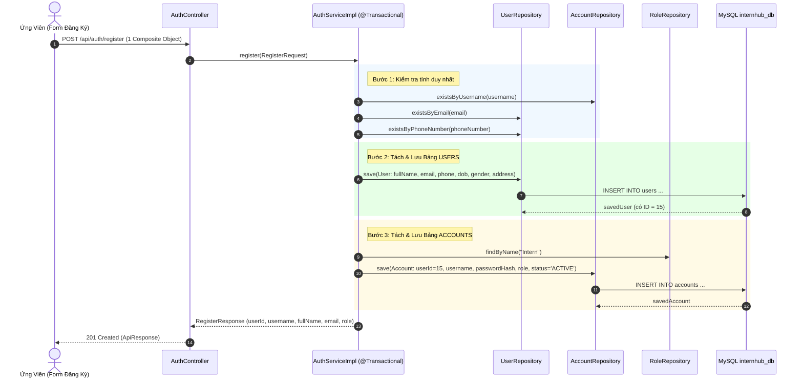

# Specification: Đăng Ký Tài Khoản và Nộp Hồ Sơ Trực Tuyến (Account Registration & Online Application)

> **Trạng thái:** IMPLEMENTED  
> **Lưu trữ tại:** `InternHub/docs/specs/TM-10-register-account-and-apply-online-spec.md`  
> **Áp dụng quy tắc:** [Persistent Spec & Change Rationale](file:///d:/Certificate_CodeGym/Module%206/InternHub/.agents/04-development-guide.md)

---

## 0. Nhật Ký Thay Đổi & Giải Trình Kỹ Thuật (Revision History & Change Rationale)

> [!IMPORTANT]
> **BẮT BUỘC ĐIỀN ĐẦY ĐỦ**: Bất kể khi nào Lập trình viên hay AI Agent thay đổi mã nguồn ảnh hưởng đến logic, API, validation hay database (từ cấp độ L2 trở lên), **bắt buộc** phải ghi thêm một dòng vào bảng này để giải trình lý do trước khi coi nhiệm vụ là hoàn tất.

| Phiên bản | Ngày | Người thực hiện | Task / Jira | Loại thay đổi | Lý do & Giải trình kỹ thuật (Rationale) |
| :---: | :---: | :---: | :---: | :---: | :--- |
| **v1.0** | 2026-09-24 | Senior Backend AI Pair-Programmer | `TM-10` | Tạo mới | Thiết kế đặc tả ban đầu cho chức năng Đăng ký tài khoản (IAM) và Nộp hồ sơ trực tuyến có liên kết định danh người dùng (Intern Service). |
| **v1.1** | 2026-09-24 | Senior Backend AI Pair-Programmer | `TM-10` | Cập nhật thiết kế nghiệp vụ | Làm rõ cơ chế tiếp nhận một Composite JSON Object duy nhất từ Client, sau đó bóc tách dữ liệu tuần tự: Lưu thông tin cá nhân vào bảng `users` trước $\rightarrow$ Lấy `user.getId()` tự sinh $\rightarrow$ Lưu thông tin đăng nhập vào bảng `accounts` liên kết tương ứng trong cùng một Atomic Transaction (chống rác mồ côi). |
| **v1.2** | 2026-09-24 | Senior Backend AI Pair-Programmer | `TM-10` | Triển khai hoàn tất | Hoàn thành toàn bộ code cho cả 2 microservices: IAM (đăng ký 2 pha bóc tách trong @Transactional) và Intern Service (nộp hồ sơ trực tuyến, liên kết userId, chặn nộp trùng lặp). Đã vượt qua 100% Unit Tests và bootJar. |

---

## 1. Feature Overview (Tổng Quan Tính Năng)
- **Feature Name:** Đăng ký tài khoản và nộp hồ sơ trực tuyến (Account Registration & Online Application)
- **Jira Ticket:** [TM-10](https://robluccibn9935.atlassian.net/browse/TM-10)
- **Target Microservices:** 
  1. `identity-and-access-service` (Port 8081 - Tiếp nhận 1 Object đăng ký tổng hợp, bóc tách lưu bảng `users` trước, sau đó lưu bảng `accounts` liên kết theo `userId`, băm mật khẩu BCrypt, gán vai trò `Intern`).
  2. `intern-and-program-service` (Port 8082 - Tiếp nhận hồ sơ thực tập trực tuyến, liên kết `userId`, khởi tạo trạng thái `PENDING`, hỗ trợ tải lên CV đính kèm).
  3. `api-gateway` (Port 8080 - Định tuyến public endpoints `/api/auth/register`, `/api/interns/apply`).
- **Target Users & Roles:** 
  - Ứng viên / Sinh viên chưa có tài khoản (`GUEST` / `PUBLIC`).
  - Thực tập sinh đã đăng ký (`ROLE_INTERN`).
  - Cán bộ nhân sự (`ROLE_HR`), Quản trị viên (`ROLE_ADMIN`).
- **Change Level:** **L3** (Thêm API đăng ký tài khoản mới trong IAM Service; bổ sung liên kết `userId` vào `intern_profiles` trong Intern Service; mở rộng cấu hình Spring Security cho Public Endpoints).

---

## 2. Business Goal & Core Objectives (Mục Tiêu Nghiệp Vụ)
1. **Trải nghiệm đăng ký một chạm (Single Composite Form Payload):**
   - Form đăng ký phía Client chỉ cần gửi **một Object JSON duy nhất** chứa toàn bộ dữ liệu cần thiết (cả thông tin cá nhân và thông tin tài khoản đăng nhập). Người dùng không phải bấm nhiều bước phức tạp.
2. **Bóc tách và lưu trữ chuẩn hóa theo mô hình 2 bảng (`users` ➔ `accounts`):**
   - Hệ thống Backend tự động tách dữ liệu ra làm 2 phần:
     + Lưu thông tin cá nhân vào bảng `users` để sinh khóa chính `user_id`.
     + Sử dụng `user_id` vừa sinh kết hợp với thông tin xác thực để tạo bản ghi đăng nhập trong bảng `accounts`.
3. **Toàn vẹn dữ liệu giao dịch nguyên tử (Atomic Transaction):**
   - Đảm bảo tính nguyên tử qua `@Transactional`: Nếu việc tạo tài khoản `accounts` gặp bất kỳ sự cố nào (ví dụ trùng username hoặc lỗi hệ thống), toàn bộ giao dịch sẽ rollback ngay lập tức, tuyệt đối không để lại bản ghi người dùng mồ côi (`orphaned user`) trong bảng `users`.
4. **Liên kết định danh chặt chẽ với Hồ sơ thực tập sinh (`intern_profiles`):**
   - Sau khi có tài khoản, thực tập sinh nộp hồ sơ ứng tuyển sẽ được liên kết trực tiếp qua `user_id`, cho phép đăng nhập vào hệ thống để tra cứu trạng thái xét duyệt, lịch phỏng vấn và lộ trình thực tập.

---

## 3. Scope of Work (Phạm Vi Tính Năng)

### 3.1. Trong phạm vi (In Scope)
1. **Phân hệ Quản lý định danh (`identity-and-access-service`):**
   - **Composite DTO `RegisterRequest`**: Tiếp nhận một Object duy nhất chứa tất cả các trường: `username`, `password`, `fullName`, `email`, `phoneNumber`, `dateOfBirth`, `gender`, `address`, `avatarUrl`.
   - **Tầng Service (`AuthServiceImpl.register`)**:
     - *Bước 1 (Check tính duy nhất)*: Kiểm tra `username`, `email`, `phoneNumber` trong DB. Nếu trùng lặp, trả về HTTP `409 Conflict`.
     - *Bước 2 (Lưu bảng `users`)*: Tạo đối tượng `User` từ các trường thông tin cá nhân $\rightarrow$ Gọi `userRepository.save(user)` $\rightarrow$ Nhận về `User` có `id` tự sinh.
     - *Bước 3 (Lưu bảng `accounts`)*: Tạo đối tượng `Account`, gán `userId = user.getId()`, gán `user = user`, băm mật khẩu `passwordHash = passwordEncoder.encode(password)`, gán vai trò `Role` tên `"Intern"`, `status = "ACTIVE"` $\rightarrow$ Gọi `accountRepository.save(account)`.
     - *Bước 4 (Đóng gói kết quả)*: Trả về `RegisterResponse` chứa thông tin tóm tắt (`userId`, `username`, `fullName`, `email`, `role`, `status`).
   - **Cấu hình Security**: Mở quyền public (`permitAll()`) cho endpoint `POST /api/auth/register` (và alias `/api/employees/auth/register`).
2. **Phân hệ Thực tập sinh (`intern-and-program-service`):**
   - Cập nhật JPA Entity `InternProfile`: Bổ sung trường `userId` (Long/Integer, nullable để tương thích dữ liệu cũ) đánh chỉ mục index để truy vấn nhanh.
   - Thêm DTO `ApplyInternRequest` chứa thông tin học vấn và vị trí ứng tuyển.
   - Thêm endpoint nộp hồ sơ trực tuyến `POST /api/interns/apply`:
     + Tự động trích xuất `userId` từ JWT token (nếu đã đăng nhập) hoặc nhận `userId` từ body request.
     + Tự động sinh mã thực tập sinh duy nhất chuẩn `INT-YYYY-XXXX`.
     + Khởi tạo trạng thái mặc định là `PENDING` (Chờ HR tiếp nhận và xét duyệt).
   - Tích hợp đính kèm CV (qua `InternDocument`).
3. **Phân hệ Cổng kết nối (`api-gateway`):**
   - Đảm bảo route `/api/auth/**` và `/api/interns/**` chuyển tiếp chính xác đến các microservice tương ứng.

### 3.2. Ngoài phạm vi (Out of Scope - *Ngăn chặn suy diễn sai*)
- **Không bao gồm gửi email kích hoạt tài khoản bằng OTP / Link xác nhận:** Việc gửi email thuộc dịch vụ `reporting-and-integration-service` và sẽ được tích hợp riêng theo cấu hình SMTP. Tài khoản đăng ký mới sẽ ở trạng thái `ACTIVE` ngay lập tức để ứng viên có thể trải nghiệm nộp hồ sơ.
- **Không bao gồm giao diện người dùng Frontend:** Tác vụ này thuần túy xây dựng trên Backend theo nguyên tắc cách ly phân hệ (Boundary Isolation).
- **Không bao gồm logic duyệt/từ chối hồ sơ:** Chức năng phê duyệt hồ sơ thuộc quyền hạn của HR trong các ticket quản lý hồ sơ đã có (TM-5, TM-11).

---

## 4. Potential Logic Loopholes & Mitigations (Tối thiểu 5 Edge Cases Cốt Lõi)

### 4.1. Case 1: Lỗi tạo Account sau khi User đã được Insert (Orphaned User Prevention)
- **Vấn đề:** Bản ghi `User` đã được lưu vào database, nhưng khi lưu bản ghi `Account` tương ứng bị lỗi (VD: vi phạm ràng buộc unique username, hoặc mất kết nối DB) dẫn đến User bị "mồ côi" không có tài khoản đăng nhập.
- **Giải pháp:** 
  - Toàn bộ phương thức `register()` tại `AuthServiceImpl` bắt buộc phải được đánh dấu `@Transactional(rollbackFor = Exception.class)`.
  - Nếu bất kỳ ngoại lệ nào phát sinh trong quá trình tạo `Account`, Spring Data JPA sẽ tự động rollback toàn bộ giao dịch, bản ghi `User` vừa insert sẽ được hoàn tác triệt để.

### 4.2. Case 2: Trùng lặp Username, Email hoặc Số điện thoại (Unique Constraint Violation)
- **Vấn đề:** Ứng viên đăng ký tài khoản với username, email hoặc số điện thoại đã tồn tại trong cơ sở dữ liệu.
- **Giải pháp:** 
  - Tại `AuthServiceImpl`, kiểm tra chủ động trước khi lưu: `accountRepository.existsByUsername()`, `userRepository.existsByEmail()`, `userRepository.existsByPhoneNumber()`.
  - Nếu trùng lặp, quăng ngoại lệ `DuplicateResourceException` và trả về mã lỗi HTTP `409 Conflict` kèm thông báo tiếng Việt cụ thể (VD: *"Tên đăng nhập đã tồn tại trong hệ thống"*).

### 4.3. Case 3: Đăng ký mật khẩu yếu (Weak Password Vulnerability)
- **Vấn đề:** Người dùng đặt mật khẩu quá đơn giản (VD: `123456`, `abc`), dễ bị tấn công brute-force.
- **Giải pháp:** Sử dụng regex validation `@Pattern` trên trường `password` trong `RegisterRequest`: Yêu cầu tối thiểu 8 ký tự, bao gồm ít nhất 1 chữ hoa, 1 chữ thường, 1 số và 1 ký tự đặc biệt. Trả về HTTP `400 Bad Request` nếu không thỏa mãn.

### 4.4. Case 4: Nộp hồ sơ nhiều lần từ cùng một tài khoản (Double Application Submission)
- **Vấn đề:** Một ứng viên đã nộp hồ sơ đang ở trạng thái `PENDING`, nhưng lại bấm nộp tiếp hồ sơ mới nhiều lần dẫn đến trùng lặp dữ liệu trong `intern_profiles`.
- **Giải pháp:**
  - Tại `InternProfileService`, kiểm tra xem tài khoản này (`userId` hoặc `email`) đã có hồ sơ đang ở trạng thái chờ duyệt `PENDING` hay đang thực tập `IN_PROGRESS` hay không.
  - Nếu đã tồn tại hồ sơ chưa hoàn tất vòng đời, từ chối nộp mới và trả về HTTP `400 Bad Request` kèm thông báo: *"Bạn đã có một hồ sơ đang chờ xét duyệt hoặc đang trong quá trình thực tập"*.

### 4.5. Case 5: Tự mạo danh gán quyền Quản trị (Privilege Escalation Attack)
- **Vấn đề:** Kẻ tấn công cố tình gửi kèm tham số `role: "ADMIN"` hoặc `role: "HR"` trong JSON payload của request đăng ký để chiếm quyền hệ thống.
- **Giải pháp:**
  - Trong DTO `RegisterRequest`, tuyệt đối **không** có trường `role`.
  - Trong `AuthServiceImpl`, vai trò của tài khoản mới được gán cứng theo quy chuẩn hệ thống là vai trò Intern (lấy từ bảng `roles` với tên `"Intern"`). Bất kỳ ai đăng ký qua public API đều chỉ có quyền Intern.

---

## 5. Functional Requirements (Yêu Cầu Chức Năng)

- **FR-1 (Single Object Registration Endpoint):** Hệ thống cung cấp API công khai `POST /api/auth/register` tiếp nhận một Object JSON tổng hợp duy nhất.
- **FR-2 (Two-Phase Data Extraction & Persistence):**
  - **Pha 1:** Tách thông tin cá nhân $\rightarrow$ Lưu vào bảng `users` $\rightarrow$ Nhận `user.getId()`.
  - **Pha 2:** Tách thông tin đăng nhập $\rightarrow$ Băm mật khẩu bằng `BCryptPasswordEncoder` $\rightarrow$ Gán `userId = user.getId()` $\rightarrow$ Gán vai trò `Intern` $\rightarrow$ Lưu vào bảng `accounts`.
- **FR-3 (Atomic Transaction Guarantee):** Đảm bảo cả hai pha cùng thành công hoặc cùng thất bại thông qua `@Transactional`.
- **FR-4 (Default Role Assignment):** Tự động gán quyền `ROLE_INTERN` (Role name `"Intern"`) cho tài khoản đăng ký mới.
- **FR-5 (Online Application Submission):** Cung cấp API `POST /api/interns/apply` cho phép ứng viên nộp hồ sơ thực tập sinh trực tuyến kèm theo `userId` định danh.
- **FR-6 (Auto Intern Code Generation):** Tự động sinh mã thực tập sinh duy nhất theo định dạng `INT-YYYY-XXXX` (VD: `INT-2026-0001`).
- **FR-7 (Default Status Initialization):** Khởi tạo trạng thái hồ sơ mặc định là `PENDING` (Chờ HR tiếp nhận và xét duyệt).
- **FR-8 (Audit Logging):** Ghi nhật ký kiểm toán hệ thống (`@Auditable`) cho hành động đăng ký tài khoản và nộp hồ sơ.

---

## 6. Business Rules (Quy Tắc Nghiệp Vụ)

- **BR-1 (Unique Username):** Tên đăng nhập (`username`) chỉ chứa chữ cái, số và dấu gạch dưới, độ dài từ 4-50 ký tự, không được trùng lặp.
- **BR-2 (Unique Email & Phone):** Email và số điện thoại phải là duy nhất trên toàn bộ hệ thống tài khoản và hồ sơ.
- **BR-3 (Password Policy):** Mật khẩu tối thiểu 8 ký tự, bao gồm ít nhất: 1 ký tự viết hoa, 1 ký tự viết thường, 1 số và 1 ký tự đặc biệt (`@$!%*?&#`).
- **BR-4 (Intern Code Format):** Mã thực tập sinh có định dạng: `INT-<NĂM>-<SỐ THỨ TỰ 4 CHỮ SỐ>` (ví dụ: `INT-2026-0001`).
- **BR-5 (Initial Status):**
  - Tài khoản (`Account`): Trạng thái mặc định `ACTIVE`.
  - Hồ sơ thực tập sinh (`InternProfile`): Trạng thái mặc định `PENDING`.
- **BR-6 (Role Constraint):** Mọi tài khoản tạo qua API đăng ký công khai đều chỉ nhận vai trò Intern (`ROLE_INTERN`). Không hỗ trợ tự đăng ký quyền `HR`, `MENTOR` hay `ADMIN`.

---

## 7. Data Model (Mô Hình Dữ Liệu)

### 7.1. Bảng Ánh Xạ Phân Tách Dữ Liệu (Field Mapping Table)

Từ một JSON Request Object duy nhất, Backend sẽ phân tách thành hai bản ghi lưu vào 2 bảng quan hệ $1 - 1$:

| Thuộc tính trong JSON Request | Bảng đích | Cột đích trong MySQL | Ghi chú & Xử lý |
| :--- | :--- | :--- | :--- |
| `fullName` | `users` | `full_name` | NOT NULL, độ dài 2-100 ký tự |
| `email` | `users` | `email` | NOT NULL, UNIQUE, định dạng email |
| `phoneNumber` | `users` | `phone_number` | UNIQUE, 10 số Việt Nam |
| `dateOfBirth` | `users` | `date_of_birth` | Định dạng `yyyy-MM-dd` |
| `gender` | `users` | `gender` | Enum: `MALE`, `FEMALE`, `OTHER` |
| `address` | `users` | `address` | Tối đa 255 ký tự |
| `avatarUrl` | `users` | `avatar_url` | Tùy chọn (URL ảnh đại diện) |
| *(Tự sinh sau khi lưu `User`)* | `accounts` | `user_id` | **Khóa ngoại liên kết `users.id`** |
| `username` | `accounts` | `username` | NOT NULL, UNIQUE, độ dài 4-50 ký tự |
| `password` | `accounts` | `password_hash` | **Băm an toàn bằng `BCryptPasswordEncoder`** |
| *(Hệ thống gán cứng)* | `accounts` | `role_id` | **Lấy ID của Role `"Intern"`** |
| *(Mặc định)* | `accounts` | `status` | Mặc định `"ACTIVE"` |

### 7.2. Cấu Trúc Bảng `intern_profiles` (`intern-and-program-service`)
Bổ sung thêm cột `user_id` để liên kết với bảng `users` bên IAM Service:

| Tên cột | Kiểu dữ liệu | Ràng buộc | Mô tả |
| :--- | :--- | :--- | :--- |
| `id` | `BIGINT` | `PRIMARY KEY, AUTO_INCREMENT` | Kế thừa từ `BaseEntity` |
| `user_id` | `BIGINT` | `NULL, INDEX` | Khóa ngoại mềm tham chiếu tới `users.id` bên IAM Service |
| `intern_code` | `VARCHAR(50)` | `UNIQUE, NOT NULL` | Mã định danh thực tập sinh (VD: `INT-2026-0001`) |
| `full_name` | `VARCHAR(100)` | `NOT NULL` | Họ và tên ứng viên |
| `email` | `VARCHAR(100)` | `UNIQUE, NOT NULL` | Email liên hệ |
| `phone` | `VARCHAR(20)` | `UNIQUE, NOT NULL` | Số điện thoại liên hệ |
| `date_of_birth` | `DATE` | `NULL` | Ngày sinh |
| `gender` | `VARCHAR(10)` | `NULL` | Giới tính (`MALE`, `FEMALE`, `OTHER`) |
| `address` | `VARCHAR(255)` | `NULL` | Địa chỉ cư trú |
| `university` | `VARCHAR(150)` | `NOT NULL` | Trường Đại học / Cao đẳng |
| `major` | `VARCHAR(100)` | `NOT NULL` | Chuyên ngành đào tạo |
| `academic_year`| `VARCHAR(50)` | `NULL` | Niên khóa (VD: `2022-2026`) |
| `applied_position` | `VARCHAR(100)` | `NOT NULL` | Vị trí thực tập ứng tuyển (VD: `Java Backend`) |
| `start_date` | `DATE` | `NOT NULL` | Thời gian dự kiến bắt đầu |
| `end_date` | `DATE` | `NULL` | Thời gian dự kiến kết thúc |
| `status` | `VARCHAR(20)` | `NOT NULL, DEFAULT 'PENDING'` | Trạng thái hồ sơ (`PENDING`, `APPROVED`, `REJECTED`, ...) |
| `notes` | `TEXT` | `NULL` | Ghi chú thêm từ ứng viên |
| `created_at` | `DATETIME` | `NOT NULL` | Kế thừa từ `BaseEntity` |
| `updated_at` | `DATETIME` | `NULL` | Kế thừa từ `BaseEntity` |

---

## 8. API Contract (Đặc Tả Giao Tiếp REST API)

### 8.1. API Đăng Ký Tài Khoản: `POST /api/auth/register`
- **Microservice:** `identity-and-access-service`
- **Authentication:** Public (`permitAll()`), không cần Bearer Token.

#### Request Headers:
```http
Content-Type: application/json
```

#### Request Body JSON (Một Object Tổng Hợp Duy Nhất):
```json
{
  "username": "nguyenvana",
  "password": "Password123@",
  "fullName": "Nguyễn Văn A",
  "email": "nguyenvana@gmail.com",
  "phoneNumber": "0987654321",
  "dateOfBirth": "2003-05-15",
  "gender": "MALE",
  "address": "Số 123 Đường Cầu Giấy, Hà Nội",
  "avatarUrl": "https://api.dicebear.com/7.x/avataaars/svg?seed=nguyenvana"
}
```

#### Response Success (201 Created):
```json
{
  "code": 201,
  "message": "Đăng ký tài khoản thành công",
  "data": {
    "userId": 15,
    "username": "nguyenvana",
    "fullName": "Nguyễn Văn A",
    "email": "nguyenvana@gmail.com",
    "role": "Intern",
    "status": "ACTIVE"
  },
  "timestamp": "2026-09-24T14:00:00"
}
```

#### Response Errors (400 Bad Request / 409 Conflict):
```json
{
  "code": 409,
  "message": "Tên đăng nhập hoặc email hoặc số điện thoại đã tồn tại trong hệ thống",
  "data": null,
  "timestamp": "2026-09-24T14:00:00"
}
```

---

### 8.2. API Nộp Hồ Sơ Trực Tuyến: `POST /api/interns/apply`
- **Microservice:** `intern-and-program-service`
- **Authentication:** Tùy chọn (Public hoặc kèm `Authorization: Bearer <jwt>`). Nếu có token, hệ thống tự trích xuất `userId`.

#### Request Body JSON:
```json
{
  "userId": 15,
  "fullName": "Nguyễn Văn A",
  "email": "nguyenvana@gmail.com",
  "phone": "0987654321",
  "dateOfBirth": "2003-05-15",
  "gender": "MALE",
  "address": "Số 123 Đường Cầu Giấy, Hà Nội",
  "university": "Đại học Bách Khoa Hà Nội",
  "major": "Công nghệ thông tin",
  "academicYear": "2021-2025",
  "appliedPosition": "Java Backend Developer",
  "startDate": "2026-10-01",
  "notes": "Em có mong muốn được thực tập full-time tại công ty"
}
```

#### Response Success (201 Created):
```json
{
  "code": 201,
  "message": "Nộp hồ sơ ứng tuyển trực tuyến thành công",
  "data": {
    "id": 8,
    "userId": 15,
    "internCode": "INT-2026-0008",
    "fullName": "Nguyễn Văn A",
    "email": "nguyenvana@gmail.com",
    "phone": "0987654321",
    "university": "Đại học Bách Khoa Hà Nội",
    "major": "Công nghệ thông tin",
    "appliedPosition": "Java Backend Developer",
    "startDate": "2026-10-01",
    "status": "PENDING",
    "createdAt": "2026-09-24T14:05:00"
  },
  "timestamp": "2026-09-24T14:05:00"
}
```

---

## 9. Core Flow / Enforcement Flow (Luồng Xử Lý Cốt Lõi)

### 9.1. Chi Tiết Luồng Bóc Tách Dữ Liệu Tại `AuthServiceImpl`


### 9.2. Cơ Chế Xử Lý Lỗi & Rollback Tự Động
- Nếu quá trình lưu vào `accounts` thất bại (ví dụ: vi phạm ràng buộc dữ liệu hoặc crash):
  - Khối `@Transactional` kích hoạt rollback.
  - Câu lệnh `INSERT INTO users` được hoàn tác trong cơ sở dữ liệu.
  - Không có bất kỳ bản ghi rác nào tồn tại trong cả 2 bảng.

---

## 10. Non-Functional Requirements & Constraints
- **Performance:** Thời gian phản hồi API đăng ký và nộp hồ sơ < 250ms.
- **Security:** Mật khẩu bắt buộc băm bằng `BCrypt` độ sâu 10 rounds, không lưu plaintext dưới bất kỳ hình thức nào.
- **Transaction Integrity:** Đặt `@Transactional(rollbackFor = Exception.class)` cho method `register` để đảm bảo tính nguyên tử 100%.
- **Anti-God-Class:** Class `AuthServiceImpl` giữ cấu trúc dưới 250 dòng code, sử dụng helper method `mapToUser` và `mapToAccount` riêng biệt.
- **Clean Code & DI:** Bắt buộc Constructor Injection `@RequiredArgsConstructor`, không dùng `@Autowired` trên field.

---

## 11. Acceptance Criteria Checklist (Tiêu Chí Chấp Nhận)
- [x] **AC-1:** Client gửi 1 JSON Object tổng hợp với thông tin hợp lệ nhận về HTTP `201 Created`, bản ghi được tạo chuẩn xác vào cả 2 bảng `users` và `accounts` với liên kết `accounts.user_id = users.id`.
- [x] **AC-2:** Gửi request đăng ký với username hoặc email hoặc số điện thoại đã tồn tại nhận về HTTP `409 Conflict`.
- [x] **AC-3:** Nếu bước lưu `accounts` gặp sự cố, bảng `users` phải được rollback hoàn toàn (không lưu lại user mồ côi).
- [x] **AC-4:** Mật khẩu trong bảng `accounts` được mã hóa BCrypt (`password_hash`), vai trò được gán là `Intern`.
- [x] **AC-5:** Nộp hồ sơ ứng tuyển hợp lệ nhận về HTTP `201 Created` kèm `internCode` tự sinh chuẩn `INT-YYYY-XXXX` và liên kết với `userId`.
- [x] **AC-6:** Tích hợp trơn tru với API upload CV (`POST /api/interns/{internCode}/documents`).

---

## 12. Unit & Integration Test Cases Checklist
- [x] **UT-IAM-01:** `givenValidCompositeRequest_whenRegister_thenExtractAndSaveUserThenAccountSuccess()`
- [x] **UT-IAM-02:** `givenAccountSaveFailure_whenRegister_thenRollbackUserInsertion()`
- [x] **UT-IAM-03:** `givenDuplicateUsername_whenRegister_thenThrowDuplicateResourceException()`
- [x] **UT-IAM-04:** `givenDuplicateEmail_whenRegister_thenThrowDuplicateResourceException()`
- [x] **UT-INT-01:** `givenValidApplyRequest_whenApply_thenReturnCreatedInternProfileWithUserId()`
- [x] **UT-INT-02:** `givenActiveApplicationForUserId_whenApplyOnline_thenThrowBadRequestException()`
- [x] **IT-BE-01:** Kiểm thử toàn bộ luồng đăng ký qua Unit Test / MockMvc tại IAM Service (100% Passed).
- [x] **IT-BE-02:** Kiểm thử luồng nộp hồ sơ qua Unit Test / MockMvc tại Intern Service (100% Passed).

---

## 13. Implementation Checklist (Danh Sách File Triển Khai)

### Phân hệ `identity-and-access-service`:
- [x] `dto/request/RegisterRequest.java` [NEW - chứa toàn bộ trường cá nhân + xác thực]
- [x] `dto/response/RegisterResponse.java` [NEW]
- [x] `service/AuthService.java` [MODIFY - thêm hàm `register(RegisterRequest request)`]
- [x] `service/impl/AuthServiceImpl.java` [MODIFY - bóc tách lưu User trước ➔ lấy userId ➔ lưu Account trong @Transactional]
- [x] `controller/AuthController.java` [MODIFY - thêm endpoint `POST /register`]
- [x] `config/SecurityConfig.java` [MODIFY - cấp phép `permitAll()` cho `/api/auth/register`]
- [x] `service/AuthServiceTest.java` [NEW - Bộ Unit Test đầy đủ các kịch bản]

### Phân hệ `intern-and-program-service`:
- [x] `intern/entity/InternProfile.java` [MODIFY - thêm trường `userId`]
- [x] `intern/dto/request/ApplyInternRequest.java` [NEW]
- [x] `intern/dto/response/InternResponse.java` [MODIFY - thêm trường `userId`]
- [x] `intern/repository/InternProfileRepository.java` [MODIFY - thêm query methods kiểm tra hồ sơ theo userId & status]
- [x] `intern/service/InternProfileService.java` [MODIFY - thêm hàm `applyOnline`]
- [x] `intern/service/impl/InternProfileServiceImpl.java` [MODIFY - triển khai `applyOnline`, validate chống nộp trùng]
- [x] `intern/controller/InternProfileController.java` [MODIFY - thêm endpoint `POST /apply`]
- [x] `config/SecurityConfig.java` [MODIFY - cấu hình endpoint `/api/interns/apply`]
- [x] `intern/service/InternProfileServiceApplyTest.java` [NEW - Bộ Unit Test nộp hồ sơ trực tuyến]
