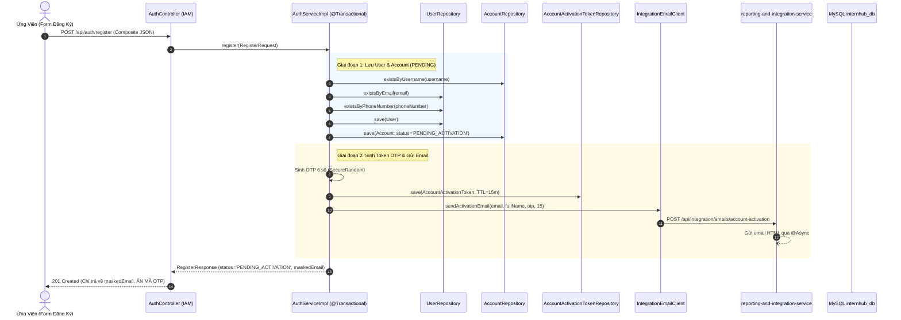

# Specification: Đăng Ký Tài Khoản và Nộp Hồ Sơ Trực Tuyến (Account Registration & Online Application)

> **Trạng thái:** IMPLEMENTED (v1.4)  
> **Lưu trữ tại:** `InternHub/docs/specs/TM-10-register-account-and-apply-online-spec.md`  
> **Áp dụng quy tắc:** [Persistent Spec & Change Rationale](file:///d:/Certificate_CodeGym/Module%206/InternHub/.agents/04-development-guide.md)

---

## 0. Nhật Ký Thay Đổi & Giải Trình Kỹ Thuật (Revision History & Change Rationale)

> [!IMPORTANT]
> **BẮT BUỘC ĐIỀN ĐẦY ĐỦ**: Bất kể khi nào Lập trình viên hay AI Agent thay đổi mã nguồn ảnh hưởng đến logic, API, validation hay database (từ cấp độ L2 trở lên), **bắt buộc** phải ghi thêm một dòng vào bảng này để giải trình lý do trước khi coi nhiệm vụ là hoàn tất.

| Phiên bản | Ngày | Người thực hiện | Task / Jira | Loại thay đổi | Lý do & Giải trình kỹ thuật (Rationale) |
| :---: | :---: | :---: | :---: | :---: | :--- |
| **v1.0** | 2026-09-24 | Senior Backend AI Pair-Programmer | `TM-10` | Tạo mới | Thiết kế đặc tả ban đầu cho chức năng Đăng ký tài khoản (IAM) và Nộp hồ sơ trực tuyến có liên kết định danh người dùng (Intern Service). |
| **v1.1** | 2026-09-24 | Senior Backend AI Pair-Programmer | `TM-10` | Cập nhật thiết kế nghiệp vụ | Làm rõ cơ chế tiếp nhận một Composite JSON Object duy nhất từ Client, sau đó bóc tách dữ liệu tuần tự: Lưu thông tin cá nhân vào bảng `users` trước $\rightarrow$ Lấy `user.getId()` tự sinh $\rightarrow$ Lưu thông tin đăng nhập vào bảng `accounts` liên kết tương ứng trong cùng một Atomic Transaction (chống rác mồ côi). |
| **v1.2** | 2026-09-24 | Senior Backend AI Pair-Programmer | `TM-10` | Triển khai hoàn tất | Hoàn thành toàn bộ code cho cả 2 microservices: IAM (đăng ký 2 pha bóc tách trong @Transactional) và Intern Service (nộp hồ sơ trực tuyến, liên kết userId, chặn nộp trùng lặp). Đã vượt qua 100% Unit Tests và bootJar. |
| **v1.3** | 2026-09-25 | Senior Backend AI Pair-Programmer | `TM-10 / TM-15` | Nâng cấp liên kết Chương trình & Hỗ trợ nộp đa chương trình | 1. Bổ sung trường `programId` vào `ApplyInternRequest`, lưu trực tiếp `program_id` vào `intern_profiles` ngay từ lúc nộp đơn (`PENDING`).<br>2. Cung cấp Public API `GET /api/programs/open` cho ứng viên lấy danh sách các chương trình đang mở tuyển.<br>3. Cho phép 1 ứng viên (cùng `userId`/`email`/`phone`) nộp hồ sơ vào NHIỀU chương trình khác nhau; gỡ bỏ UNIQUE đơn lẻ trên `email` & `phone` tại `intern_profiles`, thay thế bằng cơ chế kiểm tra chống nộp trùng trong CÙNG MỘT chương trình (`existsByUserIdAndProgramIdAndStatusIn`).<br>4. Bổ sung bộ lọc theo `programId` trong API tìm kiếm & phân trang hồ sơ của HR (`GET /api/interns`). |
| **v1.4** | 2026-09-29 | Senior Backend AI Pair-Programmer | `TM-10` | Nâng cấp Xác thực Email & Kích hoạt Tài khoản bằng OTP | 1. **Đổi trạng thái khởi tạo**: Tài khoản mới đăng ký lưu `Account` với trạng thái `PENDING_ACTIVATION` thay vì `ACTIVE`.<br>2. **Tích hợp Email OTP**: Tái sử dụng hạ tầng `reporting-and-integration-service` để gửi email HTML chứa mã kích hoạt 6 chữ số (hiệu lực 15 phút) qua `@Async`.<br>3. **Bảng dữ liệu mới**: Thêm bảng `account_activation_tokens` lưu mã OTP, số lần thử sai (chống Brute-force tối đa 5 lần), thời hạn và thời điểm tiêu thụ.<br>4. **Bổ sung 2 API mới**: `POST /api/auth/activate` (xác thực OTP để chuyển trạng thái sang `ACTIVE`) và `POST /api/auth/resend-activation` (gửi lại mã, áp dụng Cooldown 60s).<br>5. **An ninh & Bảo mật**: Tuyệt đối ẩn mã OTP khỏi API response (chỉ trả về `maskedEmail`); toàn bộ cấu hình mật khẩu SMTP/Secrets được quản lý trong file `.env`. |

---

## 1. Feature Overview (Tổng Quan Tính Năng)
- **Feature Name:** Đăng ký tài khoản, xác thực email qua mã kích hoạt và nộp hồ sơ trực tuyến (Account Registration, Email Verification & Online Application)
- **Jira Ticket:** [TM-10](https://robluccibn9935.atlassian.net/browse/TM-10)
- **Target Microservices:** 
  1. `identity-and-access-service` (Port 8081 - Tiếp nhận Object đăng ký, bóc tách `users` $\rightarrow$ `accounts` với trạng thái `PENDING_ACTIVATION`, sinh mã OTP 6 số, gọi client gửi mail, cung cấp API kích hoạt `/api/auth/activate` và gửi lại mã `/api/auth/resend-activation`).
  2. `reporting-and-integration-service` (Port 8083 - Tiếp nhận yêu cầu gửi email xác thực qua endpoint nội bộ `/api/integration/emails/account-activation`, render HTML template chuẩn nhận diện InternHub, gửi mail bất đồng bộ qua SMTP / Mock mode, ghi log vào `email_logs`).
  3. `intern-and-program-service` (Port 8082 - Tiếp nhận hồ sơ thực tập trực tuyến, liên kết `userId`, khởi tạo trạng thái `PENDING`, hỗ trợ tải lên CV đính kèm).
  4. `api-gateway` (Port 8080 - Định tuyến public endpoints `/api/auth/**`, `/api/programs/**`, `/api/interns/**`).
- **Target Users & Roles:** 
  - Ứng viên / Sinh viên chưa có tài khoản (`GUEST` / `PUBLIC`).
  - Thực tập sinh đã đăng ký và kích hoạt (`ROLE_INTERN`).
  - Cán bộ nhân sự (`ROLE_HR`), Quản trị viên (`ROLE_ADMIN`).
- **Change Level:** **L3** (Thêm API xác thực tài khoản; bảng CSDL mới `account_activation_tokens`; thay đổi trạng thái khởi tạo `Account`; tích hợp giao tiếp REST liên dịch vụ với Reporting Service).

---

## 2. Business Goal & Core Objectives (Mục Tiêu Nghiệp Vụ)

1. **Trải nghiệm đăng ký một chạm (Single Composite Form Payload):**
   - Form đăng ký chỉ cần gửi một Object JSON duy nhất chứa cả thông tin cá nhân và thông tin tài khoản đăng nhập.
2. **Bóc tách và lưu trữ chuẩn hóa theo mô hình 2 bảng (`users` ➔ `accounts`):**
   - Lưu thông tin cá nhân vào `users` trước $\rightarrow$ lấy `user_id` $\rightarrow$ lưu thông tin xác thực vào `accounts` trong cùng một Atomic Transaction.
3. **Toàn vẹn dữ liệu giao dịch nguyên tử (Atomic Transaction):**
   - Đảm bảo tính nguyên tử qua `@Transactional`: Nếu có lỗi tại bất kỳ bước nào, toàn bộ giao dịch sẽ rollback, không để lại bản ghi rác mồ côi (`orphaned user`).
4. **Xác thực hòm thư điện tử & Kích hoạt tài khoản bằng OTP (Email Verification with Activation Key - v1.4):**
   - Chặn đứng hoàn toàn vấn nạn tài khoản ảo/rác hoặc mạo danh email của người khác.
   - Tài khoản đăng ký mới bắt buộc phải xác thực mã OTP 6 chữ số gửi về email cá nhân mới được chuyển sang trạng thái `ACTIVE` để đăng nhập.
5. **Liên kết định danh chặt chẽ với Hồ sơ thực tập sinh (`intern_profiles`):**
   - Sau khi kích hoạt tài khoản, thực tập sinh nộp hồ sơ ứng tuyển sẽ được liên kết trực tiếp qua `user_id` để theo dõi tiến độ xét duyệt và lộ trình thực tập.

---

## 3. Scope of Work (Phạm Vi Tính Năng)

### 3.1. Trong phạm vi (In Scope)

1. **Phân hệ Quản lý định danh (`identity-and-access-service`):**
   - **Composite DTO `RegisterRequest`**: Tiếp nhận một Object duy nhất chứa: `username`, `password`, `fullName`, `email`, `phoneNumber`, `dateOfBirth`, `gender`, `address`, `avatarUrl`.
   - **Tầng Service (`AuthServiceImpl.register`)**:
     - *Bước 1 (Check tính duy nhất)*: Kiểm tra `username`, `email`, `phoneNumber`. Nếu trùng, trả về `409 Conflict`.
     - *Bước 2 (Lưu bảng `users`)*: Tạo và lưu `User` $\rightarrow$ Nhận về `User` có `id` tự sinh.
     - *Bước 3 (Lưu bảng `accounts`)*: Tạo `Account`, gán `userId = user.getId()`, băm mật khẩu `passwordHash`, vai trò `"Intern"`, **trạng thái khởi tạo `status = "PENDING_ACTIVATION"`**.
     - *Bước 4 (Sinh Token & Gửi Email)*: Sinh mã OTP ngẫu nhiên 6 chữ số an toàn qua `SecureRandom`, lưu vào bảng `account_activation_tokens` (hạn 15 phút), gọi `IntegrationEmailClient` bắn request sang `reporting-and-integration-service`.
     - *Bước 5 (Đóng gói kết quả)*: Trả về `RegisterResponse` chứa thông tin tóm tắt kèm **`maskedEmail` (VD: `in***@gmail.com`)**, **tuyệt đối không trả về mã OTP**.
   - **API Kích hoạt tài khoản (`POST /api/auth/activate`)**:
     - Nhận `identifier` (email hoặc username) và `activationKey` (6 chữ số).
     - Kiểm tra hạn token, kiểm tra số lần thử sai (< 5 lần).
     - Nếu đúng: Đánh dấu token đã tiêu thụ (`consumed_at = NOW()`), cập nhật `Account.status = "ACTIVE"`.
   - **API Gửi lại mã kích hoạt (`POST /api/auth/resend-activation`)**:
     - Nhận `identifier`. Kiểm tra cooldown 60 giây.
     - Vô hiệu hóa mã cũ, sinh mã mới và gửi lại email.
   - **Cấu hình Security**: Mở quyền public (`permitAll()`) cho `/api/auth/register`, `/api/auth/activate`, `/api/auth/resend-activation`.

2. **Phân hệ Báo cáo & Tích hợp (`reporting-and-integration-service`):**
   - Thêm DTO `SendAccountActivationEmailRequest`.
   - Thêm hàm `buildAccountActivationEmail` trong `EmailTemplateBuilder` (tận dụng layout `wrapEmail` chuẩn tông màu thương hiệu InternHub).
   - Thêm hàm `sendAccountActivationEmailAsync` trong `EmailDeliveryService` (chạy `@Async`, hỗ trợ `mockMode` ghi console và ghi log `email_logs`).
   - Endpoint nhận request: `POST /api/integration/emails/account-activation`.

3. **Phân hệ Thực tập sinh (`intern-and-program-service`):**
   - Giữ nguyên các tính năng đã hoàn thiện từ v1.3: `GET /api/programs/open`, `POST /api/interns/apply` nhận `programId`, hỗ trợ nộp đa chương trình, chống nộp trùng lặp.

4. **Phân hệ Cổng kết nối (`api-gateway`):**
   - Định tuyến chính xác toàn bộ cụm `/api/auth/**` sang `identity-and-access-service`.

### 3.2. Ngoài phạm vi (Out of Scope)
- **Không bao gồm tự động đăng nhập sau khi kích hoạt:** Sau khi kích hoạt thành công, người dùng được điều hướng về trang Đăng nhập để tự nhập mật khẩu (nhằm ghi nhớ thông tin tài khoản và tăng tính an toàn).
- **Không can thiệp mã nguồn Frontend trong task Backend:** Toàn bộ công việc thực thi thuần túy tại Backend (`InternHub/`).
- **Không bao gồm logic ký hợp đồng điện tử:** Thuộc ticket TM-14.

---

## 4. Potential Logic Loopholes & Mitigations (Các Lỗ Hổng Logic & Giải Pháp)

### 4.1. Case 1: Lỗi tạo Account sau khi User đã được Insert (Orphaned User Prevention)
- **Vấn đề:** Bản ghi `User` đã lưu nhưng tạo `Account` bị lỗi $\rightarrow$ User bị mồ côi.
- **Giải pháp:** Sử dụng `@Transactional(rollbackFor = Exception.class)` cho toàn bộ hàm `register()`.

### 4.2. Case 2: Trùng lặp Username, Email hoặc Số điện thoại ở IAM
- **Vấn đề:** Đăng ký trùng dữ liệu định danh.
- **Giải pháp:** Kiểm tra trước qua `accountRepository.existsByUsername()`, `userRepository.existsByEmail()`, `userRepository.existsByPhoneNumber()` $\rightarrow$ Trả về HTTP `409 Conflict`.

### 4.3. Case 3: Đăng ký mật khẩu yếu (Weak Password)
- **Vấn đề:** Mật khẩu đơn giản dễ bị dò.
- **Giải pháp:** Áp dụng regex `@Pattern` trong `RegisterRequest`: Tối thiểu 8 ký tự, 1 hoa, 1 thường, 1 số, 1 ký tự đặc biệt $\rightarrow$ Trả về HTTP `400 Bad Request`.

### 4.4. Case 4: Tấn công Brute-force dò mã OTP kích hoạt (Brute-Force OTP Attack - v1.4)
- **Vấn đề:** Kẻ xấu liên tục gọi `/api/auth/activate` để dò 1,000,000 khả năng của mã 6 chữ số.
- **Giải pháp:**
  - Bảng `account_activation_tokens` có cột `attempt_count`.
  - Mỗi lần nhập sai: `attempt_count += 1`.
  - Khi `attempt_count >= 5`: Vô hiệu hóa ngay mã hiện tại và yêu cầu người dùng phải bấm "Gửi lại mã mới".

### 4.5. Case 5: Tấn công Spam Hòm thư / Bomb Email (Email Bombing / Spam Resend - v1.4)
- **Vấn đề:** Kẻ tấn công gọi liên tục `/api/auth/resend-activation` để spam nghẽn hệ thống mail.
- **Giải pháp:** Áp dụng cơ chế **Cooldown 60 giây**: Nếu mã gần nhất được tạo chưa đủ 60 giây, hệ thống từ chối và trả về HTTP `429 Too Many Requests` (hoặc `400 Bad Request` kèm số giây còn lại phải chờ).

### 4.6. Case 6: Lộ mã kích hoạt qua Network DevTools / Browser Inspection (v1.4)
- **Vấn đề:** Nếu API trả về `activationKey` trong response body, người dùng có thể mở F12 Network Tab xem trộm mà không cần xác thực email thật.
- **Giải pháp:**
  - **Tuyệt đối không trả về `activationKey`** trong bất kỳ API response nào.
  - Phản hồi của `/register` và `/resend-activation` chỉ trả về thông báo kèm `maskedEmail` (VD: `ngu***@gmail.com`).
  - Hộp thư email cá nhân là kênh duy nhất nhận được mã OTP.

### 4.7. Case 7: Dịch vụ gửi Email gặp sự cố hoặc timeout (Email Service Resilience - v1.4)
- **Vấn đề:** Mạng giữa IAM và Reporting Service bị lag hoặc mail server timeout khiến transaction đăng ký bị fail.
- **Giải pháp:** Bọc khối gọi `IntegrationEmailClient` trong khối `try-catch`. Nếu gửi mail gặp lỗi, log cảnh báo nhưng **không rollback transaction tạo tài khoản**, token vẫn được lưu trong DB và người dùng có thể dùng chức năng "Gửi lại mã kích hoạt".

---

## 5. Functional Requirements (Yêu Cầu Chức Năng)

- **FR-1 (Single Object Registration Endpoint):** Cung cấp API công khai `POST /api/auth/register` nhận Composite JSON Object.
- **FR-2 (Two-Phase Data Extraction & Persistence):** Lưu `User` trước $\rightarrow$ Lấy `id` $\rightarrow$ Lưu `Account` với trạng thái `PENDING_ACTIVATION`.
- **FR-3 (Atomic Transaction Guarantee):** Đảm bảo tính nguyên tử qua `@Transactional`.
- **FR-4 (Default Role Assignment):** Tự động gán quyền `ROLE_INTERN` (Role name `"Intern"`).
- **FR-5 (OTP Generation & Dispatch - v1.4):** Sinh mã OTP 6 số ngẫu nhiên an toàn qua `SecureRandom`, lưu bảng `account_activation_tokens` với thời hạn 15 phút, gọi Reporting Service gửi email.
- **FR-6 (Masked Response Security - v1.4):** Trả về thông tin đăng ký với email được làm mờ (Masked Email), không bao gồm mã OTP.
- **FR-7 (Account Activation Endpoint - v1.4):** Cung cấp API `POST /api/auth/activate` nhận mã OTP và kích hoạt tài khoản thành `ACTIVE`.
- **FR-8 (Resend Activation OTP Endpoint - v1.4):** Cung cấp API `POST /api/auth/resend-activation` gửi lại mã OTP kèm cơ chế Cooldown 60s.
- **FR-9 (Multi-Program Application Support):** Cho phép một ứng viên nộp hồ sơ vào nhiều chương trình khác nhau mà không bị xung đột unique email/phone (TM-15).
- **FR-10 (Auto Intern Code Generation):** Tự động sinh mã thực tập sinh duy nhất theo định dạng `INT-YYYY-XXXX`.
- **FR-11 (Initial Application Status):** Khởi tạo trạng thái hồ sơ thực tập sinh mặc định là `PENDING`.
- **FR-12 (Audit Logging):** Ghi nhật ký kiểm toán hệ thống (`@Auditable`) cho các hành động: `REGISTER`, `ACTIVATE_SUCCESS`, `ACTIVATE_FAILED`.

---

## 6. Business Rules (Quy Tắc Nghiệp Vụ)

- **BR-1 (Unique Username in IAM):** Tên đăng nhập (`username`) chỉ chứa chữ cái, số và dấu gạch dưới, độ dài từ 4-50 ký tự, là duy nhất.
- **BR-2 (Unique Constraint Scoping):**
  - Bảng `users`: `email` và `phone_number` là duy nhất trên toàn hệ thống.
  - Bảng `intern_profiles`: Cho phép 1 email/phone/userId xuất hiện trên nhiều hồ sơ nộp cho các `program_id` **KHÁC NHAU**. Trong phạm vi **CÙNG MỘT chương trình**, một ứng viên chỉ được có tối đa 1 hồ sơ đang trong tiến trình xử lý (`PENDING`, `APPROVED`, `INTERNING`).
- **BR-3 (Activation OTP Lifetime):** Mã OTP có hiệu lực tối đa **15 phút**.
- **BR-4 (Brute-Force Limit):** Mỗi mã OTP chỉ cho phép nhập sai tối đa **5 lần**. Vượt quá 5 lần, mã bị vô hiệu hóa.
- **BR-5 (Resend Cooldown):** Khoảng cách giữa 2 lần yêu cầu gửi lại mã tối thiểu là **60 giây**.
- **BR-6 (Initial Status Lifecycle):**
  - Tài khoản (`Account`): Khi mới đăng ký là `PENDING_ACTIVATION`. Chỉ chuyển sang `ACTIVE` khi xác thực mã OTP thành công.
  - Người dùng không thể đăng nhập bằng tài khoản đang ở trạng thái `PENDING_ACTIVATION`.
  - Hồ sơ thực tập sinh (`InternProfile`): Trạng thái mặc định `PENDING`.
- **BR-7 (Role Constraint):** Mọi tài khoản đăng ký công khai đều chỉ nhận vai trò Intern (`ROLE_INTERN`).

---

## 7. Data Model (Mô Hình Dữ Liệu)

### 7.1. Bảng Mới: `account_activation_tokens` (`identity-and-access-service`)

| Tên cột | Kiểu dữ liệu | Ràng buộc | Mô tả |
| :--- | :--- | :--- | :--- |
| `id` | `BIGINT` | `PRIMARY KEY, AUTO_INCREMENT` | Khóa chính |
| `account_id` | `INT` | `NOT NULL, FK` | Khóa ngoại tham chiếu `accounts(id)` |
| `activation_key` | `VARCHAR(64)` | `NOT NULL, INDEX` | Mã OTP 6 chữ số |
| `token_type` | `VARCHAR(20)` | `NOT NULL, DEFAULT 'REGISTER_ACTIVATION'` | Loại token (`REGISTER_ACTIVATION`, `RESET_PASSWORD`) |
| `expires_at` | `DATETIME` | `NOT NULL` | Thời điểm hết hạn (mặc định 15 phút) |
| `consumed_at` | `DATETIME` | `NULL` | Thời điểm kích hoạt thành công |
| `attempt_count`| `INT` | `NOT NULL, DEFAULT 0` | Số lần nhập sai mã (tối đa 5 lần) |
| `created_at` | `DATETIME` | `NOT NULL, DEFAULT CURRENT_TIMESTAMP` | Thời điểm tạo |
| `updated_at` | `DATETIME` | `NOT NULL, DEFAULT CURRENT_TIMESTAMP ON UPDATE` | Thời điểm cập nhật |

### 7.2. Cập Nhật Bảng `accounts` (`identity-and-access-service`)
- `status`: Mặc định khi tạo mới là `'PENDING_ACTIVATION'`.

---

## 8. API Contract (Đặc Tả Giao Tiếp REST API)

### 8.1. API Đăng Ký Tài Khoản: `POST /api/auth/register`
- **Authentication:** Public (`permitAll()`).

#### Request Body JSON:
```json
{
  "username": "nguyenvana",
  "password": "Password123@",
  "fullName": "Nguyễn Văn A",
  "email": "nguyenvana@gmail.com",
  "phoneNumber": "0987654321",
  "dateOfBirth": "2003-05-15",
  "gender": "MALE",
  "address": "Số 123 Đường Cầu Giấy, Hà Nội",
  "avatarUrl": "https://api.dicebear.com/7.x/avataaars/svg?seed=nguyenvana"
}
```

#### Response Success (201 Created - Bảo mật, Ẩn mã OTP):
```json
{
  "code": 201,
  "message": "Đăng ký tài khoản thành công! Vui lòng kiểm tra email để lấy mã kích hoạt.",
  "data": {
    "userId": 15,
    "username": "nguyenvana",
    "fullName": "Nguyễn Văn A",
    "email": "nguyenvana@gmail.com",
    "maskedEmail": "ngu***@gmail.com",
    "role": "Intern",
    "status": "PENDING_ACTIVATION"
  },
  "timestamp": "2026-09-29T10:00:00"
}
```

---

### 8.2. API Kích Hoạt Tài Khoản: `POST /api/auth/activate` (MỚI v1.4)
- **Authentication:** Public (`permitAll()`).

#### Request Body JSON:
```json
{
  "identifier": "nguyenvana@gmail.com",
  "activationKey": "682941"
}
```

#### Response Success (200 OK):
```json
{
  "code": 200,
  "message": "Kích hoạt tài khoản thành công! Bạn có thể đăng nhập ngay bây giờ.",
  "data": {
    "username": "nguyenvana",
    "status": "ACTIVE",
    "activatedAt": "2026-09-29T10:05:00"
  },
  "timestamp": "2026-09-29T10:05:00"
}
```

#### Response Error (400 Bad Request):
```json
{
  "code": 400,
  "message": "Mã kích hoạt không chính xác. Bạn còn 3 lần thử.",
  "data": null,
  "timestamp": "2026-09-29T10:05:00"
}
```

---

### 8.3. API Gửi Lại Mã Kích Hoạt: `POST /api/auth/resend-activation` (MỚI v1.4)
- **Authentication:** Public (`permitAll()`).

#### Request Body JSON:
```json
{
  "identifier": "nguyenvana@gmail.com"
}
```

#### Response Success (200 OK):
```json
{
  "code": 200,
  "message": "Mã kích hoạt mới đã được gửi vào hòm thư của bạn.",
  "data": {
    "maskedEmail": "ngu***@gmail.com",
    "expiresInMinutes": 15,
    "cooldownSeconds": 60
  },
  "timestamp": "2026-09-29T10:06:00"
}
```

---

### 8.4. API Tiếp Nhận Gửi Email Kích Hoạt: `POST /api/integration/emails/account-activation` (MỚI v1.4)
- **Microservice:** `reporting-and-integration-service` (Internal REST Endpoint).

#### Request Body JSON:
```json
{
  "email": "nguyenvana@gmail.com",
  "fullName": "Nguyễn Văn A",
  "activationKey": "682941",
  "expiresInMinutes": 15,
  "idempotencyKey": "ACTIVATE_nguyenvana@gmail.com_1727581200000"
}
```

---

## 9. Core Flow / Sequence Diagram (Luồng Xử Lý Cốt Lõi v1.4)


```mermaid
sequenceDiagram
    autonumber
    actor Client as Ứng Viên (Form Đăng Ký)
    participant Ctrl as AuthController (IAM)
    participant Svc as AuthServiceImpl (@Transactional)
    participant UserRepo as UserRepository
    participant AccRepo as AccountRepository
    participant TokenRepo as AccountActivationTokenRepository
    participant MailClient as IntegrationEmailClient
    participant MailSvc as reporting-and-integration-service
    participant DB as MySQL internhub_db

    Client->>Ctrl: POST /api/auth/register (Composite JSON)
    Ctrl->>Svc: register(RegisterRequest)
    
    rect rgb(240, 248, 255)
    note right of Svc: Giai đoạn 1: Lưu User & Account (PENDING)
    Svc->>AccRepo: existsByUsername(username)
    Svc->>UserRepo: existsByEmail(email)
    Svc->>UserRepo: existsByPhoneNumber(phoneNumber)
    Svc->>UserRepo: save(User)
    Svc->>AccRepo: save(Account: status='PENDING_ACTIVATION')
    end

    rect rgb(255, 250, 230)
    note right of Svc: Giai đoạn 2: Sinh Token OTP & Gửi Email
    Svc->>Svc: Sinh OTP 6 số (SecureRandom)
    Svc->>TokenRepo: save(AccountActivationToken: TTL=15m)
    Svc->>MailClient: sendActivationEmail(email, fullName, otp, 15)
    MailClient->>MailSvc: POST /api/integration/emails/account-activation
    MailSvc--)MailSvc: Gửi email HTML qua @Async
    end

    Svc-->>Ctrl: RegisterResponse (status='PENDING_ACTIVATION', maskedEmail)
    Ctrl-->>Client: 201 Created (Chỉ trả về maskedEmail, ẨN MÃ OTP)
```

---

## 10. Non-Functional Requirements & Security Constraints

- **Bảo mật biến môi trường (.env):** Mọi credentials (SMTP, JWT, DB) bắt buộc cấu hình qua biến môi trường trong file `.env`. Tuyệt đối không commit thông tin thật lên Git.
- **Bảo mật phía Client:** Tuyệt đối không trả về `activationKey` trong response body hoặc header của bất kỳ API nào.
- **Chống Brute-force:** Khóa/hủy token sau 5 lần nhập sai.
- **Chống Spam Email:** Cooldown 60s giữa các lần gửi lại mã.
- **Graceful Degradation:** Lỗi kết nối gửi email không làm hỏng transaction tạo tài khoản.

---

## 11. Acceptance Criteria Checklist (Tiêu Chí Chấp Nhận)

- [x] **AC-1:** Client gửi 1 JSON Object tổng hợp với thông tin hợp lệ nhận về HTTP `201 Created`, bản ghi được tạo chuẩn xác vào cả 2 bảng `users` và `accounts`.
- [x] **AC-2:** Gửi request đăng ký với username hoặc email hoặc số điện thoại đã tồn tại nhận về HTTP `409 Conflict`.
- [x] **AC-3:** Nếu bước lưu `accounts` gặp sự cố, bảng `users` phải được rollback hoàn toàn.
- [ ] **AC-4 (v1.4):** Tài khoản mới tạo có `status = 'PENDING_ACTIVATION'`, chưa thể đăng nhập được qua `/api/auth/login`.
- [ ] **AC-5 (v1.4):** Hệ thống sinh mã OTP 6 số, lưu vào `account_activation_tokens` với hạn 15 phút và gửi email HTML thông báo tới người dùng.
- [ ] **AC-6 (v1.4):** Response của `/api/auth/register` chỉ trả về `maskedEmail`, không để lộ mã OTP.
- [ ] **AC-7 (v1.4):** Gọi `/api/auth/activate` với đúng mã OTP $\rightarrow$ Chuyển `Account.status = 'ACTIVE'`, đánh dấu `consumed_at`, cho phép đăng nhập thành công.
- [ ] **AC-8 (v1.4):** Nhập sai mã OTP $\rightarrow$ Tăng `attempt_count`. Nhập sai quá 5 lần $\rightarrow$ Vô hiệu hóa mã và yêu cầu gửi lại mã mới.
- [ ] **AC-9 (v1.4):** Gọi `/api/auth/resend-activation` trong vòng 60s kể từ lần gửi trước $\rightarrow$ Bị từ chối (Cooldown Rate Limit).
- [ ] **AC-10:** Nộp hồ sơ ứng tuyển hợp lệ nhận về HTTP `201 Created` kèm `internCode` tự sinh chuẩn `INT-YYYY-XXXX` và liên kết với `userId`.
- [ ] **AC-11:** Cho phép cùng một ứng viên nộp hồ sơ vào NHIỀU chương trình khác nhau mà không bị lỗi trùng email/phone.

---

## 12. Implementation Checklist (Danh Sách File Triển Khai v1.4)

### Phân hệ `reporting-and-integration-service`:
- [ ] `email/dto/request/SendAccountActivationEmailRequest.java` [NEW]
- [ ] `email/template/EmailTemplateBuilder.java` [MODIFY - thêm hàm `buildAccountActivationEmail`]
- [ ] `email/service/EmailDeliveryService.java` [MODIFY - thêm method `sendAccountActivationEmailAsync`]
- [ ] `email/controller/EmailIntegrationController.java` [MODIFY - thêm endpoint `/api/integration/emails/account-activation`]

### Phân hệ `identity-and-access-service`:
- [ ] `entity/AccountActivationToken.java` [NEW]
- [ ] `repository/AccountActivationTokenRepository.java` [NEW]
- [ ] `client/IntegrationEmailClient.java` [NEW - RestTemplate gọi sang Reporting Service]
- [ ] `dto/request/ActivateAccountRequest.java` [NEW]
- [ ] `dto/request/ResendActivationRequest.java` [NEW]
- [ ] `dto/response/RegisterResponse.java` [MODIFY - thêm trường `maskedEmail`]
- [ ] `service/AuthService.java` [MODIFY - thêm hàm `activateAccount` và `resendActivation`]
- [ ] `service/impl/AuthServiceImpl.java` [MODIFY - cập nhật `register` gán `PENDING_ACTIVATION`, gọi mail client, thêm logic activate/resend]
- [ ] `controller/AuthController.java` [MODIFY - thêm endpoint `/activate` và `/resend-activation`]
- [ ] `config/SecurityConfig.java` [MODIFY - cấp phép `permitAll()` cho `/activate` và `/resend-activation`]
- [ ] `service/AuthServiceTest.java` [EXPAND - Bổ sung Unit Tests cho activate, resend, OTP expiration, brute-force]
