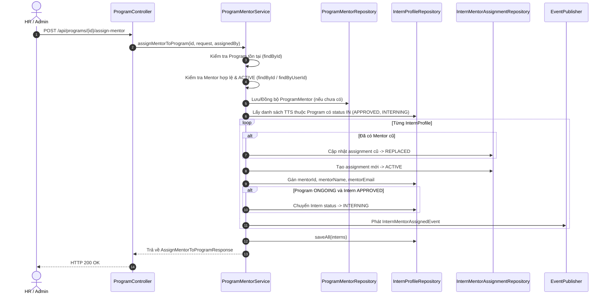

# Specification: Phân Công Mentor Cho Toàn Bộ Kỳ Thực Tập (TM-101)

> **Tài liệu Đặc Tả Kỹ Thuật (Backend Specification)**  
> **Dự án:** [InternHub](file:///d:/codegym_final_project/InternHub) (Spring Boot 3, Java 21, Spring Data JPA, Hibernate, Kafka)  
> **Dịch vụ:** `intern-and-program-service` (Port: `8082`, Gateway: `8080`)  
> **Mã Jira Ticket:** [TM-101](https://robluccibn9935.atlassian.net/browse/TM-101) - *Phân công Người hướng dẫn (Mentor) trực tiếp cho cả Chương trình thực tập và tự động lan tỏa (Cascade) cho toàn bộ thực tập sinh bên trong*  
> **Trạng thái:** DRAFT / IN_REVIEW  
> **Lưu trữ tại:** `InternHub/docs/specs/TM-101-assign-mentor-to-program-spec.md`  
> **Change Level:** **L3** (Mở rộng nghiệp vụ quản lý Program-Mentor, tự động phân công hàng loạt TTS trong kỳ, ghi đè mentor cũ với lưu vết audit lịch sử, tự động kế thừa mentor cho TTS duyệt sau hoặc import sau).  
> **Tiêu chuẩn tuân thủ:** 22 Nguyên tắc cốt lõi ([`AGENTS.md`](file:///d:/codegym_final_project/InternHub/AGENTS.md)) & Tài liệu chuẩn hóa kiến trúc ([`07-coding-standard.md`](file:///d:/codegym_final_project/InternHub/.agents/07-coding-standard.md)).

---

## 0. Nhật Ký Thay Đổi & Giải Trình Kỹ Thuật (Revision History & Change Rationale)

| Phiên bản | Ngày | Người thực hiện | Task / Jira | Loại thay đổi | Lý do & Giải trình kỹ thuật (Rationale) |
| :---: | :---: | :---: | :---: | :---: | :--- |
| **v1.0** | 2026-10-09 | AI Senior Backend Pair-Programmer | `TM-101` | Tạo mới Đặc Tả | Thay vì HR phải gán thủ công từng TTS cho Mentor, xây dựng tính năng phân công trực tiếp Mentor cho cả Chương trình (Program ID). Tự động cập nhật Mentor cho 100% TTS trong kỳ, đồng bộ ProgramMentor, ghi vết lịch sử phân công và tự động kế thừa Mentor cho TTS mới nhập vào kỳ sau đó. |

---

## 1. Feature Overview (Tổng Quan Tính Năng)

- **Tên tính năng:** Phân công Mentor cấp Chương trình thực tập (Program-Level Mentor Assignment & Intern Cascade).
- **Phân hệ phụ trách:** `intern-and-program-service` (Module `program` và module `intern`).
- **Mục tiêu:**
  1. Cho phép HR/Admin gán một Mentor phụ trách trực tiếp một Kỳ thực tập (`InternshipProgram`).
  2. Tự động lan tỏa (Cascade) gán Mentor đó cho toàn bộ các thực tập sinh hiện có trong kỳ (`APPROVED` hoặc `INTERNING`).
  3. Xử lý ghi đè (Overwrite): Đóng bản ghi phân công cũ sang `REPLACED` (có lý do điều phối tự động) và kích hoạt bản ghi phân công mới `ACTIVE` trong `intern_mentor_assignments`.
  4. Cơ chế chuyển trạng thái kép: Nếu kỳ thực tập đang `ONGOING` và TTS đang ở trạng thái `APPROVED`, tự động kích hoạt chuyển sang `INTERNING`.
  5. Cơ chế kế thừa tự động (Auto-Inheritance): Các TTS được tiếp nhận sau đó (qua đơn duyệt hoặc import Excel) sẽ tự động nhận Mentor phụ trách của chương trình mà không cần gán thêm thủ công.
  6. Phát sự kiện thông báo qua Kafka / EventPublisher để gửi email thông báo cho Intern và Mentor.

---

## 2. Khảo Sát Hiện Trạng & Đánh Giá Tái Sử Dụng Mã Nguồn (Mandatory Survey)

| Thành phần hệ thống | Hiện trạng khảo sát | Đánh giá & Chiến lược tái sử dụng |
| :--- | :--- | :--- |
| **Entity `ProgramMentor`** | Đã tồn tại trong bảng `program_mentors` (`program_id`, `mentor_id`, `assigned_by`, `assigned_at`). | **Tái sử dụng 100%**. Dùng để lưu trữ quan hệ giữa Program và Mentor. |
| **Entity `InternProfile`** | Đã có các trường `program_id`, `mentor_id`, `mentor_name`, `mentor_email`, `status`. | **Tái sử dụng 100%**. Cập nhật thông tin Mentor trực tiếp trên Entity. |
| **Entity `InternMentorAssignment`** | Đã có bảng `intern_mentor_assignments` lưu vết lịch sử phân công, trạng thái `ACTIVE`, `REPLACED`, `REVOKED`. | **Tái sử dụng 100%**. Đóng bản ghi cũ sang `REPLACED` và tạo bản ghi mới `ACTIVE`. |
| **`ProgramMentorRepository`** | Đã có `findByProgramId(programId)`, `existsByProgramIdAndMentorId(...)`. | **Tái sử dụng 100%**. Bổ sung phương thức truy vấn tiện ích nếu cần. |
| **`InternProfileRepository`** | Đã có `findByProgramId(programId)`. | **Tái sử dụng**. Bổ sung `findByProgramIdAndStatusIn(programId, statuses)` để lấy chính xác danh sách TTS active. |
| **`MissionBoardService`** | Đang có `addMentorToProgram(programId, mentorId, assignedBy)` nhưng chỉ tạo `ProgramMentor`, chưa cập nhật TTS. | **Nâng cấp & Mở rộng**. Tích hợp logic phân công hàng loạt TTS vào service chuyên trách. |

---

## 3. Thiết Kế Kỹ Thuật Chi Tiết (Technical Architecture)

### 3.1. REST Endpoints

#### 1. Phân công Mentor cho Chương trình thực tập
- **Method & URL:** `POST /api/programs/{id}/assign-mentor`
- **Quyền hạn (RBAC):** `@PreAuthorize("hasAnyRole('HR', 'ADMIN')")`
- **Request Body (`AssignMentorToProgramRequest`):**
  ```json
  {
    "mentorId": 15,
    "notes": "Phân công Mentor trưởng phụ trách toàn bộ học viên kỳ K26"
  }
  ```
- **Response (`ApiResponse<AssignMentorToProgramResponse>`):**
  ```json
  {
    "code": 200,
    "message": "Phân công Mentor cho chương trình thực tập thành công",
    "data": {
      "programId": 10,
      "programName": "Chương trình Thực tập Java Backend K26",
      "mentorId": 15,
      "mentorName": "Trần Văn Mentor",
      "mentorEmail": "mentor.tran@internhub.vn",
      "totalAssignedInterns": 8,
      "replacedMentorsCount": 2,
      "affectedInternCodes": ["INT-202610-0001", "INT-202610-0002", "..."],
      "assignedAt": "2026-10-09T11:45:00"
    }
  }
  ```

### 3.2. Luồng Xử Lý Nghiệp Vụ (Business Workflow)



### 3.3. Tự Động Kế Thừa Cho TTS Mới Gia Nhập (Auto-Inheritance)
1. **Tiếp nhận đơn nộp (`submitDecision` -> `APPROVED`):**
   - Nếu Intern được duyệt vào Program, kiểm tra `programMentorRepository.findByProgramId(program.getId())`.
   - Nếu chương trình đã có Mentor và TTS chưa có Mentor, tự động thiết lập Mentor của chương trình cho TTS đó.
2. **Nhập từ file Excel (`importInternsFromExcel`):**
   - Trước khi lưu danh sách `InternProfile`, truy vấn xem chương trình có Mentor trong `ProgramMentor` không.
   - Nếu có, gán sẵn `mentorId`, `mentorName`, `mentorEmail` cho toàn bộ TTS được import.
   - Tự động tạo bản ghi `InternMentorAssignment` cho các TTS này.

---

## 4. Kiểm Thử & Tiêu Chí Chấp Nhận (Acceptance Criteria)

- [ ] **AC-1:** Gán Mentor thành công cho Program cập nhật đồng thời bảng `program_mentors` và toàn bộ các `InternProfile` thuộc kỳ có status `APPROVED` hoặc `INTERNING`.
- [ ] **AC-2:** Các TTS đã có Mentor cũ được ghi đè chính xác, bản ghi `InternMentorAssignment` cũ chuyển sang `REPLACED` với lý do thay thế, bản ghi mới tạo trạng thái `ACTIVE`.
- [ ] **AC-3:** Nếu Program đang `ONGOING` và TTS đang `APPROVED`, TTS tự động được chuyển sang `INTERNING`.
- [ ] **AC-4:** Khi import Excel hoặc duyệt đơn mới vào Program đã có Mentor, TTS mới tự động nhận Mentor của Program.
- [ ] **AC-5:** Tất cả test cases đơn vị (Unit Tests) đạt 100% Passed.
