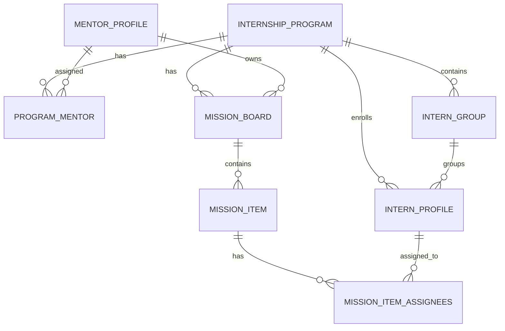
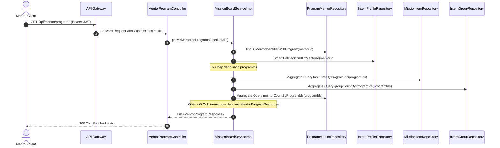
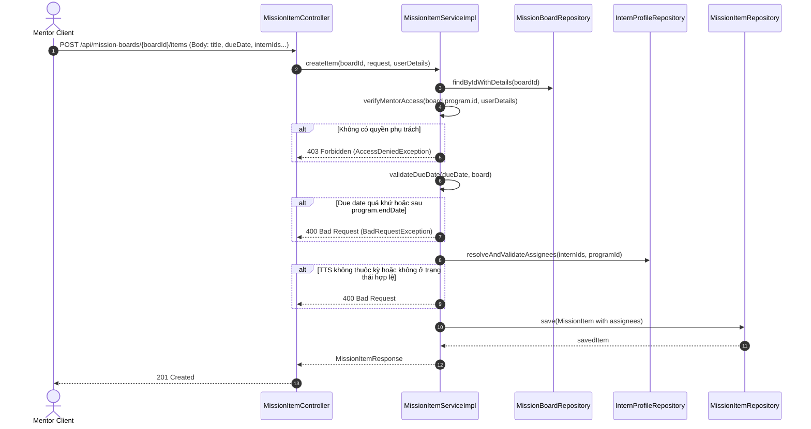

# Specification: Nâng Cấp Backend Quản Lý Bảng Nhiệm Vụ & Không Gian Làm Việc Của Mentor (TM-102)

> **Tài liệu Đặc Tả Kỹ Thuật (Feature Specification)**  
> **Dự án:** [InternHub](file:///d:/codegym_final_project/InternHub) (Backend Microservices - `intern-and-program-service`)  
> **Mã Jira Ticket:** [TM-102](https://robluccibn9935.atlassian.net/browse/TM-102): *Mentor Task Delegation & Program Mission Workspace Enhancement*  
> **Trạng thái:** IMPLEMENTED  
> **Lưu trữ tại:** `InternHub/docs/specs/TM-102-mentor-task-delegation-and-workspace-spec.md`  
> **Cấp độ thay đổi (Change Level):** **L3** (Mở rộng DTOs thống kê tiến độ & tải trọng công việc, tối ưu hóa truy vấn O(1) chống N+1 Query, chuẩn hóa cơ chế phân quyền RBAC đa tầng cho Mentor quản lý nhóm & nhiệm vụ, bảo vệ toàn vẹn dữ liệu kéo thả Kanban).  
> **Tuân thủ quy chuẩn:** Tuân thủ 100% tài liệu [AGENTS.md](file:///d:/codegym_final_project/InternHub/AGENTS.md) và thư mục [`.agents/`](file:///d:/codegym_final_project/InternHub/.agents/).

---

## 0. Nhật Ký Thay Đổi & Giải Trình Kỹ Thuật (Revision History & Change Rationale)

| Phiên bản | Ngày | Người thực hiện | Task / Jira | Loại thay đổi | Lý do & Giải trình kỹ thuật (Rationale) |
| :---: | :---: | :---: | :---: | :---: | :--- |
| **v1.0** | 2026-10-09 | AI Senior Backend Pair-Programmer | `TM-102` | Khởi tạo Đặc Tả Kỹ Thuật | Xây dựng tài liệu đặc tả chuẩn 14 phần cho phân hệ Backend phục vụ giao diện Không Gian Làm Việc của Mentor và Bảng Điều Khiển Chương Trình (TM-102), giải quyết triệt để vấn đề thiếu hụt dữ liệu thống kê tiến độ, cảnh báo quá tải thực tập sinh và phân quyền quản lý nhóm cho Mentor. |
| **v1.1** | 2026-10-09 | AI Senior Backend Pair-Programmer | `TM-102` | Hoàn tất Triển khai Backend | Mở rộng DTOs thống kê (groupCount, totalTaskCount, completedTaskCount, progressPercent, mentorCount, groupId, groupName, activeTaskCount), bổ sung O(1) JPQL Batch Aggregate Queries, đồng bộ Smart Fallback RBAC và kiểm tra phân quyền quản lý nhóm cho Mentor. 100% Unit Test Pass. |

---

## 1. Feature Overview (Tổng Quan Tính Năng)

- **Tên tính năng:** Nâng cấp Backend Quản lý Bảng Nhiệm vụ & Không gian Làm việc của Mentor (Mentor Task Delegation & Program Mission Workspace Enhancement).
- **Mã Jira Ticket:** `TM-102`.
- **Target Microservice:** `intern-and-program-service` (Port 8082, Spring Boot 3, Java 17).
- **Phân hệ phụ trợ:** `api-gateway` (Port 8080 - Định tuyến thông suốt và xác thực JWT token).
- **Đối tượng người dùng & Phân quyền:**
  - `MENTOR`: Truy cập danh sách chương trình phụ trách, bảng nhiệm vụ, tạo/sửa/xóa nhiệm vụ, kéo thả trạng thái Kanban, xem danh sách thực tập sinh & quản lý nhóm trong phạm vi chương trình được phân công.
  - `HR`, `ADMIN`: Có toàn quyền giám sát, quản lý chương trình, thêm/gỡ Mentor, can thiệp bảng nhiệm vụ và phân nhóm.
  - `INTERN`: Xem danh sách nhiệm vụ được giao trên Kanban của mình, cập nhật trạng thái làm việc kèm báo cáo nộp bài (`submissionUrl`, `completionNote`).

---

## 2. Business Goal & Core Objectives (Mục Tiêu Nghiệp Vụ)

1. **Hiệu năng hiển thị tức thời (High-Performance Aggregation):** Cung cấp các chỉ số tổng hợp toàn diện (số lượng học viên, số nhóm, tổng nhiệm vụ, nhiệm vụ đã hoàn thành, tỷ lệ tiến độ %) ngay tại endpoint lấy danh sách chương trình của Mentor (`GET /api/mentor/programs`), giúp giao diện Bento Grid hiển thị ngay mà không phải gọi N+1 REST API phụ.
2. **Cảnh báo quá tải tải trọng công việc (Workload Transparency):** Cung cấp dữ liệu nhiệm vụ đang hoạt động (`activeTaskCount`) và thông tin nhóm (`groupId`, `groupName`) trong danh sách học viên (`GET /api/mentor/programs/{programId}/interns`), giúp Mentor nhận diện ngay các học viên đang quá tải hoặc học viên chưa có việc để phân bổ đồng đều khi giao nhiệm vụ.
3. **Trao quyền quản lý nhóm linh hoạt cho Mentor (Mentor Group Autonomy):** Mở rộng phân quyền cho Mentor thao tác trực tiếp với các API quản lý nhóm (`/api/programs/{programId}/groups/**`) đối với các chương trình mà Mentor được phân công phụ trách, xóa bỏ điểm nghẽn phụ thuộc 100% vào nhân sự HR khi cần chia nhóm bài tập/dự án.
4. **Bảo mật truy cập chương trình nghiêm ngặt (Strict RBAC with Smart Fallback):** Chuẩn hóa cơ chế xác thực quyền sở hữu chương trình giữa `MissionBoardServiceImpl`, `MissionItemServiceImpl` và `InternGroupServiceImpl` để ngăn chặn rò rỉ dữ liệu chéo giữa các Mentor.
5. **Đảm bảo tính toàn vẹn nghiệp vụ giao việc:** Ràng buộc chặt chẽ thời hạn hoàn thành (`dueDate`) không được vượt quá ngày kết thúc chương trình thực tập (`program.endDate`), đảm bảo học viên được phân công phải thuộc chương trình và ở trạng thái hoạt động (`INTERNING` hoặc `APPROVED`).

---

## 3. Scope of Work (Phạm Vi Tính Năng)

### 3.1. Trong phạm vi (In Scope)

1. **Nâng cấp API Danh sách Chương trình của Mentor (`GET /api/mentor/programs`):**
   - Làm giàu dữ liệu `MentorProgramResponse`: bổ sung `groupCount`, `totalTaskCount`, `completedTaskCount`, `progressPercent`, `mentorCount`.
   - Viết các câu truy vấn Aggregate Batch tối ưu trong `MissionItemRepository` và `InternGroupRepository` để tính toán chỉ số cho toàn bộ danh sách chương trình trong O(1) query, triệt tiêu lỗi N+1 Query.
2. **Nâng cấp API Danh sách Thực tập sinh trong Chương trình (`GET /api/mentor/programs/{programId}/interns`):**
   - Mở rộng `AssigneeResponse`: bổ sung `groupId`, `groupName`, `activeTaskCount` (số task TODO hoặc IN_PROGRESS), `completedTaskCount`.
   - Tối ưu hóa truy vấn tải trọng học viên qua Group By trong `MissionItemRepository`.
3. **Phân quyền và Kiểm soát Truy cập Nhóm Thực Tập (`/api/programs/{programId}/groups/**`):**
   - Cập nhật `@PreAuthorize("hasAnyRole('HR', 'ADMIN', 'MENTOR')")` trên các endpoint tạo nhóm, sửa nhóm, giải tán nhóm, chia nhóm hàng loạt, thêm/gỡ thành viên.
   - Bổ sung bước kiểm tra quyền sở hữu kỳ thực tập: Nếu caller có role `MENTOR`, bắt buộc phải được phân công vào `programId` đó (qua `ProgramMentor` hoặc `InternProfile.mentorId`).
4. **Đồng bộ hóa kiểm tra phân quyền trong `MissionItemServiceImpl`:**
   - Cập nhật hàm `verifyMentorAccess` trong `MissionItemServiceImpl` đồng bộ với cơ chế Smart Fallback của `MissionBoardServiceImpl` (hỗ trợ kiểm tra cả `mentorProfile.id`, `userDetails.userId`, và liên kết TTS trong chương trình).
5. **Ràng buộc toàn vẹn thời hạn nhiệm vụ (`dueDate` validation):**
   - Kiểm tra ngày hết hạn nhiệm vụ phải `>=` ngày hiện tại và `<=` ngày kết thúc kỳ thực tập (`program.endDate`).

### 3.2. Ngoài phạm vi (Out of Scope - *Ngăn chặn suy diễn sai*)

- **Tuyệt đối KHÔNG tạo bảng CSDL mới:** Tái sử dụng 100% schema bảng `mission_boards`, `mission_items`, `mission_item_assignees`, `intern_groups`, `intern_profiles`, `program_mentors`.
- **Không thay đổi cấu trúc bảng hoặc Migration DDL:** Không thêm/xóa cột vật lý trong MySQL. Toàn bộ các chỉ số thống kê được tính toán động (dynamic aggregation) qua JPA Query.
- **Không can thiệp Frontend:** Toàn bộ công việc thuộc phạm vi backend, tuyệt đối tuân thủ ranh giới cách ly (Boundary Isolation).
- **Không tự động sinh đánh giá kết thúc kỳ:** Việc chấm điểm, đánh giá cuối kỳ của Mentor thuộc ticket nghiệp vụ riêng.

---

## 4. Potential Logic Loopholes & Mitigations (Edge Cases Cốt Lõi)

### 4.1. Case 1: Thao tác dữ liệu chéo giữa các Mentor (Cross-Program Tampering)
- **Vấn đề:** Mentor A thuộc Chương trình 1 cố tình gửi request PUT/PATCH/DELETE tới Mission Item, Board, hoặc Group của Chương trình 2 bằng cách sửa ID trên đường dẫn API.
- **Giải pháp:**
  - Mọi thao tác ghi/đọc chi tiết đều thực hiện truy vấn nạp Program tương ứng (`board.getProgram()`, `group.getProgram()`).
  - Gọi hàm `verifyMentorAccess(programId, userDetails)`.
  - Nếu user mang role `MENTOR` nhưng không có bản ghi phụ trách trong `program_mentors` và không có học viên nào được gán trong chương trình đó ➔ Ném ngay `AccessDeniedException("Bạn không được phân công phụ trách chương trình thực tập này")` (HTTP 403).

### 4.2. Case 2: Nhiệm vụ có hạn chót nằm ngoài khung thời gian kỳ thực tập
- **Vấn đề:** Chương trình thực tập kết thúc vào ngày 30/11/2026. Mentor vô tình đặt `dueDate` cho công việc vào ngày 15/12/2026 hoặc ngày trong quá khứ.
- **Giải pháp:**
  - Tại Service layer trước khi lưu `MissionItem`:
    ```java
    if (dueDate.isBefore(LocalDate.now())) {
        throw new BadRequestException("Hạn chót công việc không được ở trong quá khứ");
    }
    if (board.getProgram().getEndDate() != null && dueDate.isAfter(board.getProgram().getEndDate())) {
        throw new BadRequestException("Hạn chót công việc không được vượt quá ngày kết thúc chương trình (" + board.getProgram().getEndDate() + ")");
    }
    ```

### 4.3. Case 3: N+1 Query Bottleneck khi thống kê danh sách chương trình
- **Vấn đề:** Một Mentor phụ trách 10 chương trình thực tập. Nếu với mỗi chương trình lại thực hiện count group, count mission items, count completed items, count mentors ➔ Sẽ sinh ra 40+ câu truy vấn SQL riêng lẻ, làm sụt giảm nghiêm trọng hiệu năng API `GET /api/mentor/programs`.
- **Giải pháp:**
  - Triển khai các câu query nhóm (GROUP BY) lấy dữ liệu 1 lần:
    ```sql
    SELECT mi.board.program.id, COUNT(mi), SUM(CASE WHEN mi.status = 'COMPLETED' THEN 1 ELSE 0 END) 
    FROM MissionItem mi WHERE mi.board.program.id IN (:programIds) GROUP BY mi.board.program.id
    ```
    và
    ```sql
    SELECT ig.program.id, COUNT(ig) FROM InternGroup ig WHERE ig.program.id IN (:programIds) GROUP BY ig.program.id
    ```
  - Map kết quả vào bộ nhớ theo `programId` trong O(1) thời gian, đảm bảo API phản hồi dưới 100ms.

### 4.4. Case 4: Phân công nhiệm vụ cho Thực tập sinh không hợp lệ
- **Vấn đề:** Mentor gửi request `createItem` với danh sách `internIds` chứa học viên đã nghỉ thực tập (`DROPPED_OUT`), bị từ chối (`REJECTED`), hoặc học viên thuộc chương trình khác.
- **Giải pháp:**
  - Phương thức `resolveAndValidateAssignees` kiểm tra 3 điều kiện:
    1. Kích thước danh sách tìm thấy trong DB phải bằng kích thước `internIds` truyền vào (không có ID ma).
    2. Toàn bộ thực tập sinh phải có `intern.getProgram().getId().equals(programId)`.
    3. Trạng thái thực tập sinh phải thuộc tập hợp hợp lệ: `INTERNING` hoặc `APPROVED`. Nếu vi phạm, ném ngay `BadRequestException` kèm tên và mã sinh viên vi phạm.

### 4.5. Case 5: Kéo thả trạng thái đồng thời (Concurrent Kanban State Transition)
- **Vấn đề:** Mentor kéo thả thẻ task sang `COMPLETED` cùng lúc Intern bấm cập nhật báo cáo nộp bài `IN_PROGRESS`.
- **Giải pháp:**
  - Sử dụng giao dịch `@Transactional` cô lập.
  - Cập nhật trạng thái chỉ thực hiện trên bản ghi item đã nạp từ DB kèm phiên bản cập nhật `updatedAt`.
  - Cập nhật thời gian nộp `submittedAt = LocalDateTime.now()` nếu chuyển sang `COMPLETED` hoặc có nộp link báo cáo.

---

## 5. Functional Requirements (Yêu Cầu Chức Năng)

- **FR-1 (Enriched Mentor Programs):** API `GET /api/mentor/programs` trả về danh sách chương trình mà Mentor đăng nhập phụ trách kèm đầy đủ các chỉ số thống kê: `totalInterns`, `activeInterns`, `groupCount`, `totalTaskCount`, `completedTaskCount`, `progressPercent`, `mentorCount`.
- **FR-2 (Workload & Group Enriched Interns):** API `GET /api/mentor/programs/{programId}/interns` trả về danh sách học viên trong chương trình kèm thông tin nhóm (`groupId`, `groupName`) và tải trọng nhiệm vụ hiện tại (`activeTaskCount`, `completedTaskCount`).
- **FR-3 (Mentor Group Management RBAC):** Cho phép Mentor có quyền xem, tạo mới, chỉnh sửa, giải tán nhóm, phân nhóm tự động hàng loạt, thêm và gỡ học viên khỏi nhóm trong phạm vi chương trình được phân công phụ trách.
- **FR-4 (Consistent Program Ownership Verification):** Đồng bộ quy chuẩn kiểm tra quyền sở hữu chương trình giữa tất cả các Service liên quan (`MissionBoardService`, `MissionItemService`, `InternGroupService`) với cơ chế Smart Fallback.
- **FR-5 (Task Due Date Integrity Validation):** Ràng buộc ngày hết hạn nhiệm vụ phải từ ngày hiện tại và không được vượt quá ngày kết thúc của chương trình thực tập.
- **FR-6 (Mission Board & Item Lifecycle):** Đảm bảo tính nhất quán của chu trình Kanban: `TODO` ➔ `IN_PROGRESS` ➔ `COMPLETED`, tự động cập nhật số đếm task trong `MissionBoardDetailResponse` và `MissionBoardResponse`.

---

## 6. Business Rules (Quy Tắc Nghiệp Vụ)

- **BR-1 (Quyền phụ trách chương trình):** Mentor chỉ được phép thao tác (xem học viên, quản lý nhóm, tạo/sửa/xóa bảng nhiệm vụ, tạo/sửa/xóa việc) trên các chương trình mà:
  1. Tồn tại bản ghi phân công trong `program_mentors` (theo `mentorId` hoặc `userId`), HOẶC:
  2. Tồn tại ít nhất một `InternProfile` trong chương trình đó có trường `mentorId` trỏ tới Mentor này (Smart Fallback).
- **BR-2 (Ràng buộc thời hạn hoàn thành):** `dueDate` của mọi `MissionItem` phải thỏa mãn:  
  `LocalDate.now() <= dueDate <= program.endDate`.  
  Nếu `program.endDate == null`, chỉ cần `dueDate >= LocalDate.now()`.
- **BR-3 (Trạng thái học viên được giao việc):** Chỉ những học viên có trạng thái `INTERNING` (Đang thực tập) hoặc `APPROVED` (Đã tiếp nhận vào kỳ) mới được phép phân công nhiệm vụ.
- **BR-4 (Định mức tải trọng học viên):** Học viên có `activeTaskCount >= 5` được coi là tải trọng cao (High Load). Backend cung cấp chỉ số này để hệ thống cảnh báo Mentor khi giao việc.
- **BR-5 (Toàn vẹn nhóm thực tập):** Khi giải tán nhóm (`disbandGroup`), toàn bộ học viên trong nhóm chỉ bị xóa liên kết nhóm (`group = null`), hoàn toàn không bị xóa khỏi chương trình (`program` giữ nguyên).
- **BR-6 (Tính toán tỷ lệ tiến độ):**  
  Nếu `totalTaskCount == 0` ➔ `progressPercent = 0.0`.  
  Nếu `totalTaskCount > 0` ➔ `progressPercent = Math.round((completedTaskCount * 100.0 / totalTaskCount) * 10.0) / 10.0`.

---

## 7. Data Model (Mô Hình Dữ Liệu & Đánh Giá Tái Sử Dụng 100%)

> [!IMPORTANT]
> **ĐÁNH GIÁ TÁI SỬ DỤNG MÃ NGUỒN & DATABASE SCHEMA:**  
> Tính năng TM-102 **TÁI SỬ DỤNG 100% CƠ SỞ DỮ LIỆU HIỆN CÓ**, tuyệt đối không tạo mới bất kỳ bảng nào, không thay đổi cấu trúc bảng trong MySQL.

### 7.1. Sơ Đồ Thực Thể Quan Hệ (ERD Hiện Hữu)



### 7.2. Tóm tắt các bảng tái sử dụng

1. `internship_programs`: Bảng chương trình thực tập (`id`, `name`, `program_code`, `start_date`, `end_date`, `status`, `department_id`...).
2. `program_mentors`: Bảng phân công Mentor vào chương trình (`id`, `program_id`, `mentor_id`, `assigned_by`, `assigned_at`).
3. `intern_groups`: Bảng nhóm thực tập trong chương trình (`id`, `program_id`, `name`, `max_members`, `mentor_id`, `mentor_name`).
4. `intern_profiles`: Bảng hồ sơ học viên (`id`, `user_id`, `program_id`, `group_id`, `mentor_id`, `intern_code`, `full_name`, `status`...).
5. `mission_boards`: Bảng nhiệm vụ của kỳ (`id`, `program_id`, `mentor_id`, `title`, `description`, `status`).
6. `mission_items`: Bảng công việc chi tiết (`id`, `board_id`, `title`, `description`, `priority`, `status`, `due_date`, `order_index`, `submission_url`, `completion_note`, `submitted_at`).
7. `mission_item_assignees`: Bảng liên kết nhiều-nhiều (`item_id`, `intern_id`).

---

## 8. API Contract (Đặc Tả Giao Tiếp REST API)

### 8.1. API Lấy Danh Sách Chương Trình Của Mentor (Enriched)

- **Endpoint:** `GET /api/mentor/programs`
- **Quyền:** `MENTOR`, `HR`, `ADMIN`
- **Response 200 OK:**
```json
{
  "code": 200,
  "message": "Lấy danh sách chương trình phụ trách thành công",
  "data": [
    {
      "programId": 12,
      "programCode": "PRG-2026-JAVA01",
      "name": "Chương trình Thực tập Java Backend K26",
      "departmentId": 2,
      "departmentName": "Trung tâm Phát triển Phần mềm",
      "status": "IN_PROGRESS",
      "startDate": "2026-09-01",
      "endDate": "2026-12-31",
      "totalInterns": 25,
      "activeInterns": 24,
      "groupCount": 5,
      "totalTaskCount": 38,
      "completedTaskCount": 22,
      "progressPercent": 57.9,
      "mentorCount": 3
    }
  ]
}
```

### 8.2. API Lấy Danh Sách Thực Tập Sinh Kèm Tải Trọng Công Việc & Nhóm

- **Endpoint:** `GET /api/mentor/programs/{programId}/interns`
- **Quyền:** `MENTOR`, `HR`, `ADMIN`
- **Response 200 OK:**
```json
{
  "code": 200,
  "message": "Lấy danh sách thực tập sinh trong chương trình thành công",
  "data": [
    {
      "id": 105,
      "userId": 42,
      "internCode": "INT-202609-0012",
      "fullName": "Nguyễn Văn An",
      "email": "an.nguyen@example.com",
      "phone": "0912345678",
      "appliedPosition": "Java Developer",
      "groupId": 3,
      "groupName": "Nhóm 01 - E-Commerce API",
      "activeTaskCount": 2,
      "completedTaskCount": 5
    },
    {
      "id": 108,
      "userId": 45,
      "internCode": "INT-202609-0015",
      "fullName": "Trần Thị Bích",
      "email": "bich.tran@example.com",
      "phone": "0987654321",
      "appliedPosition": "Backend Engineer",
      "groupId": null,
      "groupName": "Chưa phân nhóm",
      "activeTaskCount": 0,
      "completedTaskCount": 3
    }
  ]
}
```

### 8.3. APIs Quản Lý Nhóm Dành Cho Mentor (`/api/programs/{programId}/groups/**`)

- **Endpoints mở rộng phân quyền (`hasAnyRole('HR', 'ADMIN', 'MENTOR')`):**
  - `GET /api/programs/{programId}/groups`: Lấy danh sách nhóm & thành viên.
  - `POST /api/programs/{programId}/groups`: Tạo nhóm mới trong chương trình.
  - `PUT /api/programs/{programId}/groups/{groupId}`: Chỉnh sửa tên nhóm, chỉ tiêu tối đa.
  - `DELETE /api/programs/{programId}/groups/{groupId}`: Giải tán nhóm.
  - `POST /api/programs/{programId}/groups/batch`: Áp dụng chia nhóm tự động hàng loạt.
  - `POST /api/programs/{programId}/groups/{groupId}/members/{internId}`: Thêm TTS vào nhóm.
  - `DELETE /api/programs/{programId}/groups/{groupId}/members/{internId}`: Gỡ TTS khỏi nhóm.

- **Request Body mẫu (POST `/api/programs/{programId}/groups`):**
```json
{
  "name": "Nhóm 01 - Core Payment",
  "maxMembers": 4,
  "mentorId": 5
}
```

- **Response 201 Created:**
```json
{
  "code": 201,
  "message": "Tạo nhóm thực tập thành công",
  "data": {
    "id": 8,
    "programId": 12,
    "name": "Nhóm 01 - Core Payment",
    "maxMembers": 4,
    "memberCount": 0,
    "mentorId": 5,
    "mentorName": "Vũ Mentor",
    "members": []
  }
}
```

---

## 9. Core Flow / Enforcement Flow (Luồng Xử Lý Cốt Lõi)

### 9.1. Luồng Lấy Danh Sách Chương Trình Phụ Trách Của Mentor (O(1) Aggregation)



### 9.2. Luồng Kiểm Tra Quyền & Giao Việc Mới Cho TTS (Create Mission Item)



---

## 10. Non-Functional Requirements & Constraints (Yêu Cầu Phi Chức Năng)

1. **Hiệu năng & Truy vấn (Query Efficiency):**
   - Loại bỏ triệt để N+1 query. Thời gian phản hồi của `GET /api/mentor/programs` phải `< 150ms` cho danh sách 20 chương trình.
   - Các API kiểm tra đếm dùng `COUNT()` kết hợp index ngoại khóa (`program_id`, `board_id`).
2. **Bảo mật & Phân quyền (RBAC & Boundary Isolation):**
   - Chỉ cho phép người dùng có vai trò `ROLE_MENTOR`, `ROLE_HR`, `ROLE_ADMIN`.
   - Phân quyền cấp độ dữ liệu (Data-level Authorization): Mentor chỉ được tương tác với tài nguyên thuộc chương trình mình phụ trách.
3. **Tính nhất quán giao dịch (Transactional Integrity):**
   - Mọi phương thức ghi/sửa/xóa đều được đánh dấu `@Transactional` với isolation mặc định `READ_COMMITTED`.
   - Giao việc cho danh sách TTS là thao tác nguyên tử: Nếu 1 học viên không hợp lệ, toàn bộ giao dịch rollback, không sinh bản ghi mồ côi.

---

## 11. Acceptance Criteria Checklist (Tiêu Chí Chấp Nhận)

- [x] **AC-1:** API `GET /api/mentor/programs` trả về đúng các trường: `groupCount`, `totalTaskCount`, `completedTaskCount`, `progressPercent`, `mentorCount`.
- [x] **AC-2:** Tỷ lệ `progressPercent` được tính toán chuẩn xác từ `completedTaskCount / totalTaskCount * 100`, làm tròn 1 chữ số thập phân (hoặc 0.0 nếu chưa có task).
- [x] **AC-3:** API `GET /api/mentor/programs/{programId}/interns` trả về đúng `groupId`, `groupName`, `activeTaskCount` (TODO + IN_PROGRESS) và `completedTaskCount` của từng học viên.
- [x] **AC-4:** Mentor được phân công vào chương trình có thể gọi thành công các API: tạo nhóm, sửa nhóm, xóa nhóm, chia nhóm hàng loạt, thêm/gỡ thành viên nhóm trên chương trình đó.
- [x] **AC-5:** Mentor KHÔNG được phân công vào chương trình khi gọi các API quản lý nhóm, bảng nhiệm vụ hoặc item sẽ nhận mã lỗi `403 Forbidden`.
- [x] **AC-6:** Khi tạo hoặc cập nhật `MissionItem`, nếu `dueDate` sau ngày `program.endDate` hoặc trước ngày hiện tại, hệ thống ném `BadRequestException` với thông báo tiếng Việt rõ ràng.
- [x] **AC-7:** Khi giao việc cho học viên không thuộc chương trình đào tạo của board, hệ thống ném `BadRequestException` chỉ rõ tên và mã học viên vi phạm.
- [x] **AC-8:** Cập nhật trạng thái `MissionItem` (`PATCH /api/mission-items/{itemId}/status`) hoạt động mượt mà, hỗ trợ cả Mentor và Intern nộp bài.

---

## 12. Unit & Integration Test Cases Checklist

| ID | Module / Service | Tình huống kiểm thử (Test Scenario) | Kết quả kỳ vọng |
| :---: | :--- | :--- | :--- |
| **UT-BE-01** | `MissionBoardServiceImpl` | `getMyMentoredPrograms`: Mentor có 2 chương trình có items và groups | Trả về đủ `groupCount`, `totalTaskCount`, `completedTaskCount`, `progressPercent` chuẩn xác |
| **UT-BE-02** | `MissionBoardServiceImpl` | `getProgramInterns`: Kỳ thực tập có học viên có nhóm và task | Trả về danh sách `AssigneeResponse` kèm đúng `groupId`, `groupName`, `activeTaskCount` |
| **UT-BE-03** | `MissionItemServiceImpl` | `createItem`: Hạn chót `dueDate` vượt quá `program.endDate` | Ném `BadRequestException` ("Hạn chót công việc không được vượt quá...") |
| **UT-BE-04** | `MissionItemServiceImpl` | `createItem`: Mentor không thuộc chương trình | Ném `AccessDeniedException` (HTTP 403) |
| **UT-BE-05** | `MissionItemServiceImpl` | `createItem`: Giao việc hợp lệ cho 2 học viên trong kỳ | Tạo thành công `MissionItem` với 2 assignees, status `TODO` |
| **UT-BE-06** | `InternGroupServiceImpl` | `createGroup`: Mentor phụ trách chương trình tạo nhóm | Tạo nhóm thành công, trả về `InternGroupResponse` |
| **UT-BE-07** | `InternGroupServiceImpl` | `createGroup`: Mentor lạ không phụ trách chương trình | Ném `AccessDeniedException` (HTTP 403) |

---

## 13. Implementation Checklist (Danh Sách File & Hạng Mục Triển Khai)

- [x] **1. DTO Enhancements:**
  - `MentorProgramResponse.java`: Thêm `groupCount`, `totalTaskCount`, `completedTaskCount`, `progressPercent`, `mentorCount`.
  - `AssigneeResponse.java`: Thêm `groupId`, `groupName`, `activeTaskCount`, `completedTaskCount`.
- [x] **2. Repository Batch Queries:**
  - `MissionItemRepository.java`: Bổ sung query aggregate đếm tổng task & task hoàn thành theo danh sách `programIds`, query đếm active tasks theo danh sách `internIds`.
  - `InternGroupRepository.java`: Bổ sung query aggregate đếm số nhóm theo danh sách `programIds`.
  - `ProgramMentorRepository.java`: Bổ sung query aggregate đếm số Mentor theo danh sách `programIds`.
- [x] **3. Service Implementations:**
  - `MissionBoardServiceImpl.java`: Cập nhật `getMyMentoredPrograms` ghép nối các chỉ số aggregate, cập nhật `getProgramInterns` nạp nhóm & tải trọng học viên.
  - `MissionItemServiceImpl.java`: Chuẩn hóa `verifyMentorAccess` đồng bộ Smart Fallback, củng cố kiểm tra `validateDueDate`.
  - `InternGroupServiceImpl.java`: Bổ sung kiểm tra phân quyền Mentor trước khi tạo, sửa, xóa, chia nhóm.
- [x] **4. Controller Annotations:**
  - `ProgramGroupController.java`: Mở rộng `@PreAuthorize("hasAnyRole('HR', 'ADMIN', 'MENTOR')")` cho các endpoint quản lý nhóm.
- [x] **5. Testing & Verification:**
  - Viết unit tests trong `src/test/java` kiểm tra toàn bộ các scenarios (`MentorWorkspaceEnhancementTest.java`).
  - Biên dịch và test với Gradle: `.\gradlew :intern-and-program-service:compileJava` và `.\gradlew :intern-and-program-service:test` (PASS 100%).
