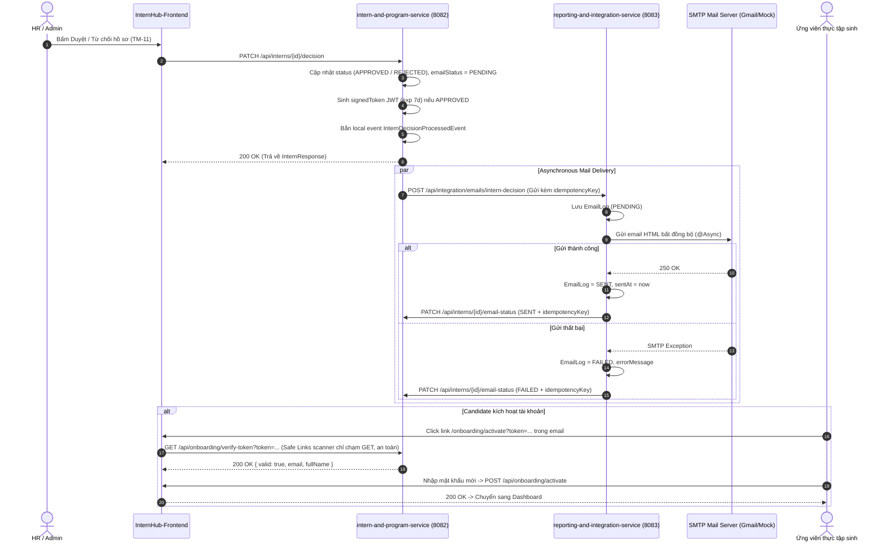

# Specification: Gửi Email Thông Báo Kết Quả Xét Duyệt Hồ Sơ Thực Tập Sinh (Notify Intern Application Result via Email)

---

## 1. Feature Overview (Tổng Quan Tính Năng)
- **Feature Name:** Gửi email thông báo kết quả duyệt/từ chối hồ sơ ứng viên (Email Notification for Intern Application Result)
- **Jira Ticket:** [TM-12](https://robluccibn9935.atlassian.net/browse/TM-12)
- **Target Subsystems:**
  - `reporting-and-integration-service` (Integration & Notification Service - Port 8083)
  - `intern-and-program-service` (Core Intern Domain Service - Port 8082)
  - `InternHub-Frontend` (HR Portal & Candidate Onboarding Activation Page)
- **Target Users:** Ứng viên thực tập sinh (Intern), Nhân sự (HR), Quản trị viên (Admin)
- **Change Level:** **L3** (Tích hợp Microservice liên service qua Feign/Eureka, xử lý bất đồng bộ Async Email, REST Callback có Idempotency & Reconciliation cho PENDING timeout, Rate limit 2 lớp chống spam, Email Templates HTML responsive, trang Onboarding Activation chống Safe Links scanner).

---

## 2. Business Goal & Core Objectives (Mục Tiêu Nghiệp Vụ)
Tiếp nối quyết định phê duyệt/từ chối từ [TM-11](https://robluccibn9935.atlassian.net/browse/TM-11), tính năng **TM-12** tự động hóa chu trình phản hồi kết quả cho ứng viên:
1. **Phản hồi tức thì & chuyên nghiệp:** Ứng viên nhận được email thông báo ngay sau khi HR đưa ra quyết định.
2. **Minh bạch lý do từ chối:** Nếu hồ sơ bị từ chối (`REJECTED`), email hiển thị rõ ràng lý do từ chối (`rejectionReason`) do HR nhập ở TM-11.
3. **Kích hoạt tài khoản không đứt gãy UX:** Nếu hồ sơ được tiếp nhận (`APPROVED`), email cung cấp nút CTA dẫn tới `${APP_FRONTEND_URL}/onboarding/activate?token=${signedToken}` (JWT có exp 7 ngày, miễn nhiễm với bẫy quét link tự động Safe Links scanner của Outlook/Google Workspace).
4. **Bảo vệ chống Spam / Race-Condition 2 lớp:**
   - **Phía Client:** Nút "Gửi lại" hiển thị đếm ngược cooldown 30-60s sau khi gửi hoặc khi nhận mã `429 Too Many Requests`.
   - **Phía Server:** Cooldown giữa 2 lần resend cho cùng 1 hồ sơ, giới hạn tối đa 5 lần resend/ngày/hồ sơ, chặn race-condition bằng Idempotency Key.
5. **Cơ chế Bất đồng bộ & Phục hồi lỗi (Async Callback & Reconciliation):**
   - Bắn sang `reporting-and-integration-service` chạy ngầm `@Async`.
   - Báo cáo kết quả qua REST Callback có Idempotency.
   - Có cơ chế Reconciliation tự động đánh dấu `FAILED` nếu trạng thái `PENDING` bị treo quá 5 phút.

---

## 3. Kiến Trúc & Luồng Tương Tác (Architecture & Data Flow)

---

## 4. Chi Tiết Kỹ Thuật (Technical Specifications)

### 4.1. Module `reporting-and-integration-service` (Service Gửi Mail - 8083)
1. **Dependencies:** `org.springframework.boot:spring-boot-starter-mail`.
2. **Cấu hình (`reporting-and-integration-service.yml`):**
   - `spring.mail.host`, `spring.mail.port`, `spring.mail.username`, `spring.mail.password`.
   - Hỗ trợ mock log ra console khi chưa cấu hình mật khẩu thật để tránh crash môi trường dev/test.
3. **Entity `EmailLog`:**
   - `id`, `recipientEmail`, `recipientName`, `subject`, `templateCode`, `referenceId`, `idempotencyKey`, `status` (`PENDING`, `SENT`, `FAILED`), `errorMessage`, `sentAt`, `createdAt`.
4. **HTML Templates:**
   - **Template Approved:** Nền header tím `#4f46e5`, badge `✓ HỒ SƠ ĐÃ ĐƯỢC DUYỆT`, Chúc mừng `{{ten_intern}}`, card thông tin vị trí `{{vi_tri}}`, phòng ban `{{phong_ban}}`, mentor `{{ten_mentor}}`, ngày bắt đầu `{{ngay_bat_dau}}`, nút CTA `{{onboarding_link}}`.
   - **Template Rejected:** Nền header slate dark `#1e293b`, thông báo lịch sự, hiển thị box lý do từ chối `{{ly_do_tu_choi}}`, nút `{{jobs_link}}`.
5. **REST API & Callback:**
   - `POST /api/integration/emails/intern-decision`: Nhận yêu cầu gửi email từ `intern-service`.
   - Callback sang `intern-service` qua Feign/WebClient: `PATCH /api/interns/{id}/email-status`.

### 4.2. Module `intern-and-program-service` (Core Service - 8082)
1. **Bổ sung Entity `InternProfile`:**
   - `emailStatus` (String: `PENDING`, `SENT`, `FAILED`, default null)
   - `emailSentAt` (LocalDateTime)
   - `emailRetryCount` (Integer, default 0)
   - `lastEmailSentAt` (LocalDateTime)
2. **Token Onboarding & Safe Links Immunity:**
   - JWT Secret độc lập, thời hạn 7 ngày, chứa claims: `sub: internId`, `email`, `type: ONBOARDING_ACTIVATION`.
   - Endpoint: `GET /api/onboarding/verify-token?token=...` (chỉ đọc, không vô hiệu hóa token).
   - Endpoint: `POST /api/onboarding/activate` (tiêu thụ token và hoàn tất kích hoạt).
3. **Resend API & Rate Limiting:**
   - `POST /api/interns/{id}/resend-decision-email`:
     - Kiểm tra trạng thái hiện tại phải là `APPROVED` hoặc `REJECTED`.
     - Kiểm tra Cooldown 45 giây: nếu `now - lastEmailSentAt < 45s`, trả về `429 Too Many Requests` kèm body `{ retryAfter: seconds }`.
     - Kiểm tra hạn mức ngày: tối đa 5 lần/ngày. Sau 5 lần, báo lỗi "Không gửi được nhiều lần liên tiếp, vui lòng kiểm tra lại địa chỉ email của thực tập sinh".
4. **Callback & Reconciliation:**
   - `PATCH /api/interns/{id}/email-status`: Endpoint nội bộ cho reporting-service callback cập nhật kết quả.
   - `@Scheduled` định kỳ mỗi 5 phút quét các hồ sơ có `emailStatus = PENDING` và `lastEmailSentAt > 5 phút` chuyển thành `FAILED` (Reconciliation).

### 4.3. Module `InternHub-Frontend`
1. **Header DetailInternModal (`src/pages/hr/components/DetailInternModal.tsx`):**
   - Đặt ngay dưới badge trạng thái ở header:
     - Khi `emailStatus === 'SENT'`: `✓ Đã gửi email thông báo · dd/MM/yyyy HH:mm` (màu `--text-muted`).
     - Khi `emailStatus === 'PENDING'`: `⏳ Đang gửi email...`
     - Khi `emailStatus === 'FAILED'`: `✗ Gửi email thất bại` kèm nút text `[Gửi lại]`.
   - Click "Gửi lại" -> Gọi API `resendDecisionEmail(id)`. Nếu thành công hoặc gặp `429`, bật đếm ngược tick từng giây (ví dụ: "Gửi lại sau 45s").
2. **Trang Candidate Onboarding Activation (`src/pages/public/OnboardingActivationPage.tsx`):**
   - Route `/onboarding/activate?token=...`.
   - Kiểm tra tính hợp lệ của token -> Hiển thị form thiết lập mật khẩu mới và nút "Hoàn tất kích hoạt".

---

## 5. Kế Hoạch Kiểm Thử (Verification Plan)
1. **Unit Test Backend:**
   - Cooldown logic: Test chặn 429 khi gửi lại quá nhanh và test hạn mức 5 lần/ngày.
   - Token JWT generator & verify logic.
   - HTML template generation.
2. **Integration Test:**
   - Duyệt hồ sơ -> Trigger email -> Kiểm tra callback cập nhật `emailStatus`.
3. **Frontend Test:**
   - Mở modal hồ sơ, kiểm tra trạng thái email và nút đếm ngược cooldown khi resend.
   - Truy cập URL `/onboarding/activate?token=...` kiểm tra giao diện kích hoạt.
