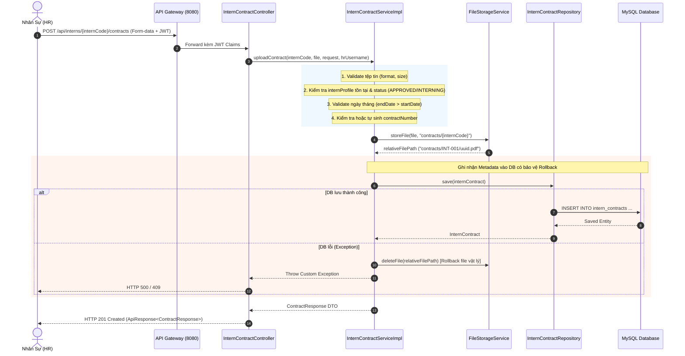

# Specification: Tải Lên Hợp Đồng Thực Tập (Internship Contract Upload by HR)

> **Trạng thái:** IMPLEMENTED  
> **Lưu trữ tại:** `InternHub/docs/specs/TM-13-contract-upload-spec.md`  
> **Áp dụng quy tắc:** [Persistent Spec & Change Rationale](file:///d:/Certificate_CodeGym/Module%206/InternHub/.agents/04-development-guide.md)

---

## 0. Nhật Ký Thay Đổi & Giải Trình Kỹ Thuật (Revision History & Change Rationale)

> [!IMPORTANT]
> **BẮT BUỘC ĐIỀN ĐẦY ĐỦ**: Bất kể khi nào Lập trình viên hay AI Agent thay đổi mã nguồn ảnh hưởng đến logic, API, validation hay database (từ cấp độ L2 trở lên), **bắt buộc** phải ghi thêm một dòng vào bảng này để giải trình lý do trước khi coi nhiệm vụ là hoàn tất.

| Phiên bản | Ngày | Người thực hiện | Task / Jira | Loại thay đổi | Lý do & Giải trình kỹ thuật (Rationale) |
| :---: | :--- :| :---: | :---: | :---: | :--- |
| **v1.0** | 2026-09-23 | AI Agent (Antigravity) | `TM-13` | Tạo mới | Thiết kế đặc tả chuẩn 14 phần cho tính năng tải lên hợp đồng thực tập dành cho Actor HR. |

---

## 1. Feature Overview (Tổng Quan Tính Năng)
- **Feature Name:** Tải lên hợp đồng thực tập (Internship Contract Upload by HR)
- **Jira Ticket:** [TM-13](https://robluccibn9935.atlassian.net/browse/TM-13)
- **Target Microservice:** `intern-and-program-service` (Port 8082), `api-gateway` (Port 8080)
- **Target Users & Roles:** `HR`, `ADMIN` (Chỉ nhân sự và quản trị viên mới có thẩm quyền lập và tải lên hợp đồng thực tập)
- **Change Level:** **L3** (Bổ sung Entity/Bảng `intern_contracts`, Enum `ContractStatus`, Contract Service/Controller, REST API Multipart Upload, liên kết với `InternProfile`, File Storage Rollback)

---

## 2. Business Goal & Core Objectives (Mục Tiêu Nghiệp Vụ)
Cung cấp giải pháp số hóa toàn diện quy trình tạo lập và lưu trữ hợp đồng thực tập cho ứng viên đã được phê duyệt tiếp nhận:
1. **Thiết lập cơ sở pháp lý và cam kết thực tập (Legal Foundation):**
   - Sau khi hồ sơ ứng viên được HR phê duyệt ở [TM-11](file:///d:/Module_6/InternHub/docs/specs/TM-11-approve-reject-application-spec.md) (`status = APPROVED`), HR cần tải lên bản thảo hoặc văn bản hợp đồng thực tập chính thức kèm theo các điều khoản quan trọng (mã hợp đồng, thời hạn thực tập, mức phụ cấp/trợ cấp) để chuẩn bị cho bước ký kết tiếp theo ([TM-14](https://robluccibn9935.atlassian.net/browse/TM-14)).
2. **Quản lý tập trung metadata hợp đồng (Centralized Contract Metadata):**
   - Không chỉ lưu trữ tệp đính kèm vật lý (PDF/DOCX), hệ thống lưu trữ có cấu trúc các trường nghiệp vụ quan trọng: Số hợp đồng (`contractNumber`), tiêu đề hợp đồng (`contractTitle`), ngày bắt đầu (`startDate`), ngày kết thúc (`endDate`), phụ cấp (`allowanceAmount`), trạng thái (`status`), người tạo (`uploadedBy`).
3. **Bảo mật và phân quyền nghiêm ngặt (Strict RBAC):**
   - Hợp đồng chứa các thông tin pháp lý và tài chính nhạy cảm. Khác với CV nộp tự do của ứng viên (TM-4), API tải lên hợp đồng **bắt buộc yêu cầu xác thực JWT** và **chỉ cấp quyền cho vai trò `HR` và `ADMIN`**.
4. **An toàn dữ liệu và cơ chế khôi phục tự động (Storage Atomicity & Rollback):**
   - Đảm bảo tính toàn vẹn giữa lưu trữ tệp vật lý và bản ghi cơ sở dữ liệu: nếu giao dịch ghi vào cơ sở dữ liệu thất bại, tệp tin vật lý vừa lưu trên ổ đĩa sẽ tự động bị xóa bỏ để chống rác ổ cứng (Disk Leaks).
5. **Tiền đề cho quy trình ký duyệt hợp đồng (Foundation for TM-14 & TM-16):**
   - Tạo lập hợp đồng ở trạng thái ban đầu `PENDING_SIGNATURE` (Chờ ký kết) làm tiền đề trực tiếp cho tính năng ký/xác nhận hợp đồng từ phía Thực tập sinh ([TM-14]) trước khi chính thức chuyển sang giai đoạn `INTERNING` và phân công Mentor ([TM-16]).

---

## 3. Scope of Work (Phạm Vi Tính Năng)

### 3.1. Trong phạm vi (In Scope)
- **RESTful API Multipart Upload:** `POST /api/interns/{internCode}/contracts` cho phép HR tải lên tệp tin hợp đồng đính kèm dữ liệu form (metadata).
- **RESTful API Tra cứu danh sách hợp đồng:** `GET /api/interns/{internCode}/contracts` cho phép HR/Admin/Mentor/Intern xem danh sách các hợp đồng liên quan tới thực tập sinh.
- **RESTful API Tải/Xem hợp đồng:** `GET /api/interns/contracts/{contractId}/download` cho phép tải hoặc xem inline tệp hợp đồng có phân quyền.
- **Validation trạng thái hồ sơ:** Chỉ cho phép tải hợp đồng cho thực tập sinh có trạng thái `APPROVED` hoặc `INTERNING`. Từ chối các hồ sơ đang ở trạng thái `PENDING`, `REJECTED`, hoặc `COMPLETED`.
- **Validation tệp tin (File Validation):**
  - Giới hạn định dạng: Chỉ chấp nhận `.pdf`, `.docx`, `.doc` (ưu tiên khuyến nghị `.pdf` cho hợp đồng).
  - Giới hạn kích thước tệp: Tối đa **10MB / file** (phù hợp với các văn bản hợp đồng nhiều trang).
  - Kiểm tra tệp tin không rỗng (`!file.isEmpty()`).
- **Validation nghiệp vụ hợp đồng:**
  - `contractTitle`: Bắt buộc, độ dài từ 3 đến 200 ký tự.
  - `startDate` & `endDate`: Bắt buộc, `endDate` phải sau `startDate`.
  - `contractNumber`: Nếu không truyền, hệ thống tự động sinh theo mẫu chuẩn `HDTT-YYYYMM-XXXX` (trong đó YYYYMM là năm tháng hiện tại, XXXX là chuỗi số thứ tự hoặc số ngẫu nhiên không trùng). Nếu truyền thủ công, kiểm tra tính duy nhất (`unique`).
  - `allowanceAmount`: Tùy chọn (nullable), nếu có phải $\ge 0$.
- **Audit Logging:** Ghi nhận sự kiện kiểm toán `@Auditable(action = AuditAction.UPLOAD_DOCUMENT, module = AuditModule.DOCUMENT)` hoặc bổ sung `UPLOAD_CONTRACT`.

### 3.2. Ngoài phạm vi (Out of Scope - *Ngăn chặn suy diễn sai*)
- **Không thực hiện ký số điện tử / xác nhận hợp đồng (E-sign / Confirmation):** Việc Intern hoặc HR thực hiện ký xác nhận thuộc ticket [TM-14](https://robluccibn9935.atlassian.net/browse/TM-14).
- **Không gửi email thông báo ký hợp đồng:** Việc bắn email tự động gửi link hợp đồng thuộc về ticket thông báo [TM-12] hoặc tích hợp sự kiện email.
- **Không phân công Mentor sau khi có hợp đồng:** Thuộc ticket [TM-16](https://robluccibn9935.atlassian.net/browse/TM-16).
- **Không chỉnh sửa nội dung văn bản bên trong tệp PDF:** Hệ thống chỉ lưu trữ và quản lý phiên bản tệp tin, không cung cấp bộ soạn thảo văn bản trực tuyến (Online Document Editor).

---

## 4. Potential Logic Loopholes & Mitigations (Tối thiểu 5 Edge Cases Cốt Lõi)

### 4.1. Case 1: Tải hợp đồng cho hồ sơ chưa được duyệt hoặc đã đóng (Invalid Intern State)
- **Vấn đề:** HR nhầm lẫn hoặc cố tình gọi API upload hợp đồng cho ứng viên mới nộp (`PENDING`), hoặc ứng viên đã bị từ chối tiếp nhận (`REJECTED`), hoặc đã tốt nghiệp kết thúc khóa (`COMPLETED`).
- **Giải pháp:** Service kiểm tra `internProfile.getStatus()`. Nếu trạng thái khác `APPROVED` và `INTERNING`, ném `BadRequestException` với thông điệp: *"Chỉ có thể tải lên hợp đồng cho thực tập sinh đã được phê duyệt tiếp nhận (APPROVED) hoặc đang thực tập (INTERNING)"*. Trả về HTTP `400 Bad Request`.

### 4.2. Case 2: Trùng lặp mã hợp đồng (`contractNumber` Duplicate)
- **Vấn đề:** HR tự nhập mã hợp đồng đã tồn tại trên một hồ sơ khác hoặc chính hồ sơ đó trong hệ thống, gây vi phạm Unique Constraint tại cơ sở dữ liệu.
- **Giải pháp:** Service kiểm tra trước `internContractRepository.existsByContractNumber(contractNumber)`. Nếu đã tồn tại, ném `DuplicateResourceException` $\rightarrow$ Trả về HTTP `409 Conflict` kèm thông báo *"Mã hợp đồng '<contractNumber>' đã tồn tại trên hệ thống"*.

### 4.3. Case 3: Ngày tháng không hợp lệ (Invalid Date Range)
- **Vấn đề:** `endDate` trước hoặc bằng `startDate`, hoặc thời hạn thực tập quá ngắn (< 2 tuần) hoặc quá dài (> 2 năm).
- **Giải pháp:** Validate ràng buộc logic tại Service Layer: `if (endDate.isBefore(startDate) || endDate.isEqual(startDate))` $\rightarrow$ Ném `BadRequestException("Ngày kết thúc hợp đồng phải sau ngày bắt đầu")`.

### 4.4. Case 4: Lỗi I/O khi lưu file đĩa hoặc mất kết nối DB giữa chừng (Disk/DB Inconsistency)
- **Vấn đề:** File vật lý đã được ghi vào ổ đĩa máy chủ (`contracts/...`), nhưng khi thực thi `internContractRepository.save(contract)` thì DB gặp lỗi (deadlock, out-of-memory, validation fail) khiến file rác tồn tại vĩnh viễn trên server.
- **Giải pháp:** Sử dụng cơ chế bọc Exception Handling tương tự `InternDocumentServiceImpl`: Trong khối `try-catch` của quá trình lưu DB, nếu có bất kỳ ngoại lệ nào phát sinh, Service sẽ lập tức gọi `fileStorageService.deleteFile(relativeFilePath)` để dọn dẹp file vật lý trước khi ném ngoại lệ ra ngoài.

### 4.5. Case 5: Tấn công Path Traversal & Giả mạo đuôi tệp (Security / File Tampering)
- **Vấn đề:** File tải lên chứa ký tự đường dẫn tương đối (`../`) hoặc tên file chứa payload độc hại (`malware.exe.pdf`), hoặc file rỗng dung lượng 0 byte.
- **Giải pháp:**
  - Kiểm tra `!file.isEmpty()` và `file.getSize() <= 10MB`.
  - Whitelist Content-Type và Extension: Chỉ chấp nhận `.pdf`, `.docx`, `.doc`.
  - Sinh tên file vật lý bằng `UUID.randomUUID().toString() + extension`, lưu trữ theo cấu trúc thư mục an toàn: `contracts/{internCode}/{UUID}.pdf`. Tên gốc được làm sạch bằng `StringUtils.cleanPath()`.

### 4.6. Case 6: Truy cập trái phép hợp đồng (Access Control Violation)
- **Vấn đề:** Ứng viên hoặc người dùng chưa đăng nhập cố tình gọi API upload hợp đồng; hoặc một thực tập sinh xem trộm hợp đồng của thực tập sinh khác.
- **Giải pháp:**
  - API Upload yêu cầu `@PreAuthorize("hasAnyRole('HR', 'ADMIN')")`.
  - API Download/Xem danh sách: Yêu cầu xác thực. Nếu caller có role `INTERN`, kiểm tra username trong Token có khớp với email hoặc mã của chính `internProfile` đó hay không. Nếu không khớp $\rightarrow$ ném `AccessDeniedException` (HTTP `403 Forbidden`).

---

## 5. Functional Requirements (Yêu Cầu Chức Năng)

- **FR-1 (Upload Contract Endpoint):** Cung cấp API `POST /api/interns/{internCode}/contracts` nhận `multipart/form-data` chứa tệp tin đính kèm và các tham số metadata hợp đồng.
- **FR-2 (Strict Intern Eligibility Check):** Kiểm tra sự tồn tại của `internCode` và đảm bảo thực tập sinh có trạng thái `APPROVED` hoặc `INTERNING`.
- **FR-3 (Auto-generate Contract Number):** Nếu trường `contractNumber` không được cung cấp bởi HR, hệ thống tự động sinh mã theo quy tắc `HDTT-YYYYMM-XXXX` (trong đó YYYYMM là năm tháng hiện tại, XXXX là chuỗi 4 chữ số tăng dần hoặc ngẫu nhiên đảm bảo tính duy nhất).
- **FR-4 (Contract Date Range Validation):** Bắt buộc cung cấp `startDate` và `endDate` với điều kiện `endDate > startDate`.
- **FR-5 (Stipend / Allowance Tracking):** Cho phép ghi nhận mức phụ cấp hàng tháng (`allowanceAmount`) dạng số thập phân không âm.
- **FR-6 (Physical Storage & Rollback):** Lưu trữ tệp tin vào thư mục lưu trữ cục bộ/mở rộng `contracts/{internCode}/` và tự động rollback xóa file nếu ghi DB thất bại.
- **FR-7 (Metadata Persistence):** Lưu bản ghi vào bảng `intern_contracts` với trạng thái ban đầu là `PENDING_SIGNATURE`, ghi nhận `uploaded_by` từ Security Context.
- **FR-8 (List Contracts by Intern):** Cung cấp API `GET /api/interns/{internCode}/contracts` trả về danh sách lịch sử các hợp đồng của thực tập sinh (sắp xếp giảm dần theo ngày tạo).
- **FR-9 (Download Contract):** Cung cấp API `GET /api/interns/contracts/{contractId}/download` cho phép tải về (`attachment`) hoặc xem trực tiếp (`inline`) tệp hợp đồng.

---

## 6. Business Rules (Quy Tắc Nghiệp Vụ)

- **BR-1 (Allowed File Types):** Chỉ cho phép các định dạng `.pdf`, `.docx`, `.doc`. Định dạng khuyến nghị ưu tiên là `.pdf`.
- **BR-2 (Maximum File Size):** Kích thước tệp tin tối đa là **10,485,760 bytes** (10MB).
- **BR-3 (Contract Lifecycle States):** Hợp đồng có các trạng thái:
  - `PENDING_SIGNATURE` (Chờ ký): Mặc định khi HR tải lên.
  - `SIGNED` (Đã ký): Khi hai bên hoàn tất xác nhận.
  - `EXPIRED` (Hết hạn): Khi ngày hiện tại vượt quá `endDate`.
  - `TERMINATED` (Chấm dứt): Khi hợp đồng bị hủy bỏ trước thời hạn.
- **BR-4 (Re-upload / Versioning):** Một thực tập sinh có thể có nhiều hợp đồng trong quá trình thực tập (ví dụ: Hợp đồng ban đầu, Phụ lục gia hạn, Hợp đồng mới). Hợp đồng mới nhất khi tạo sẽ không ghi đè xóa bỏ hợp đồng cũ mà được lưu thành bản ghi mới để phục vụ tra cứu lịch sử pháp lý.
- **BR-5 (Auditing):** Mọi hành động upload hợp đồng đều tự động ghi nhận `uploaded_by` (username HR thực hiện) và `created_at` để phục vụ thanh tra và kiểm toán.

---

## 7. Data Model (Mô Hình Dữ Liệu)

### 7.1. Cấu Trúc Bảng MySQL (`intern_contracts`)
| Tên cột | Kiểu dữ liệu | Ràng buộc | Mô tả |
| :--- | :--- | :--- | :--- |
| `id` | `BIGINT` | `PRIMARY KEY, AUTO_INCREMENT` | Khóa chính kế thừa từ `BaseEntity` |
| `created_at` | `DATETIME` | `NOT NULL` | Thời gian tạo (kế thừa `BaseEntity`) |
| `updated_at` | `DATETIME` | `NULL` | Thời gian cập nhật (kế thừa `BaseEntity`) |
| `intern_id` | `BIGINT` | `NOT NULL, FK -> intern_profiles(id)` | Khóa ngoại liên kết tới hồ sơ thực tập sinh |
| `contract_number` | `VARCHAR(50)` | `NOT NULL, UNIQUE` | Số hiệu hợp đồng (VD: `HDTT-202609-0001`) |
| `contract_title` | `VARCHAR(200)` | `NOT NULL` | Tên hợp đồng (VD: Hợp đồng thực tập tốt nghiệp) |
| `start_date` | `DATE` | `NOT NULL` | Ngày bắt đầu hiệu lực hợp đồng |
| `end_date` | `DATE` | `NOT NULL` | Ngày kết thúc hiệu lực hợp đồng |
| `allowance_amount` | `DECIMAL(12, 2)` | `NULL` | Mức phụ cấp/trợ cấp hàng tháng (VNĐ) |
| `status` | `VARCHAR(30)` | `NOT NULL, DEFAULT 'PENDING_SIGNATURE'` | Trạng thái hợp đồng (`ContractStatus`) |
| `original_file_name` | `VARCHAR(255)` | `NOT NULL` | Tên file gốc người dùng tải lên |
| `file_name` | `VARCHAR(255)` | `NOT NULL, UNIQUE` | Tên file vật lý lưu trên đĩa (UUID + ext) |
| `file_path` | `VARCHAR(500)` | `NOT NULL` | Đường dẫn tương đối lưu file |
| `file_size` | `BIGINT` | `NOT NULL` | Dung lượng file tính bằng bytes |
| `content_type` | `VARCHAR(100)` | `NOT NULL` | MIME type của tệp tin |
| `uploaded_by` | `VARCHAR(100)` | `NOT NULL` | Username của HR thực hiện upload |
| `signed_at` | `DATETIME` | `NULL` | Thời gian hợp đồng được ký xác nhận |
| `notes` | `TEXT` | `NULL` | Ghi chú bổ sung của HR |

**Chỉ mục (Indexes):**
- `idx_contract_intern` trên cột `intern_id`
- `idx_contract_number` trên cột `contract_number`
- `idx_contract_status` trên cột `status`

### 7.2. JPA Entity Mapping
```java
package org.example.internservice.intern.entity;

import jakarta.persistence.*;
import lombok.*;
import org.example.internservice.common.entity.BaseEntity;
import org.example.internservice.intern.entity.enums.ContractStatus;

import java.math.BigDecimal;
import java.time.LocalDate;
import java.time.LocalDateTime;

@Entity
@Table(name = "intern_contracts", indexes = {
        @Index(name = "idx_contract_intern", columnList = "intern_id"),
        @Index(name = "idx_contract_number", columnList = "contract_number"),
        @Index(name = "idx_contract_status", columnList = "status")
})
@Getter
@Setter
@NoArgsConstructor
@AllArgsConstructor
@Builder
public class InternContract extends BaseEntity {

    @ManyToOne(fetch = FetchType.LAZY)
    @JoinColumn(name = "intern_id", nullable = false)
    private InternProfile internProfile;

    @Column(name = "contract_number", nullable = false, unique = true, length = 50)
    private String contractNumber;

    @Column(name = "contract_title", nullable = false, length = 200)
    private String contractTitle;

    @Column(name = "start_date", nullable = false)
    private LocalDate startDate;

    @Column(name = "end_date", nullable = false)
    private LocalDate endDate;

    @Column(name = "allowance_amount", precision = 12, scale = 2)
    private BigDecimal allowanceAmount;

    @Enumerated(EnumType.STRING)
    @Column(name = "status", nullable = false, length = 30)
    @Builder.Default
    private ContractStatus status = ContractStatus.PENDING_SIGNATURE;

    @Column(name = "original_file_name", nullable = false)
    private String originalFileName;

    @Column(name = "file_name", nullable = false, unique = true)
    private String fileName;

    @Column(name = "file_path", nullable = false, length = 500)
    private String filePath;

    @Column(name = "file_size", nullable = false)
    private Long fileSize;

    @Column(name = "content_type", nullable = false, length = 100)
    private String contentType;

    @Column(name = "uploaded_by", nullable = false, length = 100)
    private String uploadedBy;

    @Column(name = "signed_at")
    private LocalDateTime signedAt;

    @Column(name = "notes", columnDefinition = "TEXT")
    private String notes;
}
```

### 7.3. Enum `ContractStatus`
```java
package org.example.internservice.intern.entity.enums;

public enum ContractStatus {
    PENDING_SIGNATURE,  // Chờ thực tập sinh ký/xác nhận
    SIGNED,             // Đã ký kết hợp lệ
    EXPIRED,            // Hết hạn hợp đồng
    TERMINATED          // Chấm dứt trước thời hạn
}
```

---

## 8. API Contract (Đặc Tả Giao Tiếp REST API)

### 8.1. API Tải Lên Hợp Đồng: `POST /api/interns/{internCode}/contracts`
- **Method:** `POST`
- **URL:** `/api/interns/{internCode}/contracts`
- **Content-Type:** `multipart/form-data`
- **Authorization:** `Bearer <JWT_TOKEN>`
- **Phân quyền:** `@PreAuthorize("hasAnyRole('HR', 'ADMIN')")`

#### Request Parameters (Form Data):
| Tên field | Kiểu dữ liệu | Bắt buộc | Ràng buộc | Mô tả |
| :--- | :--- | :---: | :--- | :--- |
| `file` | `MultipartFile` | **Có** | File `.pdf`, `.docx`, `.doc` $\le$ 10MB | Tệp tin văn bản hợp đồng |
| `contractTitle` | `String` | **Có** | Độ dài 3 - 200 ký tự | Tiêu đề hợp đồng (VD: "Hợp đồng thực tập tốt nghiệp") |
| `startDate` | `String` (ISO Date) | **Có** | Định dạng `YYYY-MM-DD` | Ngày bắt đầu thực tập theo HĐ |
| `endDate` | `String` (ISO Date) | **Có** | Định dạng `YYYY-MM-DD`, `endDate > startDate` | Ngày kết thúc thực tập |
| `contractNumber` | `String` | Không | Nếu có: độ dài 3 - 50, duy nhất | Mã hợp đồng (Tự sinh nếu để trống) |
| `allowanceAmount`| `BigDecimal` | Không | $\ge 0$ | Mức phụ cấp thực tập hàng tháng (VNĐ) |
| `notes` | `String` | Không | Tối đa 1000 ký tự | Ghi chú thêm từ HR |

#### Response Success (HTTP 201 Created):
```json
{
  "success": true,
  "message": "Tải lên hợp đồng thực tập thành công",
  "data": {
    "id": 1,
    "internCode": "INT-202609-0001",
    "internFullName": "Nguyễn Văn A",
    "contractNumber": "HDTT-202609-0001",
    "contractTitle": "Hợp đồng thực tập kỹ thuật phần mềm",
    "startDate": "2026-10-01",
    "endDate": "2026-12-31",
    "allowanceAmount": 3000000.00,
    "status": "PENDING_SIGNATURE",
    "originalFileName": "hop_dong_thuc_tap_nguyen_van_a.pdf",
    "fileSize": 245120,
    "contentType": "application/pdf",
    "uploadedBy": "hr_manager",
    "signedAt": null,
    "notes": "Hợp đồng thực tập 3 tháng đợt 2",
    "createdAt": "2026-09-23T16:30:00",
    "updatedAt": "2026-09-23T16:30:00"
  },
  "timestamp": "2026-09-23T16:30:00"
}
```

#### Response Error 400 Bad Request:
```json
{
  "success": false,
  "message": "Chỉ có thể tải lên hợp đồng cho thực tập sinh đã được phê duyệt tiếp nhận (APPROVED) hoặc đang thực tập (INTERNING)",
  "errors": ["Hồ sơ thực tập sinh INT-202609-0002 đang ở trạng thái PENDING, không đủ điều kiện tạo hợp đồng"],
  "timestamp": "2026-09-23T16:30:00"
}
```

#### Response Error 404 Not Found:
```json
{
  "success": false,
  "message": "Không tìm thấy hồ sơ thực tập sinh với mã: INT-999999-9999",
  "errors": ["Tài nguyên không tồn tại"],
  "timestamp": "2026-09-23T16:30:00"
}
```

#### Response Error 409 Conflict:
```json
{
  "success": false,
  "message": "Mã hợp đồng 'HDTT-202609-0001' đã tồn tại trên hệ thống",
  "errors": ["Trùng lặp dữ liệu duy nhất"],
  "timestamp": "2026-09-23T16:30:00"
}
```

---

### 8.2. API Lấy Danh Sách Hợp Đồng Của Thực Tập Sinh: `GET /api/interns/{internCode}/contracts`
- **Method:** `GET`
- **URL:** `/api/interns/{internCode}/contracts`
- **Authorization:** `Bearer <JWT_TOKEN>`
- **Phân quyền:** `@PreAuthorize("hasAnyRole('HR', 'ADMIN', 'MENTOR', 'INTERN')")`
- **Response Success (HTTP 200 OK):**
```json
{
  "success": true,
  "message": "Lấy danh sách hợp đồng thành công",
  "data": [
    {
      "id": 1,
      "internCode": "INT-202609-0001",
      "internFullName": "Nguyễn Văn A",
      "contractNumber": "HDTT-202609-0001",
      "contractTitle": "Hợp đồng thực tập kỹ thuật phần mềm",
      "startDate": "2026-10-01",
      "endDate": "2026-12-31",
      "allowanceAmount": 3000000.00,
      "status": "PENDING_SIGNATURE",
      "originalFileName": "hop_dong_thuc_tap_nguyen_van_a.pdf",
      "fileSize": 245120,
      "contentType": "application/pdf",
      "uploadedBy": "hr_manager",
      "signedAt": null,
      "notes": "Hợp đồng thực tập 3 tháng đợt 2",
      "createdAt": "2026-09-23T16:30:00",
      "updatedAt": "2026-09-23T16:30:00"
    }
  ],
  "timestamp": "2026-09-23T16:30:00"
}
```

---

### 8.3. API Tải / Xem Tệp Hợp Đồng: `GET /api/interns/contracts/{contractId}/download`
- **Method:** `GET`
- **URL:** `/api/interns/contracts/{contractId}/download?disposition=inline`
- **Query Params:** `disposition` (`inline` hoặc `attachment`, mặc định `inline`)
- **Phân quyền:** `@PreAuthorize("hasAnyRole('HR', 'ADMIN', 'MENTOR', 'INTERN')")`
- **Response:** Nhị phân stream (`Resource`), `Content-Type: application/pdf`, `Content-Disposition: inline; filename="hop_dong.pdf"`.

---

## 9. Core Flow / Enforcement Flow (Luồng Xử Lý Cốt Lõi)



### Các bước thực thi chi tiết:
1. **Bước 1 (Xác thực & Phân quyền):** Gateway định tuyến, Spring Security xác thực token của caller có quyền `ROLE_HR` hoặc `ROLE_ADMIN`. Lấy `username` của HR từ `SecurityContextHolder`.
2. **Bước 2 (Kiểm tra tệp tin):** Service kiểm tra `file`: không rỗng, dung lượng $\le 10MB$, phần mở rộng nằm trong danh sách cho phép (`.pdf`, `.docx`, `.doc`).
3. **Bước 3 (Kiểm tra hồ sơ thực tập sinh):** Tra cứu `InternProfile` theo `internCode`. Nếu không tồn tại $\rightarrow$ HTTP 404. Nếu hồ sơ không ở trạng thái `APPROVED` hoặc `INTERNING` $\rightarrow$ HTTP 400.
4. **Bước 4 (Validate nghiệp vụ & Mã hợp đồng):** Kiểm tra `startDate`, `endDate`. Nếu không có `contractNumber`, gọi thuật toán sinh mã duy nhất `HDTT-YYYYMM-XXXX`. Nếu có truyền, kiểm tra `existsByContractNumber()`.
5. **Bước 5 (Lưu trữ tệp vật lý):** Gọi `fileStorageService.storeFile(file, "contracts/" + internCode)` sinh tên ngẫu nhiên UUID và lưu tệp an toàn.
6. **Bước 6 (Lưu trữ Metadata có Rollback):** Tạo `InternContract` entity. Gọi `internContractRepository.save(contract)`. Nếu phát sinh exception $\rightarrow$ gọi `fileStorageService.deleteFile(...)` để dọn dẹp file vật lý vừa lưu.
7. **Bước 7 (Phản hồi DTO):** Map sang `ContractResponse` và bọc trong `ApiResponse.success(201, ...)`.

---

## 10. Non-Functional Requirements & Constraints

- **Công nghệ áp dụng:** Java 17/21, Spring Boot 3.x, Spring Data JPA, Hibernate, Spring Security JWT.
- **Microservices Boundaries:** Toàn bộ logic lưu trữ hợp đồng nằm trong `intern-and-program-service` (Port 8082). Không sửa đổi Frontend (`InternHub-Frontend/`).
- **JPA N+1 Prevention:** Khi query danh sách hợp đồng kèm hồ sơ thực tập sinh, sử dụng `JOIN FETCH` hoặc DTO Projection để tránh Lazy Loading Exception và N+1 Query.
- **Anti-God-Class:** Class Controller và Service mới không vượt quá 200 - 300 dòng code. Tách biệt `InternContractController` và `InternContractService` riêng, không nhồi nhét vào `InternDocumentController` để tránh phình to God Class.
- **Transaction Management:** Đặt `@Transactional(readOnly = true)` tại cấp Class của `InternContractServiceImpl`, và `@Transactional` tường minh trên hàm `uploadContract()`.
- **Constructor Injection:** Sử dụng `@RequiredArgsConstructor` từ Lombok, không dùng `@Autowired` trên field.

---

## 11. Acceptance Criteria Checklist (Tiêu Chí Chấp Nhận)

- [x] **AC-1 (Upload thành công):** HR gửi request với đầy đủ file PDF hợp lệ và ngày tháng hợp lệ cho thực tập sinh `APPROVED` $\rightarrow$ Nhận HTTP 201 Created kèm dữ liệu hợp đồng đầy đủ.
- [x] **AC-2 (Auto sinh mã hợp đồng):** Không truyền `contractNumber` $\rightarrow$ Hệ thống tự sinh mã `HDTT-YYYYMM-XXXX` hợp lệ và không trùng lặp.
- [x] **AC-3 (Từ chối hồ sơ chưa duyệt):** Tải hợp đồng cho ứng viên có trạng thái `PENDING` hoặc `REJECTED` $\rightarrow$ Nhận HTTP 400 Bad Request kèm thông báo giải thích rõ ràng bằng tiếng Việt.
- [x] **AC-4 (Từ chối định dạng sai):** Tải lên file `.exe`, `.zip`, `.png` $\rightarrow$ Nhận HTTP 400 Bad Request.
- [x] **AC-5 (Từ chối file quá 10MB):** Tải lên file dung lượng > 10MB $\rightarrow$ Nhận HTTP 400 Bad Request.
- [x] **AC-6 (Từ chối ngày kết thúc $\le$ ngày bắt đầu):** Gửi `endDate <= startDate` $\rightarrow$ Nhận HTTP 400 Bad Request.
- [x] **AC-7 (Chống trùng mã hợp đồng):** Gửi `contractNumber` đã tồn tại $\rightarrow$ Nhận HTTP 409 Conflict.
- [x] **AC-8 (Rollback tệp vật lý khi DB lỗi):** Khi DB ném lỗi lưu trữ, tệp tin vật lý vừa lưu trên ổ cứng được xóa sạch.
- [x] **AC-9 (Phân quyền):** Caller không có token hoặc có token `ROLE_INTERN` cố gọi API upload hợp đồng $\rightarrow$ Nhận HTTP 403 Forbidden.
- [x] **AC-10 (Tải và xem hợp đồng):** Gọi API download hợp đồng thành công trả về stream nhị phân đúng Content-Type và Content-Disposition.

---

## 12. Unit & Integration Test Cases Checklist

- [x] **UT-BE-01:** `uploadContract_validApprovedIntern_shouldSucceed()`
- [x] **UT-BE-02:** `uploadContract_pendingIntern_shouldThrowBadRequestException()`
- [x] **UT-BE-03:** `uploadContract_invalidDateRange_shouldThrowBadRequestException()`
- [x] **UT-BE-04:** `uploadContract_duplicateContractNumber_shouldThrowDuplicateResourceException()`
- [x] **UT-BE-05:** `uploadContract_invalidFileType_shouldThrowBadRequestException()`
- [x] **UT-BE-06:** `uploadContract_databaseFailure_shouldRollbackPhysicalFile()`
- [x] **UT-BE-07:** `uploadContract_noContractNumber_shouldAutoGenerate()`
- [x] **UT-BE-08:** `getContractsByInternCode_valid_shouldReturnList()`
- [x] **UT-BE-09:** `loadContractForDownload_validId_shouldReturnDto()`
- [x] **UT-BE-10:** `loadContractForDownload_notFoundId_shouldThrowException()`

---

## 13. Implementation Checklist (Danh Sách File Triển Khai)

- [x] **Enum:**
  - `intern/entity/enums/ContractStatus.java`
- [x] **Entity:**
  - `intern/entity/InternContract.java` (kế thừa `BaseEntity`)
- [x] **DTOs:**
  - `intern/dto/request/UploadContractRequest.java`
  - `intern/dto/response/ContractResponse.java`
- [x] **Repository:**
  - `intern/repository/InternContractRepository.java`
- [x] **Service:**
  - `intern/service/InternContractService.java`
  - `intern/service/impl/InternContractServiceImpl.java`
- [x] **Controller:**
  - `intern/controller/InternContractController.java`
- [x] **Audit Enum:**
  - Cập nhật `AuditAction.java` thêm `UPLOAD_CONTRACT`.
- [x] **Unit Tests:**
  - `intern/service/InternContractServiceTest.java` (10 tests PASSED)
