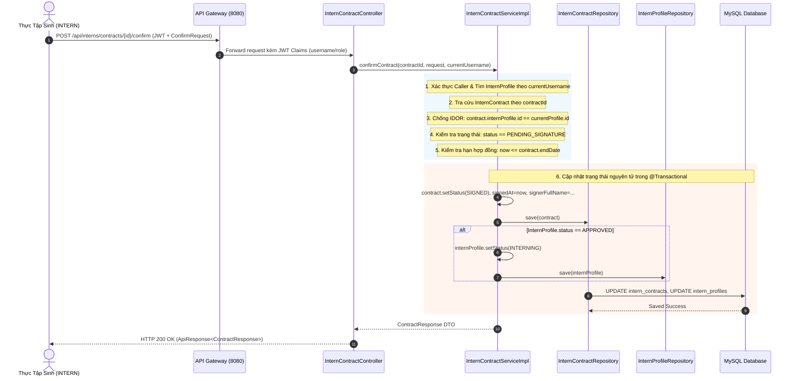

# Specification: Xác Nhận Hợp Đồng Thực Tập (Internship Contract Confirmation by Intern)

> **Trạng thái:** IMPLEMENTED  
> **Lưu trữ tại:** `InternHub/docs/specs/TM-14-contract-confirm-spec.md`  
> **Áp dụng quy tắc:** [Persistent Spec & Change Rationale](file:///d:/Certificate_CodeGym/Module%206/InternHub/.agents/04-development-guide.md)

---

## 0. Nhật Ký Thay Đổi & Giải Trình Kỹ Thuật (Revision History & Change Rationale)

> [!IMPORTANT]
> **BẮT BUỘC ĐIỀN ĐẦY ĐỦ**: Bất kể khi nào Lập trình viên hay AI Agent thay đổi mã nguồn ảnh hưởng đến logic, API, validation hay database (từ cấp độ L2 trở lên), **bắt buộc** phải ghi thêm một dòng vào bảng này để giải trình lý do trước khi coi nhiệm vụ là hoàn tất.

| Phiên bản | Ngày | Người thực hiện | Task / Jira | Loại thay đổi | Lý do & Giải trình kỹ thuật (Rationale) |
| :---: | :---: | :---: | :---: | :---: | :--- |
| **v1.0** | 2026-09-25 | AI Agent (Antigravity) | `TM-14` | Tạo mới | Thiết kế đặc tả chuẩn 14 phần cho tính năng xác nhận / từ chối hợp đồng thực tập dành cho vai trò Thực tập sinh (INTERN). |
| **v1.1** | 2026-09-29 | AI Agent (Antigravity) | `TM-14` | Triển khai mã nguồn | Triển khai hoàn chỉnh toàn bộ 5 REST endpoints, Entity/DTO/Repo/Service, bảo mật chống IDOR, đồng bộ State Machine APPROVED -> INTERNING, ghi nhận Audit Action, và 20 unit test cases pass 100%. |
| **v1.2** | 2026-09-29 | AI Agent (Antigravity) | `TM-14` | Cập nhật logic & xử lý lỗi 404 | Bổ sung trạng thái ACTIVE vào ContractStatus, tối ưu truy vấn tìm hợp đồng theo userId/profileId/internCode, hoàn thiện lọc getMyActiveContract, validate rejectionReason >= 10 ký tự, và thêm bộ xử lý NoResourceFoundException trả về HTTP 404 trong GlobalExceptionHandler. |

---

## 1. Feature Overview (Tổng Quan Tính Năng)
- **Feature Name:** Xác nhận hợp đồng thực tập (Internship Contract Confirmation by Intern)
- **Jira Ticket:** [TM-14](https://robluccibn9935.atlassian.net/browse/TM-14)
- **Target Microservice:** `intern-and-program-service` (Port 8082), `api-gateway` (Port 8080)
- **Target Users & Roles:**
  - `INTERN` (Chính): Thực tập sinh đã được cấp tài khoản, đọc điều khoản và ký xác nhận hoặc từ chối hợp đồng.
  - `HR`, `ADMIN` (Giám sát): Theo dõi tiến độ ký kết hợp đồng của ứng viên để chuẩn bị phân công Mentor ([TM-16](https://robluccibn9935.atlassian.net/browse/TM-16)).
- **Change Level:** **L3** (Mở rộng nghiệp vụ State Machine của `InternContract` và `InternProfile`, bổ sung các trường chữ ký điện tử/lý do từ chối, kiểm soát an ninh chống IDOR theo danh tính JWT, bổ sung DTO/Controller/Service methods, Audit Logging).

---

## 2. Business Goal & Core Objectives (Mục Tiêu Nghiệp Vụ)

Khép kín quy trình số hóa tuyển dụng và tiếp nhận thực tập sinh bắt đầu từ nộp hồ sơ ([TM-10]), duyệt hồ sơ ([TM-11]), gửi email thông báo ([TM-12]), tải lên hợp đồng ([TM-13]):
1. **Thiết lập cam kết pháp lý hai chiều (Two-Way Legal Agreement):**
   - Sau khi HR tải lên hợp đồng ở [TM-13](file:///d:/Module_6/InternHub/docs/specs/TM-13-contract-upload-spec.md) với trạng thái `PENDING_SIGNATURE`, ứng viên cần chủ động truy cập, rà soát điều khoản và thực hiện ký cam kết điện tử (Digital Confirmation/Sign) trước khi bắt đầu kỳ thực tập chính thức.
2. **Tự động chuyển đổi vòng đời thực tập sinh (Automated Lifecycle Transition):**
   - Khi hợp đồng được thực tập sinh ký xác nhận thành công (`ContractStatus.SIGNED`), hồ sơ `InternProfile` sẽ tự động chuyển từ trạng thái `APPROVED` sang `INTERNING`. Đây là điều kiện tiên quyết để kích hoạt phân công Mentor và tiếp nhận vào các dự án/chương trình đào tạo ([TM-16]).
3. **Quyền phản hồi & từ chối minh bạch (Candidate Empowerment & Rejection Handling):**
   - Trường hợp ứng viên không đồng ý với các điều khoản (thời gian, trợ cấp, cam kết) hoặc thay đổi kế hoạch cá nhân, hệ thống cho phép ứng viên từ chối ký kèm theo lý do bắt buộc (`rejectionReason`). Hợp đồng sẽ chuyển sang `TERMINATED` (hoặc `REJECTED_BY_INTERN`), giúp HR nắm bắt nguyên nhân kịp thời để đàm phán lại hoặc đóng hồ sơ.
4. **Bảo mật danh tính & Chống giả mạo truy cập (Strict IDOR Prevention & Anti-Tampering):**
   - Hợp đồng chứa các điều khoản nhạy cảm (mức trợ cấp, thông tin cá nhân). Hệ thống bắt buộc kiểm tra định danh `userId` hoặc `email`/`username` từ JWT Token đối chiếu với `InternProfile` sở hữu hợp đồng. Tuyệt đối ngăn chặn hành vi xem trộm hoặc xác nhận thay hợp đồng của người khác.
5. **Lưu vết kiểm toán toàn vẹn (Full Audit Trail & Non-Repudiation):**
   - Ghi nhận chi tiết thời điểm xác nhận (`signedAt`), họ tên cam kết (`signerFullName`), ghi chú của thực tập sinh (`internConfirmationNote`), và IP/User Agent qua hệ thống Audit Log phục vụ đối soát pháp lý nội bộ.

---

## 3. Scope of Work (Phạm Vi Tính Năng)

### 3.1. Trong phạm vi (In Scope)
- **API Tra cứu hợp đồng của cá nhân (My Contracts):**
  - `GET /api/interns/contracts/my-contracts`: Lấy danh sách toàn bộ hợp đồng thuộc về thực tập sinh đang đăng nhập (sắp xếp mới nhất lên đầu).
  - `GET /api/interns/contracts/my-contracts/active`: Lấy hợp đồng đang chờ ký (`PENDING_SIGNATURE`) hoặc hợp đồng đang có hiệu lực gần nhất của thực tập sinh.
- **API Xem chi tiết hợp đồng:**
  - `GET /api/interns/contracts/{contractId}`: Lấy chi tiết thông tin hợp đồng và trạng thái ký kết (có kiểm tra quyền sở hữu).
- **API Xác nhận ký hợp đồng (Confirm / Sign Contract):**
  - `POST /api/interns/contracts/{contractId}/confirm`: Thực tập sinh xác nhận đồng ý các điều khoản, gửi kèm họ tên cam kết và ghi chú (tùy chọn).
- **API Từ chối hợp đồng (Decline / Reject Contract):**
  - `POST /api/interns/contracts/{contractId}/reject`: Thực tập sinh từ chối ký hợp đồng, gửi kèm lý do từ chối bắt buộc.
- **State Machine Synchronization:**
  - Cập nhật `InternContract`: `PENDING_SIGNATURE` $\rightarrow$ `SIGNED` (nếu đồng ý) hoặc `TERMINATED` / `REJECTED_BY_INTERN` (nếu từ chối).
  - Cập nhật `InternProfile`: `APPROVED` $\rightarrow$ `INTERNING` khi ký thành công.
- **Validation nghiệp vụ:**
  - Hợp đồng phải đang ở trạng thái `PENDING_SIGNATURE`.
  - Ngày xác nhận phải $\le$ `endDate` của hợp đồng.
  - Caller phải là chủ sở hữu hợp đồng (`internProfile.userId == currentUserId` hoặc `internProfile.email == currentUsername`).
  - Họ tên người ký `signerFullName` bắt buộc khi confirm.
  - Lý do từ chối `rejectionReason` bắt buộc khi reject (tối thiểu 10 ký tự, tối đa 1000 ký tự).
- **Audit Logging:** Ghi nhận sự kiện `@Auditable(action = AuditAction.CONFIRM_CONTRACT, module = AuditModule.DOCUMENT)` hoặc `REJECT_CONTRACT`.

### 3.2. Ngoài phạm vi (Out of Scope - *Ngăn chặn suy diễn sai*)
- **Không tích hợp dịch vụ chứng thư số công cộng bên thứ ba (VNPT-CA, Viettel CA, DocuSign, SmartCA):** Ở giai đoạn này sử dụng cơ chế xác nhận cam kết điện tử nội bộ (Digital Acceptance / Checkbox & Signer Confirmation with Timestamp & Audit Trail).
- **Không chỉnh sửa hoặc đóng dấu watermark/ảnh chữ ký trực tiếp vào file PDF gốc:** File PDF giữ nguyên như bản HR tải lên ở TM-13.
- **Không tự động phân công Mentor sau khi ký:** Việc phân công Mentor thuộc ticket [TM-16](https://robluccibn9935.atlassian.net/browse/TM-16).
- **Không gửi email sau khi ký hợp đồng:** Sẽ được kích hoạt qua hệ thống thông báo hoặc ticket sự kiện tiếp theo.

---

## 4. Potential Logic Loopholes & Mitigations (Tối thiểu 6 Edge Cases Cốt Lõi)

### 4.1. Case 1: Lỗ hổng IDOR - Ký hoặc xem trộm hợp đồng của thực tập sinh khác (Insecure Direct Object Reference)
- **Vấn đề:** Một Intern A đã đăng nhập hợp lệ, nhưng thay đổi `contractId` trên URL/body thành ID hợp đồng của Intern B để xem lén mức phụ cấp hoặc cố ý bấm ký/từ chối thay.
- **Giải pháp:** Service Layer bắt buộc trích xuất thông tin người dùng từ `Authentication` (qua `currentUsername` hoặc `currentUserId`). Tra cứu `InternProfile` tương ứng và kiểm tra:
  ```java
  if (!contract.getInternProfile().getId().equals(currentInternProfile.getId())) {
      throw new AccessDeniedException("Bạn không có quyền thao tác trên hợp đồng này");
  }
  ```
  Trả về HTTP `403 Forbidden`.

### 4.2. Case 2: Xung đột trạng thái - Ký lại hợp đồng đã ký hoặc đã chấm dứt (State Machine Conflict / Double-Signing)
- **Vấn đề:** Thực tập sinh đã ký thành công (`SIGNED`), hoặc hợp đồng đã bị chấm dứt (`TERMINATED`), nhưng người dùng nhấn F5 hoặc gửi lại request xác nhận.
- **Giải pháp:** Service kiểm tra `contract.getStatus()`. Nếu trạng thái hiện tại khác `ContractStatus.PENDING_SIGNATURE`:
  - Ném `BadRequestException("Hợp đồng này không ở trạng thái chờ ký (Trạng thái hiện tại: " + contract.getStatus() + ")")`.
  - Trả về HTTP `400 Bad Request`.

### 4.3. Case 3: Xác nhận hợp đồng đã quá hạn hiệu lực (Expired Contract Confirmation)
- **Vấn đề:** HR tải lên hợp đồng với `endDate = 2026-09-20`, nhưng đến ngày `2026-09-25` thực tập sinh mới vào xác nhận.
- **Giải pháp:** Kiểm tra ngày hiện tại so với `endDate` của hợp đồng:
  ```java
  if (LocalDate.now().isAfter(contract.getEndDate())) {
      contract.setStatus(ContractStatus.EXPIRED);
      internContractRepository.save(contract);
      throw new BadRequestException("Hợp đồng này đã hết hạn hiệu lực vào ngày " + contract.getEndDate() + ". Vui lòng liên hệ HR để nhận hợp đồng mới.");
  }
  ```
  Tự động cập nhật hợp đồng sang `EXPIRED` và trả về HTTP `400 Bad Request`.

### 4.4. Case 4: Trạng thái hồ sơ thực tập sinh không hợp lệ (Invalid Intern Profile Status)
- **Vấn đề:** Hồ sơ thực tập sinh đã bị hủy tiếp nhận (`REJECTED`) sau khi upload hợp đồng, hoặc tài khoản đã bị vô hiệu hóa.
- **Giải pháp:** Kiểm tra `internProfile.getStatus()`. Chỉ cho phép xác nhận hợp đồng khi hồ sơ đang là `APPROVED` hoặc `INTERNING`. Nếu ở trạng thái khác, từ chối và ném `BadRequestException` (HTTP `400`).

### 4.5. Case 5: Race Condition / Double Submit đồng thời
- **Vấn đề:** Người dùng nhấn nút "Xác nhận ký" liên tiếp nhiều lần trong tích tắc (double-click) hoặc mạng chập chờn gửi 2 request song song.
- **Giải pháp:**
  - Đảm bảo method Service được đánh dấu `@Transactional`.
  - Sử dụng cơ chế kiểm tra điều kiện trạng thái atomic hoặc Optimistic Locking (`@Version` trên entity nếu cần) hoặc xử lý `select for update` / kiểm tra lại trạng thái trước khi save.
  - Phía Client khóa nút (disable button) ngay khi bấm gửi.

### 4.6. Case 6: Từ chối hợp đồng không có lý do hoặc lý do không hợp lệ (Invalid Rejection Reason)
- **Vấn đề:** Thực tập sinh bấm từ chối nhưng gửi body rỗng hoặc chuỗi ký tự vô nghĩa (khoảng trắng, dấu cách, text ngắn < 10 ký tự).
- **Giải pháp:** Bean Validation trên Request DTO:
  ```java
  @NotBlank(message = "Lý do từ chối hợp đồng không được để trống")
  @Size(min = 10, max = 1000, message = "Lý do từ chối phải từ 10 đến 1000 ký tự")
  private String rejectionReason;
  ```
  Nếu vi phạm, trả về HTTP `400 Bad Request` kèm thông báo lỗi chi tiết.

---

## 5. Functional Requirements (Yêu Cầu Chức Năng)

- **FR-1 (My Contracts List):** Cung cấp API `GET /api/interns/contracts/my-contracts` trả về danh sách toàn bộ hợp đồng thuộc về thực tập sinh đang đăng nhập, sắp xếp giảm dần theo thời gian tạo.
- **FR-2 (Contract Detail with Ownership Verification):** Cung cấp API `GET /api/interns/contracts/{contractId}` trả về chi tiết hợp đồng, thông tin đính kèm và trạng thái ký kết. Nếu caller là role `INTERN`, bắt buộc kiểm tra quyền sở hữu hợp đồng.
- **FR-3 (Confirm Contract Endpoint):** Cung cấp API `POST /api/interns/contracts/{contractId}/confirm` cho phép thực tập sinh xác nhận ký hợp đồng, lưu nhận `signedAt`, `signerFullName`, và `internConfirmationNote`.
- **FR-4 (Decline Contract Endpoint):** Cung cấp API `POST /api/interns/contracts/{contractId}/reject` cho phép thực tập sinh từ chối hợp đồng kèm lý do `rejectionReason`.
- **FR-5 (Contract Status Transition):**
  - Khi xác nhận thành công: Chuyển `InternContract.status` thành `SIGNED`.
  - Khi từ chối thành công: Chuyển `InternContract.status` thành `TERMINATED` (hoặc `REJECTED_BY_INTERN`).
- **FR-6 (Intern Profile Status Transition):**
  - Khi hợp đồng được chuyển thành `SIGNED`, nếu hồ sơ `InternProfile` đang ở trạng thái `APPROVED`, hệ thống tự động chuyển thành `INTERNING`.
  - Nếu hồ sơ đã ở trạng thái `INTERNING` (ví dụ ký phụ lục gia hạn), giữ nguyên `INTERNING`.
- **FR-7 (Audit Trail Recording):** Tự động ghi lại log kiểm toán với hành động `CONFIRM_CONTRACT` hoặc `REJECT_CONTRACT`, bao gồm thông tin hợp đồng, người thực hiện, thời gian và địa chỉ IP.

---

## 6. Business Rules (Quy Tắc Nghiệp Vụ)

- **BR-1 (Eligibility for Confirmation):** Chỉ có các hợp đồng ở trạng thái `PENDING_SIGNATURE` mới được phép thực hiện xác nhận hoặc từ chối.
- **BR-2 (Validity Period Check):** Ngày thực hiện xác nhận hợp đồng phải $\le$ `endDate` của hợp đồng. Nếu ngày hiện tại vượt quá `endDate`, hợp đồng tự động chuyển sang `EXPIRED` và không thể ký.
- **BR-3 (Signer Identity Binding):** Thời gian ký `signedAt` luôn được hệ thống tự động gán bằng `LocalDateTime.now()`. Client tuyệt đối không được tự ý can thiệp hoặc ghi đè thời gian này.
- **BR-4 (Legal Name Agreement):** Thực tập sinh phải nhập chính xác hoặc xác nhận họ tên ký cam kết (`signerFullName`). Độ dài từ 2 đến 100 ký tự.
- **BR-5 (Intern Profile Progression):** Ký hợp đồng là mốc chuyển giao pháp lý chính thức đưa ứng viên từ giai đoạn "Được duyệt hồ sơ" (`APPROVED`) sang "Đang thực tập chính thức" (`INTERNING`).
- **BR-6 (Rejection Reason Mandate):** Từ chối hợp đồng bắt buộc phải có giải trình lý do từ chối (`rejectionReason`) với độ dài tối thiểu 10 ký tự và tối đa 1000 ký tự để bộ phận HR lưu trữ và xử lý.
- **BR-7 (Immutability of Signed Contracts):** Hợp đồng sau khi đã chuyển sang trạng thái `SIGNED` hoặc `TERMINATED` là bất biến. Thực tập sinh không thể đảo ngược trạng thái. Mọi thay đổi tiếp theo phải do HR phát hành bản hợp đồng mới hoặc phụ lục qua TM-13.

---

## 7. Data Model (Mô Hình Dữ Liệu)

### 7.1. Cập Nhật Bảng MySQL (`intern_contracts`)
Bảng `intern_contracts` đã được tạo lập từ TM-13. Trong TM-14, bổ sung các cột phục vụ ghi nhận chữ ký và phản hồi của thực tập sinh:

| Tên cột | Kiểu dữ liệu | Ràng buộc | Mô tả |
| :--- | :--- | :--- | :--- |
| `signer_full_name` | `VARCHAR(100)` | `NULL` | Họ tên do thực tập sinh nhập khi xác nhận ký |
| `intern_confirmation_note` | `TEXT` | `NULL` | Ghi chú / lời nhắn của thực tập sinh khi xác nhận |
| `rejection_reason` | `TEXT` | `NULL` | Lý do từ chối nếu thực tập sinh không đồng ý ký |

### 7.2. Cập Nhật JPA Entity `InternContract`
```java
package org.example.internservice.intern.entity;

import jakarta.persistence.*;
import lombok.*;
import org.example.internservice.common.entity.BaseEntity;
import org.example.internservice.intern.entity.enums.ContractStatus;

import java.math.BigDecimal;
import java.time.LocalDate;
import java.time.LocalDateTime;

@Entity
@Table(name = "intern_contracts", indexes = {
        @Index(name = "idx_contract_intern", columnList = "intern_id"),
        @Index(name = "idx_contract_number", columnList = "contract_number"),
        @Index(name = "idx_contract_status", columnList = "status")
})
@Getter
@Setter
@NoArgsConstructor
@AllArgsConstructor
@Builder
public class InternContract extends BaseEntity {

    @ManyToOne(fetch = FetchType.LAZY)
    @JoinColumn(name = "intern_id", nullable = false)
    private InternProfile internProfile;

    @Column(name = "contract_number", nullable = false, unique = true, length = 50)
    private String contractNumber;

    @Column(name = "contract_title", nullable = false, length = 200)
    private String contractTitle;

    @Column(name = "start_date", nullable = false)
    private LocalDate startDate;

    @Column(name = "end_date", nullable = false)
    private LocalDate endDate;

    @Column(name = "allowance_amount", precision = 12, scale = 2)
    private BigDecimal allowanceAmount;

    @Enumerated(EnumType.STRING)
    @Column(name = "status", nullable = false, length = 30)
    @Builder.Default
    private ContractStatus status = ContractStatus.PENDING_SIGNATURE;

    @Column(name = "original_file_name", nullable = false)
    private String originalFileName;

    @Column(name = "file_name", nullable = false, unique = true)
    private String fileName;

    @Column(name = "file_path", nullable = false, length = 500)
    private String filePath;

    @Column(name = "file_size", nullable = false)
    private Long fileSize;

    @Column(name = "content_type", nullable = false, length = 100)
    private String contentType;

    @Column(name = "uploaded_by", nullable = false, length = 100)
    private String uploadedBy;

    @Column(name = "signed_at")
    private LocalDateTime signedAt;

    @Column(name = "signer_full_name", length = 100)
    private String signerFullName;

    @Column(name = "intern_confirmation_note", columnDefinition = "TEXT")
    private String internConfirmationNote;

    @Column(name = "rejection_reason", columnDefinition = "TEXT")
    private String rejectionReason;

    @Column(name = "notes", columnDefinition = "TEXT")
    private String notes;
}
```

### 7.3. Enum `ContractStatus` (Mở rộng nếu cần)
```java
package org.example.internservice.intern.entity.enums;

public enum ContractStatus {
    PENDING_SIGNATURE,      // Chờ thực tập sinh ký/xác nhận
    SIGNED,                 // Đã ký kết hợp lệ
    EXPIRED,                // Hết hạn hợp đồng mà chưa ký
    TERMINATED,             // Chấm dứt hoặc bị từ chối ký
    REJECTED_BY_INTERN      // Bị thực tập sinh từ chối ký (tùy chọn ánh xạ hoặc dùng TERMINATED)
}
```
> [!NOTE]
> Để tương thích tối đa với cấu trúc hiện tại, có thể dùng `TERMINATED` hoặc bổ sung `REJECTED_BY_INTERN`. Khuyến nghị: Bổ sung `REJECTED_BY_INTERN` vào enum để phân biệt rành mạch giữa việc thực tập sinh từ chối nhận việc và việc hủy hợp đồng trong quá trình thực tập (`TERMINATED`).

---

## 8. API Contract (Đặc Tả Giao Tiếp REST API)

### 8.1. API Lấy Danh Sách Hợp Đồng Của Tôi: `GET /api/interns/contracts/my-contracts`
- **Method:** `GET`
- **URL:** `/api/interns/contracts/my-contracts`
- **Authorization:** `Bearer <JWT_TOKEN>`
- **Phân quyền:** `@PreAuthorize("hasRole('INTERN')")`

#### Response Success (HTTP 200 OK):
```json
{
  "success": true,
  "message": "Lấy danh sách hợp đồng cá nhân thành công",
  "data": [
    {
      "id": 1,
      "internCode": "INT-202609-0001",
      "internFullName": "Nguyễn Văn A",
      "contractNumber": "HDTT-202609-0001",
      "contractTitle": "Hợp đồng thực tập kỹ thuật phần mềm",
      "startDate": "2026-10-01",
      "endDate": "2026-12-31",
      "allowanceAmount": 3000000.00,
      "status": "PENDING_SIGNATURE",
      "originalFileName": "hop_dong_thuc_tap_nguyen_van_a.pdf",
      "fileSize": 245120,
      "contentType": "application/pdf",
      "uploadedBy": "hr_manager",
      "signedAt": null,
      "signerFullName": null,
      "internConfirmationNote": null,
      "rejectionReason": null,
      "notes": "Hợp đồng thực tập 3 tháng đợt 2",
      "createdAt": "2026-09-23T16:30:00",
      "updatedAt": "2026-09-23T16:30:00"
    }
  ],
  "timestamp": "2026-09-25T16:30:00"
}
```

---

### 8.2. API Lấy Chi Tiết Hợp Đồng: `GET /api/interns/contracts/{contractId}`
- **Method:** `GET`
- **URL:** `/api/interns/contracts/{contractId}`
- **Authorization:** `Bearer <JWT_TOKEN>`
- **Phân quyền:** `@PreAuthorize("hasAnyRole('INTERN', 'HR', 'ADMIN', 'MENTOR')")`
- *Lưu ý:* Nếu caller là `INTERN`, kiểm tra hợp đồng thuộc về chính mình.

#### Response Success (HTTP 200 OK):
```json
{
  "success": true,
  "message": "Lấy chi tiết hợp đồng thành công",
  "data": {
    "id": 1,
    "internCode": "INT-202609-0001",
    "internFullName": "Nguyễn Văn A",
    "contractNumber": "HDTT-202609-0001",
    "contractTitle": "Hợp đồng thực tập kỹ thuật phần mềm",
    "startDate": "2026-10-01",
    "endDate": "2026-12-31",
    "allowanceAmount": 3000000.00,
    "status": "PENDING_SIGNATURE",
    "originalFileName": "hop_dong_thuc_tap_nguyen_van_a.pdf",
    "fileSize": 245120,
    "contentType": "application/pdf",
    "uploadedBy": "hr_manager",
    "signedAt": null,
    "signerFullName": null,
    "internConfirmationNote": null,
    "rejectionReason": null,
    "notes": "Hợp đồng thực tập 3 tháng đợt 2",
    "createdAt": "2026-09-23T16:30:00",
    "updatedAt": "2026-09-23T16:30:00"
  },
  "timestamp": "2026-09-25T16:30:00"
}
```

---

### 8.3. API Xác Nhận Ký Hợp Đồng: `POST /api/interns/contracts/{contractId}/confirm`
- **Method:** `POST`
- **URL:** `/api/interns/contracts/{contractId}/confirm`
- **Content-Type:** `application/json`
- **Authorization:** `Bearer <JWT_TOKEN>`
- **Phân quyền:** `@PreAuthorize("hasRole('INTERN')")`

#### Request Body JSON:
```json
{
  "agreeTerms": true,
  "signerFullName": "Nguyễn Văn A",
  "confirmationNote": "Em đã đọc kỹ và đồng ý với tất cả điều khoản hợp đồng thực tập."
}
```

#### Bảng Tham Số Request Body:
| Field | Type | Bắt buộc | Ràng buộc | Mô tả |
| :--- | :--- | :---: | :--- | :--- |
| `agreeTerms` | `Boolean` | **Có** | Phải là `true` | Checkbox xác nhận cam kết đồng ý |
| `signerFullName` | `String` | **Có** | 2 - 100 ký tự | Họ tên xác nhận chữ ký điện tử |
| `confirmationNote` | `String` | Không | Tối đa 1000 ký tự | Lời nhắn / ghi chú thêm từ thực tập sinh |

#### Response Success (HTTP 200 OK):
```json
{
  "success": true,
  "message": "Xác nhận ký hợp đồng thực tập thành công",
  "data": {
    "id": 1,
    "internCode": "INT-202609-0001",
    "internFullName": "Nguyễn Văn A",
    "contractNumber": "HDTT-202609-0001",
    "contractTitle": "Hợp đồng thực tập kỹ thuật phần mềm",
    "startDate": "2026-10-01",
    "endDate": "2026-12-31",
    "allowanceAmount": 3000000.00,
    "status": "SIGNED",
    "originalFileName": "hop_dong_thuc_tap_nguyen_van_a.pdf",
    "fileSize": 245120,
    "contentType": "application/pdf",
    "uploadedBy": "hr_manager",
    "signedAt": "2026-09-25T16:35:00",
    "signerFullName": "Nguyễn Văn A",
    "internConfirmationNote": "Em đã đọc kỹ và đồng ý với tất cả điều khoản hợp đồng thực tập.",
    "rejectionReason": null,
    "notes": "Hợp đồng thực tập 3 tháng đợt 2",
    "internProfileStatus": "INTERNING",
    "createdAt": "2026-09-23T16:30:00",
    "updatedAt": "2026-09-25T16:35:00"
  },
  "timestamp": "2026-09-25T16:35:00"
}
```

#### Response Error 400 Bad Request:
```json
{
  "success": false,
  "message": "Hợp đồng không ở trạng thái chờ ký hoặc đã hết hạn",
  "errors": ["Hợp đồng HDTT-202609-0001 hiện đang ở trạng thái SIGNED, không thể ký lại"],
  "timestamp": "2026-09-25T16:35:00"
}
```

#### Response Error 403 Forbidden:
```json
{
  "success": false,
  "message": "Bạn không có quyền thao tác trên hợp đồng này",
  "errors": ["Truy cập bị từ chối: Hợp đồng không thuộc về hồ sơ thực tập sinh của bạn"],
  "timestamp": "2026-09-25T16:35:00"
}
```

#### Response Error 404 Not Found:
```json
{
  "success": false,
  "message": "Không tìm thấy hợp đồng với ID: 999",
  "errors": ["Tài nguyên không tồn tại"],
  "timestamp": "2026-09-25T16:35:00"
}
```

---

### 8.4. API Từ Chối Hợp Đồng: `POST /api/interns/contracts/{contractId}/reject`
- **Method:** `POST`
- **URL:** `/api/interns/contracts/{contractId}/reject`
- **Content-Type:** `application/json`
- **Authorization:** `Bearer <JWT_TOKEN>`
- **Phân quyền:** `@PreAuthorize("hasRole('INTERN')")`

#### Request Body JSON:
```json
{
  "rejectionReason": "Do thời gian thực tập trùng với lịch thi tốt nghiệp tại trường nên em xin phép không thể tham gia kỳ thực tập đợt này."
}
```

#### Bảng Tham Số Request Body:
| Field | Type | Bắt buộc | Ràng buộc | Mô tả |
| :--- | :--- | :---: | :--- | :--- |
| `rejectionReason` | `String` | **Có** | 10 - 1000 ký tự | Lý do từ chối ký hợp đồng |

#### Response Success (HTTP 200 OK):
```json
{
  "success": true,
  "message": "Đã ghi nhận từ chối hợp đồng thực tập",
  "data": {
    "id": 1,
    "internCode": "INT-202609-0001",
    "internFullName": "Nguyễn Văn A",
    "contractNumber": "HDTT-202609-0001",
    "contractTitle": "Hợp đồng thực tập kỹ thuật phần mềm",
    "startDate": "2026-10-01",
    "endDate": "2026-12-31",
    "allowanceAmount": 3000000.00,
    "status": "REJECTED_BY_INTERN",
    "originalFileName": "hop_dong_thuc_tap_nguyen_van_a.pdf",
    "fileSize": 245120,
    "contentType": "application/pdf",
    "uploadedBy": "hr_manager",
    "signedAt": null,
    "signerFullName": null,
    "internConfirmationNote": null,
    "rejectionReason": "Do thời gian thực tập trùng với lịch thi tốt nghiệp tại trường nên em xin phép không thể tham gia kỳ thực tập đợt này.",
    "notes": "Hợp đồng thực tập 3 tháng đợt 2",
    "createdAt": "2026-09-23T16:30:00",
    "updatedAt": "2026-09-25T16:40:00"
  },
  "timestamp": "2026-09-25T16:40:00"
}
```

---

## 9. Core Flow / Enforcement Flow (Luồng Xử Lý Cốt Lõi)

### 9.1. Sơ Đồ Trình Tự Xác Nhận Ký Hợp Đồng


### 9.2. Các Bước Thực Thi Chi Tiết:
1. **Bước 1 (Xác thực & Trích xuất danh tính):** Request đi qua Gateway, `JwtAuthenticationFilter` phân giải Token và thiết lập `SecurityContext`. Controller đón nhận request với `@PreAuthorize("hasRole('INTERN')")`.
2. **Bước 2 (Tìm hồ sơ thực tập sinh):** Service lấy `currentUsername` (từ `Authentication.getName()`), tra cứu `InternProfile` qua email hoặc userId liên kết. Nếu không tìm thấy hồ sơ $\rightarrow$ ném `ResourceNotFoundException("Không tìm thấy hồ sơ thực tập sinh liên kết với tài khoản này")`.
3. **Bước 3 (Tra cứu hợp đồng & Chống IDOR):** Tìm hợp đồng theo `contractId` (sử dụng query `findByIdWithProfile`). Nếu không tồn tại $\rightarrow$ HTTP 404. So khớp `contract.getInternProfile().getId()` với `currentProfile.getId()`. Nếu không trùng $\rightarrow$ ném `AccessDeniedException` (HTTP 403).
4. **Bước 4 (Validate trạng thái & Thời hạn):**
   - Nếu `contract.getStatus() != ContractStatus.PENDING_SIGNATURE` $\rightarrow$ ném `BadRequestException` (HTTP 400).
   - Nếu `LocalDate.now().isAfter(contract.getEndDate())` $\rightarrow$ cập nhật `contract.setStatus(EXPIRED)` và ném `BadRequestException` (HTTP 400).
5. **Bước 5 (Cập nhật hợp đồng):**
   - Đặt `contract.setStatus(ContractStatus.SIGNED)`.
   - Đặt `contract.setSignedAt(LocalDateTime.now())`.
   - Đặt `contract.setSignerFullName(request.getSignerFullName().trim())`.
   - Đặt `contract.setInternConfirmationNote(request.getConfirmationNote())`.
   - Lưu qua `internContractRepository.save(contract)`.
6. **Bước 6 (Đồng bộ trạng thái hồ sơ thực tập sinh):**
   - Nếu `internProfile.getStatus() == InternStatus.APPROVED`: chuyển sang `InternStatus.INTERNING` và lưu qua `internProfileRepository.save(internProfile)`.
7. **Bước 7 (Ghi nhận Audit Log & Trả về kết quả):** Hệ thống ghi nhận sự kiện kiểm toán và trả về `ContractResponse` bọc trong `ApiResponse.success(200, "Xác nhận ký hợp đồng thực tập thành công", response)`.

---

## 10. Non-Functional Requirements & Constraints

- **Công nghệ áp dụng:** Java 17/21, Spring Boot 3.x, Spring Data JPA, Hibernate, Spring Security JWT.
- **Ranh giới Microservices (Boundary Isolation):** Toàn bộ logic xác nhận hợp đồng nằm trong `intern-and-program-service` (Port 8082). Tuyệt đối không can thiệp mã nguồn Frontend (`InternHub-Frontend/`).
- **An toàn giao dịch (@Transactional):** Các thao tác cập nhật đồng bộ giữa `InternContract` và `InternProfile` phải nằm trong một giao dịch cơ sở dữ liệu duy nhất (`@Transactional`) để đảm bảo tính toàn vẹn (ACID). Nếu một bước lỗi, toàn bộ thao tác phải được rollback.
- **Phòng chống N+1 Query:** Khi truy xuất hợp đồng để kiểm tra quyền sở hữu, sử dụng `JOIN FETCH c.internProfile` đã có trong `findByIdWithProfile` để tránh LazyInitializationException và N+1 Query.
- **Tiêu chuẩn Anti-God-Class:** Duy trì kích thước `InternContractController` và `InternContractServiceImpl` dưới 300 dòng code. Các logic validate điều kiện chuyển trạng thái có thể tách helper method rõ ràng.
- **Constructor Injection:** Khai báo dependencies dạng `private final` kết hợp `@RequiredArgsConstructor` của Lombok, tuyệt đối không dùng `@Autowired` trên field.

---

## 11. Acceptance Criteria Checklist (Tiêu Chí Chấp Nhận)

- [x] **AC-1 (Lấy danh sách hợp đồng cá nhân thành công):** Thực tập sinh đăng nhập gọi `GET /api/interns/contracts/my-contracts` nhận được danh sách đúng các hợp đồng của chính mình với HTTP 200 OK.
- [x] **AC-2 (Ký xác nhận hợp đồng thành công):** Thực tập sinh gửi request hợp lệ tới `POST /api/interns/contracts/{contractId}/confirm` $\rightarrow$ Hợp đồng đổi sang `SIGNED`, `signedAt` được cập nhật, và nhận về HTTP 200 OK.
- [x] **AC-3 (Đồng bộ chuyển trạng thái Intern sang INTERNING):** Khi hợp đồng được ký, hồ sơ `InternProfile` đang ở `APPROVED` tự động chuyển thành `INTERNING`.
- [x] **AC-4 (Chặn IDOR - Không cho ký hợp đồng người khác):** Thực tập sinh A cố tình gọi API xác nhận hợp đồng của Thực tập sinh B $\rightarrow$ Hệ thống chặn lại và trả về HTTP 403 Forbidden.
- [x] **AC-5 (Chặn ký lại hợp đồng đã ký):** Thực hiện ký trên hợp đồng đã ở trạng thái `SIGNED` $\rightarrow$ Nhận HTTP 400 Bad Request kèm thông báo lỗi rõ ràng.
- [x] **AC-6 (Chặn ký hợp đồng đã hết hạn):** Thực hiện ký trên hợp đồng có `endDate < now` $\rightarrow$ Hợp đồng chuyển sang `EXPIRED`, nhận HTTP 400 Bad Request.
- [x] **AC-7 (Từ chối ký hợp đồng thành công):** Thực tập sinh gửi lý do từ chối hợp lệ tới `POST /api/interns/contracts/{contractId}/reject` $\rightarrow$ Hợp đồng chuyển sang `REJECTED_BY_INTERN` hoặc `TERMINATED`, nhận HTTP 200 OK.
- [x] **AC-8 (Chặn từ chối khi lý do không hợp lệ):** Gửi lý do từ chối rỗng hoặc dưới 10 ký tự $\rightarrow$ Nhận HTTP 400 Bad Request kèm message validate.
- [x] **AC-9 (Bảo vệ RBAC):** Người dùng không có vai trò `INTERN` (ví dụ tài khoản khách hoặc chưa đăng nhập) gọi API confirm/reject $\rightarrow$ Nhận HTTP 401 Unauthorized hoặc HTTP 403 Forbidden.
- [x] **AC-10 (Kiểm toán hệ thống):** Thao tác xác nhận hoặc từ chối hợp đồng đều được lưu vết đầy đủ trong bảng `audit_logs`.

---

## 12. Unit & Integration Test Cases Checklist

- [x] **UT-BE-01:** `confirmContract_validRequest_shouldSignSuccessfullyAndSetInterning()`: Xác nhận hợp đồng hợp lệ, chuyển `SIGNED` và `INTERNING`.
- [x] **UT-BE-02:** `confirmContract_otherUserContract_shouldThrowAccessDeniedException()`: Thử ký hợp đồng của người khác, ném `AccessDeniedException`.
- [x] **UT-BE-03:** `confirmContract_alreadySignedContract_shouldThrowBadRequestException()`: Thử ký hợp đồng đã `SIGNED`, ném `BadRequestException`.
- [x] **UT-BE-04:** `confirmContract_expiredContract_shouldTransitionToExpiredAndThrowBadRequestException()`: Thử ký hợp đồng đã quá hạn `endDate`, ném `BadRequestException`.
- [x] **UT-BE-05:** `confirmContract_notFoundContractId_shouldThrowResourceNotFoundException()`: ID hợp đồng không tồn tại, ném `ResourceNotFoundException`.
- [x] **UT-BE-06:** `rejectContract_validReason_shouldRejectSuccessfully()`: Từ chối hợp đồng kèm lý do hợp lệ, chuyển sang `REJECTED_BY_INTERN`.
- [x] **UT-BE-07:** `rejectContract_otherUserContract_shouldThrowAccessDeniedException()`: Từ chối hợp đồng của người khác, ném `AccessDeniedException`.
- [x] **UT-BE-08:** `getMyContracts_validIntern_shouldReturnOnlyOwnContracts()`: Lấy danh sách hợp đồng cá nhân chính xác.
- [x] **UT-BE-09:** `getContractById_asInternOwner_shouldReturnContractDetails()`: Xem chi tiết hợp đồng của chính mình thành công.
- [x] **UT-BE-10:** `getContractById_asInternNonOwner_shouldThrowAccessDeniedException()`: Xem chi tiết hợp đồng người khác bị chặn 403.

---

## 13. Implementation Checklist (Danh Sách File Triển Khai)

- [x] **Database & Migration:**
  - Script SQL bổ sung các cột `signer_full_name`, `intern_confirmation_note`, `rejection_reason` vào bảng `intern_contracts` (tự động qua JPA schema update).
- [x] **Enum:**
  - `intern/entity/enums/ContractStatus.java` (Bổ sung `REJECTED_BY_INTERN`).
- [x] **Entity:**
  - Cập nhật `intern/entity/InternContract.java` (thêm các trường `signerFullName`, `internConfirmationNote`, `rejectionReason`).
- [x] **DTOs:**
  - `intern/dto/request/ConfirmContractRequest.java`
  - `intern/dto/request/RejectContractRequest.java`
  - Cập nhật `intern/dto/response/ContractResponse.java` (thêm `signerFullName`, `internConfirmationNote`, `rejectionReason`, `internProfileStatus`).
- [x] **Repository:**
  - Cập nhật `intern/repository/InternContractRepository.java` (thêm phương thức `findAllByUserIdOrEmailWithProfile`).
- [x] **Service:**
  - Cập nhật `intern/service/InternContractService.java`
  - Cập nhật `intern/service/impl/InternContractServiceImpl.java` (thêm `confirmContract`, `rejectContract`, `getMyContracts`, `getMyActiveContract`, `getContractById`).
- [x] **Controller:**
  - Cập nhật `intern/controller/InternContractController.java` (bổ sung các endpoints `confirm`, `reject`, `my-contracts`, `my-contracts/active`, `{contractId}`).
- [x] **Audit Enum:**
  - Cập nhật `AuditAction.java` thêm `CONFIRM_CONTRACT`, `REJECT_CONTRACT`.
- [x] **Unit Tests:**
  - Bổ sung 10 test cases cho `InternContractServiceTest.java`.
