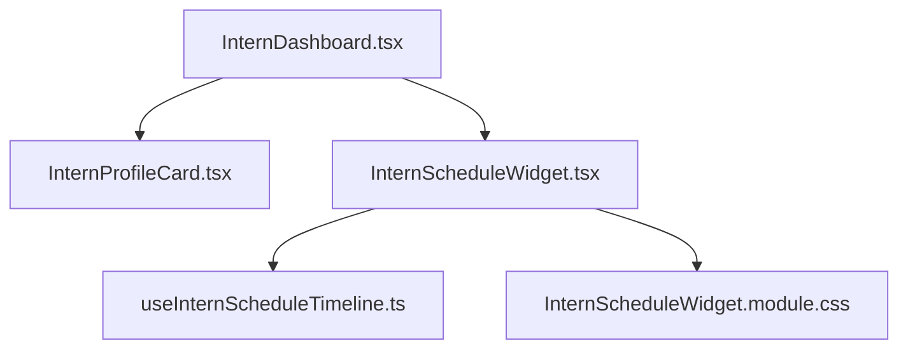

# Kế Hoạch Triển Khai Kỹ Thuật (Implementation Plan) - TM-17: Tra Cứu Lịch & Lộ Trình Thực Tập

## 1. Mục Tiêu & Phạm Vi (Goals & Scope)
- Triển khai giao diện tra cứu lịch và tiến độ thực tập trực quan cho Thực tập sinh ngay trên trang Dashboard chính (`/intern/dashboard`).
- Đảm bảo tuân thủ các tiêu chuẩn: Clean Code, Senior Frontend patterns (Custom Hooks, Timezone safety), UI/UX Design System đồng bộ, và Web Accessibility (WCAG 2.1 AA).

---

## 2. Thiết Kế Kiến Trúc & Component (Architecture & Component Design)

### Các Thành Phần Triển Khai:
1. **Hook `useInternScheduleTimeline.ts`**:
   - Đảm nhận toàn bộ toán học thời gian (epoch difference, tuần thực tập, tỷ lệ % hoàn thành).
   - Tự động normalize ngày tháng dạng `YYYY-MM-DD` theo Giờ cục bộ (Local Time) tránh lỗi lệch ngày UTC.
   - Trả về danh sách `Milestone[]` động với các cờ `isDone`, `isCurrent`.
2. **Component `InternScheduleWidget.tsx`**:
   - Khối tiêu đề với biểu tượng lịch và Badge trạng thái động (`badge-sky`, `badge-warning`, `badge-success`).
   - Khối tiến độ: Thanh `progressbar` đạt chuẩn ARIA với `role`, `aria-valuenow`, `aria-valuemin`, `aria-valuemax`.
   - Lưới 4 ô thống kê: Ngày bắt đầu, Ngày kết thúc, Tổng số tuần/ngày, Số ngày còn lại.
   - Bố cục 2 cột (Responsive Grid):
     - Cột trái: Lịch làm việc & hướng dẫn cố định hàng tuần (giờ hành chính, lịch review 1:1 với Mentor).
     - Cột phải: Lộ trình 4 cột mốc (Onboarding $\rightarrow$ Kỹ thuật $\rightarrow$ Dự án $\rightarrow$ Nghiệm thu).
3. **Styles `InternScheduleWidget.module.css`**:
   - Sử dụng CSS Variables chung của Design System (`var(--bg-card)`, `var(--text-main)`, `var(--border-default)`).
   - Đảm bảo tỷ lệ tương phản chữ đạt tối thiểu 4.5:1 (WCAG AA).

---

## 3. Danh Sách Công Việc & Tiến Trình Triển Khai (Phased Rollout)

- [x] **Giai đoạn 1**: Đặc tả yêu cầu kỹ thuật (`TM-17-view-intern-schedule-spec.md`).
- [x] **Giai đoạn 2**: Lập kế hoạch chi tiết (`TM-17-view-intern-schedule-plan.md`).
- [x] **Giai đoạn 3**: Xây dựng Hook logic thời gian `useInternScheduleTimeline.ts`.
- [x] **Giai đoạn 4**: Xây dựng Widget UI và CSS Module (`InternScheduleWidget.tsx`, `InternScheduleWidget.module.css`).
- [x] **Giai đoạn 5**: Tích hợp vào `InternDashboard.tsx`.
- [x] **Giai đoạn 6**: Kiểm thử Typecheck (`tsc -b`), Build Vite, và Audit Accessibility (a11y).
