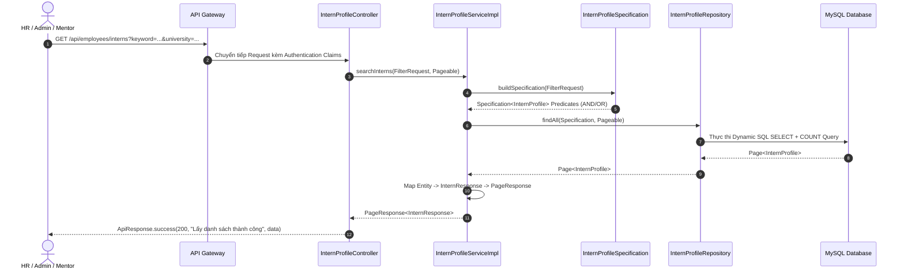

# Specification: Tìm Kiếm và Lọc Hồ Sơ Thực Tập Sinh (Search & Filter Intern Profiles)

---

## 1. Feature Overview (Tổng Quan Tính Năng)
- **Feature Name:** Tìm kiếm và lọc hồ sơ thực tập sinh theo trường/ngành/từ khóa/trạng thái (Search & Filter Intern Profiles)
- **Jira Ticket:** [TM-3](https://robluccibn9935.atlassian.net/browse/TM-3)
- **Target Subsystems:** `employee-service` (Backend Microservice), `api-gateway` (Routing & Authentication)
- **Target Users:** HR (Nhân sự), Quản trị viên (Admin), Mentor (Người hướng dẫn)
- **Phân loại thay đổi (Change Level):** **L3** (Ảnh hưởng REST API, JPA Specification Query DSL, Pagination, Security Phân quyền & Index Database)

---

## 2. Business Goal & Core Objectives (Mục Tiêu Nghiệp Vụ)
Cung cấp giải pháp tìm kiếm và phân loại hồ sơ thực tập sinh tập trung, nhanh chóng và chính xác cho bộ phận nhân sự và quản lý:
1. **Tìm kiếm đa tiêu chí linh hoạt:**
   - Hỗ trợ tìm kiếm toàn văn / gần đúng (`LIKE %keyword%` không phân biệt hoa thường) theo các trường định danh quan trọng: **Họ và tên (`fullName`)**, **Email (`email`)**, **Số điện thoại (`phone`)**, và **Mã thực tập sinh (`internCode`)**.
2. **Bộ lọc chuyên sâu (Faceted Filters):**
   - Lọc chính xác hoặc theo từ khóa đối với **Trường đại học (`university`)** và **Chuyên ngành đào tạo (`major`)**.
   - Lọc theo **Vị trí thực tập ứng tuyển (`appliedPosition`)**.
   - Lọc theo **Trạng thái hồ sơ (`status`)**: `PENDING`, `APPROVED`, `INTERNING`, `COMPLETED`, `REJECTED`.
3. **Phân trang và Sắp xếp chuẩn hóa (Standard Pagination & Sorting):**
   - Hỗ trợ phân trang linh hoạt (`page`, `size`) giúp tối ưu hiệu năng và băng thông, ngăn chặn tình trạng tràn bộ nhớ (OOM) khi số lượng hồ sơ lớn.
   - Hỗ trợ sắp xếp linh hoạt (`sort=field,asc|desc`), mặc định sắp xếp theo `createdAt,desc` (hồ sơ mới nhất hiển thị trước).
4. **Bảo mật và Kiểm soát truy cập (Access Control):**
   - Cho phép các vai trò có quyền quản lý và theo dõi thực tập sinh (`HR`, `ADMIN`, `MENTOR`) truy cập tra cứu dữ liệu (`@PreAuthorize("hasAnyRole('HR', 'ADMIN', 'MENTOR')")`).
5. **Định dạng dữ liệu trả về nhất quán:**
   - Trả về cấu trúc phân trang chuẩn `PageResponse<InternResponse>` bọc trong `ApiResponse<T>`, không làm lộ JPA Entity ra ngoài.

---

## 3. Potential Logic Loopholes & Mitigations (6 Edge Cases Cốt Lõi)

### 3.1. Case 1: SQL / Parameter Injection & Whitelist Sorting Fields
- **Vấn đề:** Người dùng truyền các tham số sắp xếp không an toàn hoặc tên thuộc tính không tồn tại trong Entity (ví dụ: `sort=password,desc` hoặc `sort=invalidField,asc`) gây lỗi `PropertyReferenceException` (500 Internal Server Error) hoặc lỗ hổng bảo mật.
- **Khắc phục:** Xây dựng cơ chế kiểm tra / sanitize danh sách các trường được phép sắp xếp (Allowed Sort Fields: `createdAt`, `updatedAt`, `fullName`, `internCode`, `university`, `major`, `appliedPosition`, `status`). Nếu truyền field không hợp lệ, fallback an toàn về `createdAt,desc`.

### 3.2. Case 2: Phân trang vượt quá tổng số trang (Page Out of Bounds)
- **Vấn đề:** Yêu cầu `page=9999` trong khi tổng dữ liệu chỉ có 2 trang.
- **Khắc phục:** Spring Data JPA trả về Page rỗng (`content = []`, `totalElements` giữ nguyên). Hệ thống trả về HTTP `200 OK` kèm `items: []`, `totalItems: N`, `totalPages: M`, không ném Exception.

### 3.3. Case 3: Denial of Service qua tham số kích thước trang (`pageSize`) cực lớn
- **Vấn đề:** Client truyền `size=1000000` làm ứng dụng tải toàn bộ database vào RAM gây quá tải bộ nhớ (OOM).
- **Khắc phục:** Ràng buộc `size` tối đa (Hard Limit `MAX_PAGE_SIZE = 100`). Nếu client truyền `size <= 0` đặt về `10`, nếu `size > 100` tự động gán về `100`.

### 3.4. Case 4: Ký tự đặc biệt trong từ khóa tìm kiếm (Wildcard Escaping)
- **Vấn đề:** Keyword chứa ký tự đại diện SQL như `%`, `_`, `\` khiến câu truy vấn LIKE quét sai hoặc lỗi cú pháp.
- **Khắc phục:** Sử dụng JPA Criteria API / Specification với `builder.lower()` và tự động escape các ký tự đặc biệt `%` và `_` trước khi đưa vào biểu thức `builder.like()`.

### 3.5. Case 5: Chuỗi tìm kiếm toàn khoảng trắng (Whitespace Keyword)
- **Vấn đề:** Client gửi `keyword="   "`, `university="  "` dẫn đến sinh mệnh đề điều kiện thừa làm chậm câu query.
- **Khắc phục:** Áp dụng `StringUtils.hasText(param)` để cắt tỉa (trim) và chỉ thêm Predicate vào `Specification` khi param thực sự có nội dung hợp lệ.

### 3.6. Case 6: Kết hợp đồng thời nhiều bộ lọc rỗng kết quả
- **Vấn đề:** Kết hợp bộ lọc không tìm thấy kết quả nào (ví dụ `university=BachKhoa` và `major=YDaKhoa`).
- **Khắc phục:** Trả về kết quả phân trang chuẩn với danh sách `items: []`, `totalItems: 0`, `totalPages: 0` và status `200 OK`.

---

## 4. Functional Requirements (Yêu Cầu Chức Năng)

- **FR-1 (Multi-criteria Search):** Tìm kiếm hồ sơ thực tập sinh theo từ khóa tự do `keyword` áp dụng đồng thời trên `fullName`, `email`, `phone`, `internCode` (sử dụng toán tử OR).
- **FR-2 (Specific Filters):** Lọc theo các trường độc lập:
  - `university` (tên trường đại học)
  - `major` (chuyên ngành đào tạo)
  - `appliedPosition` (vị trí thực tập)
  - `status` (trạng thái vòng đời thực tập sinh)
- **FR-3 (Combined Querying):** Cho phép kết hợp đồng thời `keyword` và các bộ lọc riêng lẻ (sử dụng toán tử AND giữa các nhóm điều kiện).
- **FR-4 (Pagination):** Hỗ trợ phân trang với `page` (0-indexed) và `size` (mặc định: 10, max: 100).
- **FR-5 (Custom Sorting):** Sắp xếp theo các cột được cho phép, hỗ trợ cả chiều tăng dần (`ASC`) và giảm dần (`DESC`). Mặc định là `createdAt,DESC`.
- **FR-6 (Role-Based Access):** Phân quyền truy cập cho vai trò `HR`, `ADMIN`, `MENTOR`.

---

## 5. Business Rules (Quy Tắc Nghiệp Vụ)

- **BR-1 (Case-Insensitive Search):** Mọi thao tác so khớp chuỗi tìm kiếm (keyword, trường, ngành) đều không phân biệt chữ hoa/chữ thường (Case-insensitive matching).
- **BR-2 (Default Pagination):** Nếu client không truyền `page` và `size`, giá trị mặc định là `page = 0`, `size = 10`.
- **BR-3 (Size Boundary Enforcement):** Giới hạn `1 <= size <= 100`. Nếu truyền ngoài khoảng này, tự động điều chỉnh về khoảng an toàn mà không báo lỗi.
- **BR-4 (Read-Only Transaction):** Toàn bộ luồng tìm kiếm thực thi trong `@Transactional(readOnly = true)` để tối ưu hóa bộ nhớ Hibernate Session và tăng hiệu năng truy vấn.
- **BR-5 (DTO Encapsulation):** Không trả Entity `InternProfile` ra API; mọi phần tử được map sang `InternResponse`.

---

## 6. Data Model & Indexing Strategy

### 6.1. Entity Mapping
Sử dụng Entity `InternProfile` hiện có kế thừa `BaseEntity` (đã có trong `org.example.employeeservice.intern.entity`).

### 6.2. Chỉ mục tối ưu hóa truy vấn (Database Indexing)
Để đảm bảo tốc độ truy vấn khi dữ liệu tăng cao, thiết lập các Index trên bảng `intern_profiles`:
```sql
-- Chỉ mục hỗ trợ lọc và sắp xếp
CREATE INDEX idx_intern_university ON intern_profiles(university);
CREATE INDEX idx_intern_major ON intern_profiles(major);
CREATE INDEX idx_intern_status ON intern_profiles(status);
CREATE INDEX idx_intern_created_at ON intern_profiles(created_at DESC);
```

---

## 7. API Contract (Đặc Tả Giao Tiếp REST API)

### 7.1. Endpoint Tra cứu & Lọc Danh sách Thực tập sinh
- **HTTP Method:** `GET`
- **Endpoint URL:** `/api/employees/interns`
- **Phân quyền:** `@PreAuthorize("hasAnyRole('HR', 'ADMIN', 'MENTOR')")`

#### Request Query Parameters:
| Tên tham số | Kiểu dữ liệu | Bắt buộc | Mặc định | Mô tả |
| :--- | :---: | :---: | :---: | :--- |
| `keyword` | String | Không | `null` | Từ khóa tìm kiếm trên tên, email, sđt, mã SV |
| `university`| String | Không | `null` | Tên trường đại học |
| `major` | String | Không | `null` | Chuyên ngành học |
| `appliedPosition`| String | Không | `null` | Vị trí thực tập |
| `status` | Enum | Không | `null` | Trạng thái (`PENDING`, `APPROVED`, `INTERNING`, `COMPLETED`, `REJECTED`) |
| `page` | Integer | Không | `0` | Số thứ tự trang (bắt đầu từ 0) |
| `size` | Integer | Không | `10` | Số lượng bản ghi mỗi trang (tối đa 100) |
| `sort` | String | Không | `createdAt,desc` | Tiêu chí sắp xếp (`<field>,<asc|desc>`) |

#### Response Format (200 OK):
```json
{
  "code": 200,
  "message": "Lấy danh sách hồ sơ thực tập sinh thành công",
  "data": {
    "items": [
      {
        "id": 1,
        "internCode": "INT2026090001",
        "fullName": "Nguyễn Văn A",
        "email": "nguyenvana@gmail.com",
        "phone": "0987654321",
        "dateOfBirth": "2002-05-15",
        "gender": "MALE",
        "address": "Số 1 Đại Cồ Việt, Hai Bà Trưng, Hà Nội",
        "university": "Đại học Bách Khoa Hà Nội",
        "major": "Công nghệ thông tin",
        "academicYear": "2020-2024",
        "appliedPosition": "Java Backend Developer Intern",
        "startDate": "2026-10-01",
        "endDate": "2026-12-31",
        "status": "APPROVED",
        "notes": "Ứng viên có nền tảng Java core và Spring Boot tốt",
        "createdAt": "2026-09-18T08:30:00",
        "updatedAt": "2026-09-18T08:30:00"
      }
    ],
    "currentPage": 0,
    "pageSize": 10,
    "totalItems": 1,
    "totalPages": 1,
    "isFirst": true,
    "isLast": true,
    "hasNext": false,
    "hasPrevious": false
  }
}
```

#### Error Response (400 Bad Request - Ví dụ status không đúng enum):
```json
{
  "code": 400,
  "message": "Tham số trạng thái không hợp lệ: INVALID_STATUS",
  "data": null
}
```

---

## 8. Core Flow / Enforcement Flow (Luồng Xử Lý Cốt Lõi)



---

## 9. Non-Functional Requirements & Constraints

1. **Hiệu năng & Tối ưu hóa Database:**
   - Tránh N+1 query: Chỉ truy vấn bảng `intern_profiles` với phân trang 2 giai đoạn chuẩn của Hibernate (Count Query + Content Query).
   - Tối đa thời gian phản hồi API: $< 150ms$ cho tập dữ liệu $< 100,000$ bản ghi khi có Index phù hợp.
2. **Kiến trúc & Coding Convention:**
   - Sử dụng Spring Data JPA `Specification<InternProfile>` với Criteria Builder (type-safe).
   - Áp dụng cấu trúc `PageResponse<T>` tái sử dụng trong `common/dto/response/PageResponse.java`.
3. **Bảo mật:**
   - Kiểm tra quyền truy cập thông qua `@PreAuthorize("hasAnyRole('HR', 'ADMIN', 'MENTOR')")`.

---

## 10. Acceptance Criteria Checklist (Tiêu Chí Chấp Nhận)

- [ ] **AC-1 (Tìm kiếm theo từ khóa):** Tìm kiếm `keyword` khớp với một trong các trường `fullName`, `email`, `phone`, `internCode` (không phân biệt hoa thường).
- [ ] **AC-2 (Lọc theo Trường & Ngành):** Lọc chính xác hoặc theo tiền tố/từ khóa cho `university` và `major`.
- [ ] **AC-3 (Lọc theo Trạng thái & Vị trí):** Lọc theo `status` và `appliedPosition`.
- [ ] **AC-4 (Kết hợp đồng thời):** Kết hợp nhiều tiêu chí tìm kiếm và lọc cùng lúc cho kết quả chính xác theo quan hệ `AND` giữa các trường và `OR` trong keyword.
- [ ] **AC-5 (Phân trang chuẩn):** Trả về `currentPage`, `pageSize`, `totalItems`, `totalPages`, `isFirst`, `isLast`, `hasNext`, `hasPrevious`.
- [ ] **AC-6 (Sắp xếp linh hoạt):** Hỗ trợ `sort=createdAt,desc`, `sort=fullName,asc`, v.v. Bỏ qua các field không tồn tại một cách an toàn.
- [ ] **AC-7 (Phân quyền bảo mật):** User có role `HR`, `ADMIN`, `MENTOR` truy cập thành công (HTTP 200). User không có quyền bị chặn (HTTP 403).

---

## 11. Unit & Integration Test Cases Checklist

### 11.1. Backend Unit Tests (`InternProfileServiceTest.java`)
- [ ] `UT-BE-01: searchInterns_withKeyword_shouldReturnMatchingInterns()`
- [ ] `UT-BE-02: searchInterns_withUniversityAndMajor_shouldFilterCorrectly()`
- [ ] `UT-BE-03: searchInterns_withStatusFilter_shouldReturnCorrectStatusOnly()`
- [ ] `UT-BE-04: searchInterns_withMultipleFiltersCombined_shouldApplyAllPredicates()`
- [ ] `UT-BE-05: searchInterns_withEmptyResult_shouldReturnEmptyPageResponse()`
- [ ] `UT-BE-06: searchInterns_withCustomSort_shouldSortBySpecifiedField()`
- [ ] `UT-BE-07: searchInterns_withInvalidSortField_shouldFallbackToDefaultSort()`

### 11.2. Backend Controller Tests (`InternProfileControllerTest.java`)
- [ ] `IT-BE-01: GET /api/employees/interns with HR role -> 200 OK and valid PageResponse structure`
- [ ] `IT-BE-02: GET /api/employees/interns with MENTOR role -> 200 OK`
- [ ] `IT-BE-03: GET /api/employees/interns without authentication -> 401 Unauthorized`
- [ ] `IT-BE-04: GET /api/employees/interns with query params -> 200 OK with filtered content`

---

## 12. Implementation Checklist (Danh Sách Hạng Mục Triển Khai)

- [ ] Tạo DTO `PageResponse<T>` trong `common/dto/response/PageResponse.java`.
- [ ] Tạo DTO `InternFilterRequest` trong `intern/dto/request/InternFilterRequest.java`.
- [ ] Tạo Specification `InternProfileSpecification` trong `intern/repository/specification/InternProfileSpecification.java`.
- [ ] Cập nhật Interface `InternProfileService` bổ sung method `searchInterns(InternFilterRequest request, Pageable pageable)`.
- [ ] Cài đặt logic tìm kiếm & phân trang trong `InternProfileServiceImpl`.
- [ ] Thêm endpoint `GET /api/employees/interns` trong `InternProfileController` với `@PreAuthorize("hasAnyRole('HR', 'ADMIN', 'MENTOR')")`.
- [ ] Viết Unit Test cho Service trong `InternProfileServiceTest.java`.
- [ ] Viết Controller WebMvc Test trong `InternProfileControllerTest.java`.
- [ ] Chạy `./gradlew compileJava` và `./gradlew test` kiểm tra xác thực.
