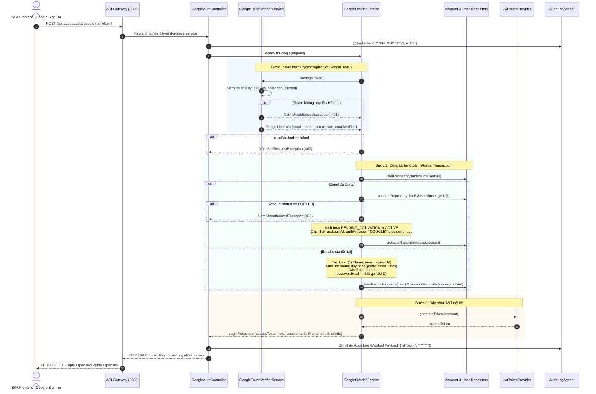

# Technical Implementation Plan: TM-30 Đăng Nhập Người Dùng Bằng Google OAuth2 (Google OAuth2 Single Sign-On)

> **Ticket:** [TM-30: Google OAuth2 Login & Account Synchronization](https://robluccibn9935.atlassian.net/browse/TM-30)  
> **Căn cứ đặc tả:** [TM-30-google-oauth2-login-spec.md](file:///d:/codegym_final_project/InternHub/docs/specs/TM-30-google-oauth2-login-spec.md)  
> **Target Microservices:** `identity-and-access-service` (Port 8081) & `api-gateway` (Port 8080)  
> **Change Level:** **L3** (Tính năng xác thực mới, liên kết thực thể người dùng, bổ sung DTO, Service, Controller và mở rộng cấu trúc tài khoản)  
> **Tuân thủ quy chuẩn:** [01-working-rules.md](file:///d:/codegym_final_project/InternHub/.agents/01-working-rules.md), [03-compliance-constraints.md](file:///d:/codegym_final_project/InternHub/.agents/03-compliance-constraints.md), [05-coding-standards.md](file:///d:/codegym_final_project/InternHub/.agents/05-coding-standards.md)

---

## 1. Tổng Quan Kiến Trúc & Mục Tiêu Kỹ Thuật (Architecture & Scope)

### 1.1. Mục tiêu cốt lõi
1. **Trải nghiệm đăng nhập 1 chạm (1-Click Google Sign-In):** Cho phép ứng viên, sinh viên thực tập và nhân sự đăng nhập hoặc đăng ký tài khoản tự động thông qua tài khoản Google/Gmail cá nhân hoặc Google Workspace.
2. **Cơ chế ID Token Verification chuẩn hóa:** Tiếp nhận `idToken` từ Frontend (SPA), xác thực chữ ký mật mã (Cryptographic Signature) với Google Public Key Certificates (JWKS) bằng thư viện chính thức `google-api-client`.
3. **Cơ chế liên kết tài khoản tự động (Auto Account Linking):**
   - **Đã tồn tại email trong hệ thống:** Tự động gắn kết tài khoản, chuyển trạng thái `PENDING_ACTIVATION` ➔ `ACTIVE`, cập nhật `lastLoginAt` và ảnh đại diện nếu có. Giữ nguyên toàn bộ vai trò hiện tại (`HR`, `ADMIN`, `MENTOR`, `INTERN`).
   - **Chưa từng tồn tại email:** Khởi tạo đồng thời bản ghi `User` và `Account` với vai trò mặc định `Intern`, trạng thái `ACTIVE`, mật khẩu ngẫu nhiên băm BCrypt, sinh username duy nhất không trùng lặp trong một Transaction nguyên tử (`@Transactional`).
4. **Cấp phát JWT nội bộ đồng nhất:** Trả về `LoginResponse` chứa `accessToken` JWT chuẩn nội bộ (đồng nhất với luồng đăng nhập truyền thống), đảm bảo tính tương thích trong suốt với toàn bộ hệ thống Microservices hiện có.

### 1.2. Ranh giới hệ thống (Boundary Isolation & Strict Constraints)
- **Tuyệt đối không can thiệp Frontend (`InternHub-Frontend/`):** Tuân thủ nghiêm ngặt **Rule #7 (Boundary Isolation)**. Chỉ triển khai và hoàn thiện API Contract chuẩn hóa ở Backend để phục vụ Frontend tích hợp Google Identity Services (GIS SDK).
- **Tuyệt đối không đọc, sửa, phân tích file `.env` (Rule #12):** Nạp `clientId` qua Spring `@Value("${app.oauth2.google.client-id:mock-google-client-id}")` hoặc properties class có giá trị fallback an toàn.
- **Thiết kế Package-by-Feature độc lập chống God-Class (Rule #13 & Rule #16):** Đặt toàn bộ mã nguồn Google OAuth2 trong package riêng `org.example.employeeservice.oauth2.*` (`controller`, `service`, `dto`, `config`), tuyệt đối không làm phình to `AuthServiceImpl.java`.
- **Constructor Injection 100% (Rule #20):** Khai báo các dependency `private final` và dùng `@RequiredArgsConstructor` từ Lombok.
- **Defense-in-Depth chống rò rỉ Token & PII trên DevTools & Logs:**
  - Không truyền Token qua Query Parameter (100% POST Body).
  - Không để lộ `passwordHash`, `providerId`, hoặc internal stacktraces trong Response JSON.
  - Tự động che mờ `******` cho các trường `idToken`, `token`, `credential`, `otp` trong audit logs thông qua `DataMaskingUtils`.

---

## 2. Giải Quyết 6 Kịch Bản Ngoại Lệ Cốt Lõi (Edge Cases & Mitigations)

| STT | Kịch Bản Rủi Ro (Edge Case) | Hậu Quả Tiềm Ẩn | Giải Pháp Kỹ Thuật Đã Thiết Kế |
| :---: | :--- | :--- | :--- |
| **Case 1** | Giả mạo hoặc hết hạn Google ID Token | Kẻ xấu tự chế token JWT hoặc dùng lại token cũ để chiếm quyền. | Sử dụng `GoogleIdTokenVerifier` kiểm tra cryptographic signature với Google JWKS, đối soát thời hạn `exp` và issuer `iss` (`accounts.google.com`). Ném `UnauthorizedException("Google ID Token không hợp lệ hoặc đã hết hạn")` (HTTP 401). |
| **Case 2** | Audience Mismatch (Dùng Token của ứng dụng Google khác) | Kẻ tấn công lấy token hợp lệ của ứng dụng bên ngoài để gửi sang InternHub. | Cấu hình bắt buộc `GoogleIdTokenVerifier.Builder.setAudience(Collections.singletonList(clientId))`. Trình xác thực tự động so khớp claim `aud` trong token. Nếu lệch, lập tức từ chối. |
| **Case 3** | Email Google chưa được xác minh (`email_verified = false`) | Kẻ xấu đăng ký Google bằng email nạn nhân chưa xác thực để chiếm đoạt tài khoản. | Kiểm tra `payload.getEmailVerified()`. Nếu `false` hoặc `null`, lập tức ném `BadRequestException("Địa chỉ email Google chưa được xác minh. Vui lòng xác thực tài khoản Google trước khi tiếp tục.")` (HTTP 400). |
| **Case 4** | Trùng lặp username khi sinh tự động từ tiền tố Email | Hai tài khoản Google có email trùng tiền tố (`nguyen.van.a@...`) gây vướng lỗi `UNIQUE` username trong DB. | Thuật toán sinh username an toàn: Chuẩn hóa tiền tố (loại bỏ ký tự lạ), giới hạn 30 ký tự, kiểm tra `accountRepository.existsByUsername()`. Nếu trùng, tự động nối hậu tố hex ngẫu nhiên: `prefix + "_" + randomHex(4)` cho đến khi duy nhất. |
| **Case 5** | Tài khoản đã bị khóa bởi Quản trị viên (`status = 'LOCKED'`) | Người dùng vi phạm bị khóa tài khoản cố tình đăng nhập bằng Google để vượt rào. | Khi tra cứu tài khoản đã tồn tại, kiểm tra `account.getStatus().equalsIgnoreCase("LOCKED")`. Nếu đúng, ném ngay `UnauthorizedException("Tài khoản của bạn đã bị khóa hoặc vô hiệu hóa bởi Quản trị viên")`. Không sinh JWT Token. |
| **Case 6** | Nguy cơ rò rỉ Token & PII lên DevTools (Network, Console, History, Logs) | Lộ token Google hoặc mật khẩu băm trên DevTools Network tab hoặc hệ thống Audit Logs. | 1. 100% Token đóng gói trong **POST Body (JSON)**, không qua URL.<br>2. `LoginResponse` chỉ chứa các trường hiển thị an toàn.<br>3. `DataMaskingUtils` tự động biến `idToken` thành `******` trong audit logs.<br>4. Không echo token trong exception error responses. |

---

## 3. Kiến Trúc Luồng Dữ Liệu (Sequence Flow Diagram)



---

## 4. Danh Sách File Tác Động (File Impact Analysis)

| Trạng thái | Tên File & Đường dẫn | Phân loại & Nhiệm vụ |
| :---: | :--- | :--- |
| **[MODIFY]** | [build.gradle](file:///d:/codegym_final_project/InternHub/identity-and-access-service/build.gradle) | Bổ sung dependency Google API Client: `implementation 'com.google.api-client:google-api-client:2.7.0'`. |
| **[MODIFY]** | [Account.java](file:///d:/codegym_final_project/InternHub/identity-and-access-service/src/main/java/org/example/employeeservice/entity/Account.java) | Bổ sung trường `authProvider` (`VARCHAR(20)`) và `providerId` (`VARCHAR(100)`). |
| **[NEW]** | [GoogleOAuth2Properties.java](file:///d:/codegym_final_project/InternHub/identity-and-access-service/src/main/java/org/example/employeeservice/oauth2/config/GoogleOAuth2Properties.java) | Cấu hình `@ConfigurationProperties(prefix = "app.oauth2.google")` nạp `client-id` với fallback an toàn tuân thủ Rule #12. |
| **[NEW]** | [GoogleLoginRequest.java](file:///d:/codegym_final_project/InternHub/identity-and-access-service/src/main/java/org/example/employeeservice/oauth2/dto/request/GoogleLoginRequest.java) | Request DTO chứa `idToken` với validate `@NotBlank(message = "Google ID Token không được để trống")`. |
| **[NEW]** | [GoogleUserInfo.java](file:///d:/codegym_final_project/InternHub/identity-and-access-service/src/main/java/org/example/employeeservice/oauth2/dto/response/GoogleUserInfo.java) | Internal DTO chứa thông tin trích xuất sau giải mã: `email`, `name`, `picture`, `sub`, `emailVerified`. |
| **[NEW]** | [GoogleTokenVerifierService.java](file:///d:/codegym_final_project/InternHub/identity-and-access-service/src/main/java/org/example/employeeservice/oauth2/service/GoogleTokenVerifierService.java) | Interface hợp đồng xác thực Google ID Token độc lập. |
| **[NEW]** | [GoogleTokenVerifierServiceImpl.java](file:///d:/codegym_final_project/InternHub/identity-and-access-service/src/main/java/org/example/employeeservice/oauth2/service/impl/GoogleTokenVerifierServiceImpl.java) | Triển khai xác thực Google ID Token với `GoogleIdTokenVerifier`, in-memory key caching và audience verification. |
| **[NEW]** | [GoogleOAuth2Service.java](file:///d:/codegym_final_project/InternHub/identity-and-access-service/src/main/java/org/example/employeeservice/oauth2/service/GoogleOAuth2Service.java) | Interface nghiệp vụ đăng nhập Google & đồng bộ tài khoản. |
| **[NEW]** | [GoogleOAuth2ServiceImpl.java](file:///d:/codegym_final_project/InternHub/identity-and-access-service/src/main/java/org/example/employeeservice/oauth2/service/impl/GoogleOAuth2ServiceImpl.java) | Xử lý logic liên kết tài khoản, cấp mới tài khoản `Intern`, sinh username duy nhất, cấp phát JWT và map DTO. |
| **[NEW]** | [GoogleAuthController.java](file:///d:/codegym_final_project/InternHub/identity-and-access-service/src/main/java/org/example/employeeservice/oauth2/controller/GoogleAuthController.java) | REST Controller public endpoint `POST /api/auth/oauth2/google` và alias `/api/employees/auth/oauth2/google` gắn `@Auditable`. |
| **[MODIFY]** | [AuditLogAspect.java](file:///d:/codegym_final_project/InternHub/identity-and-access-service/src/main/java/org/example/employeeservice/system/audit/aspect/AuditLogAspect.java) | Bổ sung nhận diện `GoogleLoginRequest` trong hàm trích xuất định danh người dùng. |
| **[NEW]** | [GoogleOAuth2ServiceTest.java](file:///d:/codegym_final_project/InternHub/identity-and-access-service/src/test/java/org/example/employeeservice/oauth2/service/GoogleOAuth2ServiceTest.java) | Bộ 8 Unit Tests toàn diện kiểm thử đầy đủ các nhánh nghiệp vụ và 6 Edge Cases. |

---

## 5. Chi Tiết Kỹ Thuật Từng Thành Phần (Detailed Component Blueprint)

### 5.1. Cập nhật Thư Viện (`build.gradle`)
Bổ sung thư viện chính thức từ Google trong `identity-and-access-service/build.gradle`:
```groovy
implementation 'com.google.api-client:google-api-client:2.7.0'
```

### 5.2. Mở Rộng Entity `Account.java`
Thêm 2 trường mới theo đúng đặc tả mục 7 mà không làm ảnh hưởng đến cấu trúc bảng hiện tại:
```java
@Column(name = "auth_provider", length = 20)
@Builder.Default
private String authProvider = "LOCAL";

@Column(name = "provider_id", length = 100)
private String providerId;
```

### 5.3. Cấu Hình Thuộc Tính An Toàn (`GoogleOAuth2Properties.java`)
Tuân thủ tuyệt đối Rule #12 (Strict Zero-Access to `.env`):
```java
package org.example.employeeservice.oauth2.config;

import lombok.Getter;
import lombok.Setter;
import org.springframework.boot.context.properties.ConfigurationProperties;
import org.springframework.context.annotation.Configuration;

@Getter
@Setter
@Configuration
@ConfigurationProperties(prefix = "app.oauth2.google")
public class GoogleOAuth2Properties {
    /**
     * Google Client ID đăng ký trên Google Cloud Console.
     * Fallback an toàn phục vụ Unit Test và môi trường phát triển nội bộ.
     */
    private String clientId = "mock-google-client-id";
}
```

### 5.4. Lớp DTO (`GoogleLoginRequest.java` & `GoogleUserInfo.java`)
- `GoogleLoginRequest`:
  ```java
  package org.example.employeeservice.oauth2.dto.request;

  import jakarta.validation.constraints.NotBlank;
  import lombok.*;

  @Getter
  @Setter
  @NoArgsConstructor
  @AllArgsConstructor
  @Builder
  public class GoogleLoginRequest {
      @NotBlank(message = "Google ID Token không được để trống")
      private String idToken;
  }
  ```
- `GoogleUserInfo`:
  ```java
  package org.example.employeeservice.oauth2.dto.response;

  import lombok.*;

  @Getter
  @Setter
  @NoArgsConstructor
  @AllArgsConstructor
  @Builder
  public class GoogleUserInfo {
      private String email;
      private String name;
      private String picture;
      private String sub;
      private boolean emailVerified;
  }
  ```

### 5.5. Tầng Service Xác Thực Google Token (`GoogleTokenVerifierService.java`)
- Interface:
  ```java
  package org.example.employeeservice.oauth2.service;

  import org.example.employeeservice.oauth2.dto.response.GoogleUserInfo;

  public interface GoogleTokenVerifierService {
      GoogleUserInfo verify(String idToken);
  }
  ```
- Triển khai (`GoogleTokenVerifierServiceImpl.java`):
  - Khởi tạo `GoogleIdTokenVerifier` với `NetHttpTransport` và `GsonFactory.getDefaultInstance()`.
  - Cấu hình Audience với `properties.getClientId()`.
  - Bắt lỗi xác thực chữ ký hoặc hết hạn token, ném `UnauthorizedException("Google ID Token không hợp lệ hoặc đã hết hạn")`.
  - Trích xuất payload an toàn.

### 5.6. Tầng Service Nghiệp Vụ Google OAuth2 (`GoogleOAuth2Service.java`)
- Interface:
  ```java
  package org.example.employeeservice.oauth2.service;

  import org.example.employeeservice.dto.response.LoginResponse;
  import org.example.employeeservice.oauth2.dto.request.GoogleLoginRequest;

  public interface GoogleOAuth2Service {
      LoginResponse loginWithGoogle(GoogleLoginRequest request);
  }
  ```
- Triển khai logic trong `GoogleOAuth2ServiceImpl.java` (được bọc trong `@Transactional(rollbackFor = Exception.class)`):
  1. Gọi `verifierService.verify(request.getIdToken())`.
  2. Kiểm tra `userInfo.isEmailVerified()` ➔ nếu `false`, ném `BadRequestException("Địa chỉ email Google chưa được xác minh. Vui lòng xác thực tài khoản Google trước khi tiếp tục.")`.
  3. Tra cứu `userRepository.findByEmail(email.toLowerCase())`.
  4. **Nếu đã tồn tại User:**
     - Lấy `accountRepository.findByUserId(user.getId())`.
     - Kiểm tra: nếu `account.getStatus().equalsIgnoreCase("LOCKED")` ➔ ném `UnauthorizedException("Tài khoản của bạn đã bị khóa hoặc vô hiệu hóa bởi Quản trị viên")`.
     - Nếu `PENDING_ACTIVATION` ➔ chuyển sang `ACTIVE`.
     - Cập nhật `authProvider = "GOOGLE"`, `providerId = sub`, `lastLoginAt = LocalDateTime.now()`.
     - Nếu `user.getAvatarUrl()` rỗng và `userInfo.getPicture()` có giá trị ➔ cập nhật avatar cho user.
     - Lưu `account` và `user`.
  5. **Nếu chưa tồn tại User:**
     - Tạo mới `User`: `fullName = name`, `email = email`, `avatarUrl = picture`. Lưu vào database.
     - Sinh `username` an toàn:
       ```java
       String baseUsername = generateBaseUsername(email);
       String candidate = baseUsername;
       while (accountRepository.existsByUsername(candidate)) {
           candidate = baseUsername + "_" + UUID.randomUUID().toString().substring(0, 4);
       }
       ```
     - Lấy vai trò `Intern`: `roleRepository.findByName("Intern").or(() -> roleRepository.findByName("ROLE_INTERN")).orElseGet(...)`.
     - Tạo mới `Account`: `username`, `passwordHash = passwordEncoder.encode(UUID.randomUUID().toString())`, `role`, `status = "ACTIVE"`, `authProvider = "GOOGLE"`, `providerId = sub`, `lastLoginAt = LocalDateTime.now()`.
     - Lưu `account`.
  6. Sinh token nội bộ: `jwtTokenProvider.generateToken(account)`.
  7. Trả về `LoginResponse` DTO hoàn chỉnh.

### 5.7. Tầng Controller (`GoogleAuthController.java`)
```java
package org.example.employeeservice.oauth2.controller;

import io.swagger.v3.oas.annotations.Operation;
import io.swagger.v3.oas.annotations.tags.Tag;
import jakarta.validation.Valid;
import lombok.RequiredArgsConstructor;
import lombok.extern.slf4j.Slf4j;
import org.example.employeeservice.dto.response.ApiResponse;
import org.example.employeeservice.dto.response.LoginResponse;
import org.example.employeeservice.oauth2.dto.request.GoogleLoginRequest;
import org.example.employeeservice.oauth2.service.GoogleOAuth2Service;
import org.example.employeeservice.system.audit.annotation.Auditable;
import org.example.employeeservice.system.audit.entity.AuditAction;
import org.example.employeeservice.system.audit.entity.AuditModule;
import org.springframework.http.ResponseEntity;
import org.springframework.web.bind.annotation.*;

@Slf4j
@RestController
@RequestMapping({"/api/employees/auth", "/api/auth"})
@RequiredArgsConstructor
@Tag(name = "Google OAuth2 Controller", description = "Xử lý xác thực đăng nhập người dùng bằng tài khoản Google")
public class GoogleAuthController {

    private final GoogleOAuth2Service googleOAuth2Service;

    @Operation(summary = "Đăng nhập hoặc đăng ký tự động bằng Google ID Token")
    @Auditable(action = AuditAction.LOGIN_SUCCESS, module = AuditModule.AUTH, description = "Đăng nhập hệ thống qua Google OAuth2")
    @PostMapping("/oauth2/google")
    public ResponseEntity<ApiResponse<LoginResponse>> loginWithGoogle(@Valid @RequestBody GoogleLoginRequest request) {
        log.info("Nhận yêu cầu đăng nhập bằng tài khoản Google OAuth2");
        LoginResponse response = googleOAuth2Service.loginWithGoogle(request);
        return ResponseEntity.ok(ApiResponse.success("Đăng nhập bằng tài khoản Google thành công", response));
    }
}
```

### 5.8. Cập nhật `AuditLogAspect.java`
Bổ sung nhận diện `GoogleLoginRequest` trong `extractUsernameFromArgs`:
```java
} else if (arg instanceof GoogleLoginRequest) {
    return "GOOGLE_USER";
}
```
Và đảm bảo `requestPayload` được che dấu thành `{"idToken": "******"}` thông qua `DataMaskingUtils` (đã hỗ trợ sẵn key `"idtoken"`).

---

## 6. API Contract Chi Tiết

### Endpoint: `POST /api/auth/oauth2/google` (và alias `/api/employees/auth/oauth2/google`)
- **Phân quyền:** Public (`permitAll()`), không cần Authorization header.
- **Request Headers:** `Content-Type: application/json`

#### Request Payload:
```json
{
  "idToken": "eyJhbGciOiJSUzI1NiIsImtpZCI6IjFkMmUzZj...<Google_ID_Token>"
}
```

#### Response Thành Công (HTTP 200 OK):
```json
{
  "success": true,
  "message": "Đăng nhập bằng tài khoản Google thành công",
  "data": {
    "accessToken": "eyJhbGciOiJIUzI1NiIsInR5cCI6IkpXVCJ9...",
    "tokenType": "Bearer",
    "expiresIn": 86400,
    "username": "cuongle_g128",
    "fullName": "Lê Văn Cường",
    "email": "cuong.le@gmail.com",
    "role": "Intern",
    "userId": 15
  },
  "timestamp": "2026-09-30T14:30:00"
}
```

#### Response Lỗi (HTTP 400 Bad Request):
```json
{
  "code": 400,
  "message": "Địa chỉ email Google chưa được xác minh. Vui lòng xác thực tài khoản Google trước khi tiếp tục.",
  "timestamp": "2026-09-30T14:30:00"
}
```

#### Response Lỗi (HTTP 401 Unauthorized):
```json
{
  "code": 401,
  "message": "Google ID Token không hợp lệ hoặc đã hết hạn",
  "timestamp": "2026-09-30T14:30:00"
}
```

---

## 7. Kế Hoạch Kiểm Thử Toàn Diện (Testing Strategy)

### 7.1. Bộ 8 Unit Tests (`GoogleOAuth2ServiceTest.java`)
Sử dụng Mockito `@ExtendWith(MockitoExtension.class)` chạy cô lập, nhanh và không phụ thuộc Spring Context hay DB bên ngoài:

1. **UT-BE-01:** `givenValidGoogleIdToken_whenUserNotExists_thenProvisionUserAndAccountAndReturnLoginResponse()`
   - *Kiểm tra:* Khi email chưa có trong DB, tạo mới User + Account vai trò `Intern`, gán password băm ngẫu nhiên, cấp JWT token và trả về HTTP 200.
2. **UT-BE-02:** `givenValidGoogleIdToken_whenUserExistsPendingActivation_thenActivateAccountAndReturnLoginResponse()`
   - *Kiểm tra:* Tài khoản ở trạng thái `PENDING_ACTIVATION` được tự động chuyển thành `ACTIVE` và đăng nhập thành công.
3. **UT-BE-03:** `givenValidGoogleIdToken_whenUserExistsActive_thenUpdateLastLoginAndReturnLoginResponse()`
   - *Kiểm tra:* Tài khoản đang hoạt động bình thường được cập nhật `lastLoginAt`, giữ nguyên vai trò quản trị hiện có (`HR`/`ADMIN`).
4. **UT-BE-04:** `givenInvalidGoogleIdToken_whenLoginWithGoogle_thenThrowUnauthorizedException()`
   - *Kiểm tra:* Khi `GoogleTokenVerifierService` ném lỗi xác thực token, service ném `UnauthorizedException` chuẩn HTTP 401.
5. **UT-BE-05:** `givenUnverifiedGoogleEmail_whenLoginWithGoogle_thenThrowBadRequestException()`
   - *Kiểm tra:* Khi cờ `emailVerified == false`, service ném `BadRequestException` chuẩn HTTP 400.
6. **UT-BE-06:** `givenLockedAccount_whenLoginWithGoogle_thenThrowUnauthorizedException()`
   - *Kiểm tra:* Tài khoản có trạng thái `LOCKED` bị chặn truy cập và ném `UnauthorizedException` HTTP 401.
7. **UT-BE-07:** `givenDuplicateUsernamePrefix_whenProvisioning_thenGenerateUniqueSuffix()`
   - *Kiểm tra:* Thuật toán phát hiện username trùng lặp và tự động gắn thêm hậu tố ngẫu nhiên để đảm bảo tính duy nhất.
8. **UT-BE-08:** `givenGoogleLoginPayload_whenAuditing_thenEnsureIdTokenIsMaskedWithAsterisks()`
   - *Kiểm tra:* Kiểm tra `DataMaskingUtils.maskObject(new GoogleLoginRequest("secret_token"))` sinh ra chuỗi có `******`, bảo vệ an toàn nhật ký kiểm toán.

### 7.2. Kiểm thử Tích hợp Controller (`GoogleAuthControllerTest.java`)
- Dùng `@WebMvcTest(GoogleAuthController.class)` kiểm tra endpoint `/api/auth/oauth2/google`:
  - Request thiếu `idToken` ➔ HTTP 400 Validation Error.
  - Request hợp lệ ➔ HTTP 200 kèm cấu trúc `ApiResponse<LoginResponse>`.

---

## 8. Trình Tự Thực Thi Từng Bước (Step-by-Step Implementation Roadmap)

```
[Giai đoạn 1: Chuẩn bị Thư viện & Entity]
  ├── 1.1. Bổ sung google-api-client vào build.gradle
  └── 1.2. Thêm trường authProvider & providerId vào Account.java
          ↓
[Giai đoạn 2: Cấu hình & DTOs theo Package-by-Feature]
  ├── 2.1. Tạo package org.example.employeeservice.oauth2
  ├── 2.2. Tạo GoogleOAuth2Properties (Rule #12 Zero-Access .env)
  ├── 2.3. Tạo GoogleLoginRequest & GoogleUserInfo
          ↓
[Giai đoạn 3: Triển khai Service & Logic Nghiệp Vụ]
  ├── 3.1. Viết GoogleTokenVerifierService & GoogleTokenVerifierServiceImpl
  ├── 3.2. Viết GoogleOAuth2Service & GoogleOAuth2ServiceImpl (xử lý 6 Edge Cases)
          ↓
[Giai đoạn 4: Controller & Tích hợp Audit Log]
  ├── 4.1. Tạo GoogleAuthController với @Auditable
  ├── 4.2. Cập nhật AuditLogAspect nhận diện GoogleLoginRequest
          ↓
[Giai đoạn 5: Kiểm Thử & Xác Minh]
  ├── 5.1. Viết trọn bộ 8 Unit Tests trong GoogleOAuth2ServiceTest
  ├── 5.2. Chạy .\gradlew.bat :identity-and-access-service:test
  └── 5.3. Xác minh kết quả BUILD SUCCESSFUL 100%
```

---

## 9. Tiêu Chí Chấp Nhận & Xác Minh Hoàn Thành (Acceptance Checklist)

- [ ] **AC-1:** Gửi `idToken` Google hợp lệ với email chưa có ➔ Tự tạo `User`, tạo `Account` `Intern`, trạng thái `ACTIVE`, trả về HTTP 200 kèm JWT token.
- [ ] **AC-2:** Gửi `idToken` với email đang `PENDING_ACTIVATION` ➔ Kích hoạt thành `ACTIVE`, trả về HTTP 200 và JWT token.
- [ ] **AC-3:** Gửi `idToken` với email đã có vai trò `HR`/`ADMIN` ➔ Giữ nguyên vai trò, đăng nhập thành công.
- [ ] **AC-4:** Gửi `idToken` sai chữ ký, hết hạn hoặc sai Audience ➔ Trả về HTTP 401 Unauthorized.
- [ ] **AC-5:** Gửi `idToken` có `email_verified = false` ➔ Trả về HTTP 400 Bad Request.
- [ ] **AC-6:** Gửi `idToken` của tài khoản `LOCKED` ➔ Trả về HTTP 401 Unauthorized.
- [ ] **AC-7:** Gửi request rỗng hoặc `idToken` trống ➔ Trả về HTTP 400 kèm lỗi validation.
- [ ] **AC-8 (Zero Token Leakage):** URL API không chứa token query param; response JSON không chứa `password_hash` hay `provider_id`; log audit che mờ `{"idToken": "******"}`.
- [ ] **AC-9 (Rule #12 Zero-Access `.env`):** Tuyệt đối không đọc file `.env`; Unit tests chạy độc lập bằng Mockito.
- [ ] **AC-10 (Build & Test Success):** Toàn bộ Unit Test chạy thành công 100% không phát sinh lỗi biên dịch hay cảnh báo xung đột.
