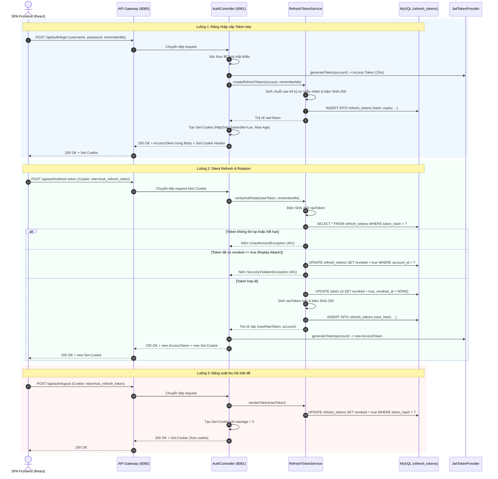

# Technical Implementation Plan: TM-32 Cải Tiến & Khắc Phục Lỗ Hổng Bảo Mật Hệ Thống (System Security Hardening)

> **Ticket:** [TM-32: System Security Hardening & Session Lifecycle](https://robluccibn9935.atlassian.net/browse/TM-32)  
> **Căn cứ đặc tả:** [TM-32-system-security-hardening-spec.md](file:///d:/codegym_final_project/InternHub/docs/specs/TM-32-system-security-hardening-spec.md) (Phiên bản v2.1)  
> **Target Microservices:** `identity-and-access-service` (Port 8081) & `api-gateway` (Port 8080)  
> **Change Level:** **L3** (Kiến trúc xác thực mới, cơ chế Token Rotation, Session Cookie & Persistent Cookie, tác động DB MySQL và Gateway CORS)  
> **Tuân thủ quy chuẩn:** [AGENTS.md](file:///d:/codegym_final_project/InternHub/AGENTS.md), [01-working-rules.md](file:///d:/codegym_final_project/InternHub/.agents/01-working-rules.md), [03-compliance-constraints.md](file:///d:/codegym_final_project/InternHub/.agents/03-compliance-constraints.md), [05-coding-standards.md](file:///d:/codegym_final_project/InternHub/.agents/05-coding-standards.md)

---

## 1. Tổng Quan Kiến Trúc & Mục Tiêu Kỹ Thuật (Architecture & Scope)

### 1.1. Mục tiêu cốt lõi
1. **Kiến trúc Token Kép (Dual-Token Architecture):**
   - Access Token: JWT thời hạn 15 phút ($900.000\text{ ms}$), lưu trữ trong In-Memory RAM của trình duyệt (triệt tiêu nguy cơ rò rỉ qua XSS).
   - Refresh Token: Chuỗi ngẫu nhiên an toàn băm SHA-256 lưu Database, thời hạn 7 ngày ($604.800.000\text{ ms}$), đóng gói trong `HttpOnly`, `SameSite=Lax`, `Path=/api/auth` Cookie.
2. **Cơ chế Xoay Vòng Refresh Token (Token Rotation - RTR):** Mỗi lần gọi `/api/auth/refresh-token`, Refresh Token cũ bị vô hiệu hóa (`revoked = true`) và một cặp token mới được cấp phát.
3. **Phát hiện Tấn công Phát lại (Replay / Reuse Attack Detection):** Nếu một Refresh Token đã bị `revoked` được gửi lên lại, hệ thống lập tức phát hiện xâm nhập và vô hiệu hóa toàn bộ Refresh Tokens của tài khoản đó (`account_id`), đồng thời trả về lỗi 401 Unauthorized.
4. **Quản lý Vòng đời Phiên (Session vs. Persistent Cookie):** Phân biệt qua cờ `rememberMe`. Nếu `false`: Cookie là Session Cookie (`maxAge = -1`, tự xóa khi tắt trình duyệt); nếu `true`: Persistent Cookie (`maxAge = 7 * 24 * 3600`).
5. **Thu hồi Token Thực sự khi Đăng xuất (End-to-End Logout):** Endpoint `/api/auth/logout` cập nhật `revoked = true` trong database và gửi Header `Set-Cookie` với `maxAge = 0` để xóa Cookie khỏi trình duyệt.
6. **Bật CORS với Credentials tại Gateway:** Bổ sung cấu hình `globalcors` cho phép `allowCredentials: true` với origin cụ thể (`http://localhost:5173`) để trình duyệt cho phép truyền nhận Cookie.

### 1.2. Ranh giới hệ thống & Ràng buộc nghiêm ngặt (Strict Compliance Boundaries)
- **Tuân thủ Tuyệt đối Rule #7 (Boundary Isolation):** AI Backend Agent **không tự ý sửa file mã nguồn trong thư mục `InternHub-Frontend/`**. Toàn bộ mã nguồn TypeScript, cấu hình Axios và Component đã được đặc tả hoàn chỉnh trong Mục 13.2 của Spec để bàn giao cho lập trình viên Frontend.
- **Tuân thủ Tuyệt đối Rule #12 (Zero-Access to `.env`):** Tuyệt đối không mở, đọc, sửa hay parse file `.env`. Mọi biến cấu hình được nạp qua `@ConfigurationProperties` và file cấu hình trong `config-repo-local/`.
- **Tuân thủ Rule #15 (Bắt buộc kế thừa `BaseEntity`):** Entity `RefreshToken.java` kế thừa `org.example.employeeservice.common.entity.BaseEntity` (đã có sẵn `id`, `createdAt`, `updatedAt`, `@PrePersist`, `@PreUpdate`).
- **Tuân thủ Rule #17 (Anti-God-Class):** Tách toàn bộ nghiệp vụ Refresh Token vào `RefreshTokenService` và `RefreshTokenServiceImpl` độc lập (giới hạn < 200 dòng), không nhồi nhét vào `AuthServiceImpl.java`.
- **Tuân thủ Rule #19 (ApiResponse chuẩn):** 100% endpoint Controller trả về `ResponseEntity<ApiResponse<T>>`.
- **Tuân thủ Rule #21 (Constructor Injection):** Khai báo các trường dependency `private final` và dùng `@RequiredArgsConstructor` từ Lombok. Cấm `@Autowired`.
- **Tuân thủ Rule #23 (Quản lý giao dịch):** Đặt `@Transactional(readOnly = true)` tại class level, `@Transactional` tại các phương thức tạo/thu hồi token.

---

## 2. Kịch Bản Ngoại Lệ Cốt Lõi & Biện Pháp Phòng Vệ (Edge Cases & Mitigations)

| STT | Kịch Bản Rủi Ro (Edge Case) | Hậu Quả | Giải Pháp Kỹ Thuật Đã Thiết Kế |
| :---: | :--- | :--- | :--- |
| **Case 1** | Kẻ tấn công dùng lại Refresh Token đã revoked | Chiếm quyền điều khiển phiên của nạn nhân. | Tìm kiếm token hash trong DB: nếu `revoked == true`, kích hoạt lệnh `revokeAllByAccountId(account.getId())`. Thu hồi toàn bộ phiên của tài khoản đó ngay lập tức, ghi log Audit bảo mật mức HIGH, trả về 401. |
| **Case 2** | Client gọi đồng thời nhiều API khi Access Token vừa hết hạn | Race Condition: nhiều request refresh đồng thời gây lỗi token reuse ngoài ý muốn. | Backend thiết kế idempotent validation; Frontend triển khai **Mutex Queue** trong Axios Interceptor (chỉ gửi 1 request refresh, xếp các request khác vào hàng đợi). |
| **Case 3** | Người dùng tắt trình duyệt mà không đăng xuất trên máy công cộng | Nguy cơ người sau tiếp tục dùng phiên làm việc. | Khi `rememberMe == false`, Backend đặt `ResponseCookie.maxAge(-1)`. Trình duyệt tự xóa Cookie ngay khi cửa sổ bị đóng. |
| **Case 4** | Cookie bị chặn do xung đột CORS credentials | Frontend không nhận được Set-Cookie, luồng refresh thất bại 100%. | Cấu hình Spring Cloud Gateway `globalcors` tại `config-repo-local/api-gateway.yml` với `allowCredentials: true` và `allowedOrigins: ["http://localhost:5173", "http://localhost:3000"]`. |
| **Case 5** | Phình to dữ liệu bảng `refresh_tokens` trong MySQL | Bảng DB phình to làm chậm truy vấn tìm kiếm token. | Đánh index tối ưu `(token_hash)` và `(account_id, expiry_date)`; thiết lập Scheduled Task `@Scheduled(cron = "0 0 2 * * ?")` dọn dẹp các token đã hết hạn quá 14 ngày. |

---

## 3. Kiến Trúc Luồng Xử Lý (Sequence Flow Diagram)



---

## 4. Chi Tiết Các Bước Triển Khai (Phase-by-Phase Implementation)

### Phase 1: Cơ Sở Dữ Liệu MySQL (`internhub_db`)
- **Tập tin:** Migration SQL hoặc JPA Auto DDL
- **Bảng:** `refresh_tokens`
- **Mã DDL:**
  ```sql
  CREATE TABLE IF NOT EXISTS refresh_tokens (
      id BIGINT AUTO_INCREMENT PRIMARY KEY,
      account_id BIGINT NOT NULL,
      token_hash VARCHAR(64) NOT NULL UNIQUE,
      expiry_date DATETIME NOT NULL,
      revoked BOOLEAN NOT NULL DEFAULT FALSE,
      revoked_at DATETIME NULL,
      replaced_by_token_hash VARCHAR(64) NULL,
      created_at DATETIME NOT NULL DEFAULT CURRENT_TIMESTAMP,
      updated_at DATETIME NULL DEFAULT CURRENT_TIMESTAMP ON UPDATE CURRENT_TIMESTAMP,
      CONSTRAINT fk_refresh_token_account FOREIGN KEY (account_id) REFERENCES accounts(id) ON DELETE CASCADE,
      INDEX idx_token_hash (token_hash),
      INDEX idx_account_id (account_id),
      INDEX idx_expiry_revoked (expiry_date, revoked)
  ) ENGINE=InnoDB DEFAULT CHARSET=utf8mb4 COLLATE=utf8mb4_unicode_ci;
  ```

---

### Phase 2: Cấu Hình Thời Gian Sống Token (`identity-and-access-service`)
- **Tập tin:** `identity-and-access-service/src/main/java/org/example/employeeservice/config/JwtProperties.java`
- **Thay đổi:**
  - Cập nhật `expiration`: từ 86.400.000 ms (24h) $\rightarrow$ `900000L` (15 phút).
  - Thêm trường `refreshExpiration`: `604800000L` (7 ngày = 604.800.000 ms).
  - Thêm getter/setter qua Lombok.

---

### Phase 3: Domain Entity & Repository Layer
- **Package:** `org.example.employeeservice.entity` & `org.example.employeeservice.repository`
- **Tập tin tạo mới:**
  1. `entity/RefreshToken.java`:
     - Kế thừa `org.example.employeeservice.common.entity.BaseEntity` (Rule #15).
     - Ràng buộc quan hệ: `@ManyToOne(fetch = FetchType.LAZY)` với `Account`.
     - Chứa các trường: `tokenHash`, `expiryDate`, `revoked`, `revokedAt`, `replacedByTokenHash`.
     - Phương thức tiện ích: `isExpired()`, `isActive()`.
  2. `repository/RefreshTokenRepository.java`:
     - Kế thừa `JpaRepository<RefreshToken, Long>`.
     - Các phương thức:
       - `Optional<RefreshToken> findByTokenHash(String tokenHash);`
       - `@Modifying @Query("UPDATE RefreshToken r SET r.revoked = true, r.revokedAt = :now WHERE r.account.id = :accountId AND r.revoked = false") void revokeAllByAccountId(@Param("accountId") Long accountId, @Param("now") LocalDateTime now);`
       - `@Modifying @Query("DELETE FROM RefreshToken r WHERE r.expiryDate < :cutoffDate OR (r.revoked = true AND r.revokedAt < :cutoffDate)") void deleteExpiredTokens(@Param("cutoffDate") LocalDateTime cutoffDate);`

---

### Phase 4: Service Layer (Anti-God-Class)
- **Package:** `org.example.employeeservice.service` & `service/impl`
- **Tập tin tạo mới:**
  1. `service/RefreshTokenService.java`:
     ```java
     public interface RefreshTokenService {
         String createRefreshToken(Account account, boolean rememberMe);
         TokenRotationResult verifyAndRotate(String rawRefreshToken, boolean rememberMe);
         void revokeToken(String rawRefreshToken);
         void revokeAllAccountTokens(Long accountId);
         void cleanupExpiredTokens();
     }
     ```
  2. `dto/response/TokenRotationResult.java`:
     - Chứa `Account account`, `String newRawRefreshToken`, `boolean rememberMe`.
  3. `service/impl/RefreshTokenServiceImpl.java`:
     - Đánh dấu `@Service`, `@RequiredArgsConstructor`, `@Slf4j`.
     - Đặt `@Transactional(readOnly = true)` cấp class; `@Transactional` trên các hàm ghi/sửa.
     - Sử dụng `SecureRandom` để sinh raw token ngẫu nhiên (32 bytes $\rightarrow$ Hex 64 ký tự).
     - Thuật toán băm một chiều SHA-256 biến raw token thành `token_hash`.
     - **Replay Attack Detection:**
       ```java
       if (refreshToken.isRevoked()) {
           log.error("Phát hiện Token Replay Attack cho Account ID: {}!", account.getId());
           revokeAllAccountTokens(account.getId());
           throw new UnauthorizedException("Cảnh báo an ninh: Phát hiện phiên làm việc bất thường. Vui lòng đăng nhập lại.");
       }
       ```

---

### Phase 5: DTOs & Controller Layer
- **Package:** `org.example.employeeservice.dto` & `controller`
- **Thay đổi & Tạo mới:**
  1. `dto/request/LoginRequest.java`:
     - Thêm trường `private Boolean rememberMe = false;`.
  2. `dto/request/RefreshTokenRequest.java` (Tùy chọn cho Postman/Mobile):
     - `private String refreshToken;`.
  3. `dto/response/RefreshTokenResponse.java`:
     - Chứa `String accessToken`, `String tokenType`, `long expiresIn`.
  4. `controller/AuthController.java`:
     - Bổ sung helper method `ResponseCookie buildRefreshCookie(String token, boolean rememberMe)` và `ResponseCookie buildCleanCookie()`.
     - Cập nhật endpoint `POST /api/auth/login`:
       - Sau khi đăng nhập thành công, gọi `refreshTokenService.createRefreshToken(account, request.getRememberMe())`.
       - Đính kèm Header `Set-Cookie` vào phản hồi.
     - Thêm endpoint `POST /api/auth/refresh-token`:
       - Đọc refresh token từ `@CookieValue(name = "internhub_refresh_token", required = false) String cookieToken` (fallback sang request body nếu có).
       - Gọi `refreshTokenService.verifyAndRotate(...)`.
       - Sinh Access Token mới và trả về cùng Set-Cookie mới.
     - Thêm endpoint `POST /api/auth/logout`:
       - Đọc refresh token từ Cookie.
       - Gọi `refreshTokenService.revokeToken(...)`.
       - Trả về Set-Cookie với `maxAge = 0` để xóa cookie tại trình duyệt.

---

### Phase 6: API Gateway & CORS Credentials Configuration
- **Tập tin:** `config-repo-local/api-gateway.yml`
- **Nội dung bổ sung:**
  ```yaml
  spring:
    cloud:
      gateway:
        globalcors:
          cors-configurations:
            '[/**]':
              allowedOrigins:
                - "http://localhost:5173"
                - "http://localhost:3000"
              allowedMethods:
                - GET
                - POST
                - PUT
                - DELETE
                - OPTIONS
                - PATCH
              allowedHeaders: "*"
              allowCredentials: true
              maxAge: 3600
  ```

---

### Phase 7: Kiểm Thử Tự Động & Biên Dịch Bắt Buộc (Verification Protocol)
- **Unit Tests:** `identity-and-access-service/src/test/java/.../RefreshTokenServiceImplTest.java`
  - `givenValidAccount_whenCreateRefreshToken_thenSuccess()`
  - `givenValidToken_whenVerifyAndRotate_thenRotateSuccessfully()`
  - `givenExpiredToken_whenVerifyAndRotate_thenThrowUnauthorizedException()`
  - `givenRevokedToken_whenVerifyAndRotate_thenCascadeRevokeAndThrow()`
  - `givenValidToken_whenRevokeToken_thenMarkRevoked()`
- **Lệnh biên dịch bắt buộc (Rule #27):**
  - `.\gradlew :identity-and-access-service:compileJava`
  - `.\gradlew :identity-and-access-service:test`
  - `.\gradlew :api-gateway:compileJava`

---

## 5. Danh Sách Tệp Mã Nguồn Tác Động (File Impact Matrix)

| Tệp tin | Service | Hành động | Mô tả |
| :--- | :--- | :---: | :--- |
| `config/JwtProperties.java` | `identity-and-access` | Sửa | Thu ngắn access expiration (15m), thêm refresh expiration (7d) |
| `entity/RefreshToken.java` | `identity-and-access` | Tạo mới | JPA Entity kế thừa `BaseEntity` (Rule #15) |
| `repository/RefreshTokenRepository.java` | `identity-and-access` | Tạo mới | JpaRepository quản lý bảng `refresh_tokens` |
| `dto/response/TokenRotationResult.java` | `identity-and-access` | Tạo mới | Internal DTO trả về kết quả rotate |
| `dto/request/RefreshTokenRequest.java` | `identity-and-access` | Tạo mới | Request DTO fallback cho mobile/Postman |
| `dto/response/RefreshTokenResponse.java` | `identity-and-access` | Tạo mới | Response DTO chứa Access Token mới |
| `dto/request/LoginRequest.java` | `identity-and-access` | Sửa | Bổ sung thuộc tính `Boolean rememberMe` |
| `service/RefreshTokenService.java` | `identity-and-access` | Tạo mới | Interface quản lý vòng đời Refresh Token |
| `service/impl/RefreshTokenServiceImpl.java` | `identity-and-access` | Tạo mới | Triển khai Service, băm SHA-256, Replay Attack detection |
| `controller/AuthController.java` | `identity-and-access` | Sửa | Cập nhật login, thêm `/api/auth/refresh-token` và `/api/auth/logout` |
| `config-repo-local/api-gateway.yml` | `api-gateway` | Sửa | Bổ sung cấu hình `globalcors` với `allowCredentials: true` |

---

## 6. Kế Hoạch Bàn Giao Kỹ Thuật Cho Đội Ngũ Frontend (Rule #7)

Lập trình viên Frontend sẽ tiếp nhận bản đặc tả tại **Mục 13.2 của Spec TM-32** và tiến hành cập nhật 4 file tương ứng:
1. `src/services/api.ts`: Bật `withCredentials: true`, chuyển token sang In-Memory RAM, cài đặt Axios Response Interceptor với Mutex Queue chống Race Condition.
2. `src/services/authService.ts`: Xóa bỏ lưu token vào `localStorage`, thêm `refreshToken()`, chuyển `logout()` thành async gọi `POST /api/auth/logout`.
3. `src/contexts/AuthContext.tsx`: Khôi phục phiên ngầm (Silent Restoration) lúc mount app và quản lý cờ `isInitializing`.
4. `src/components/auth/LoginModal.tsx`: Thêm checkbox UI `"Ghi nhớ đăng nhập trên thiết bị này"`.
