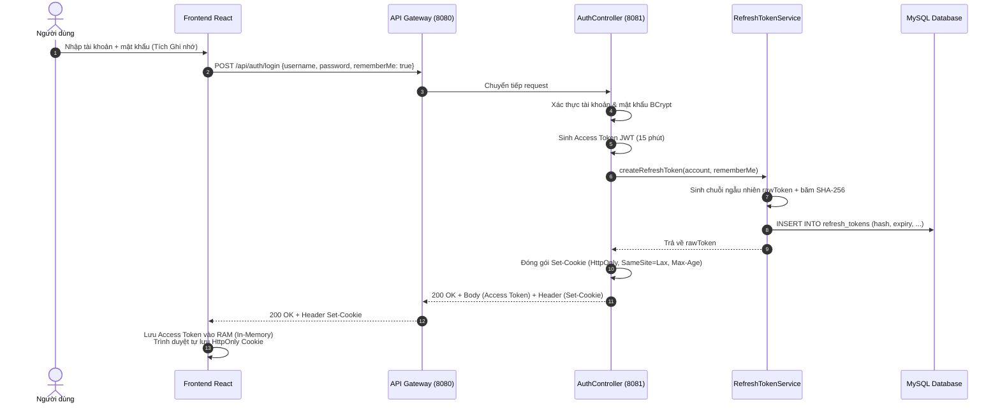
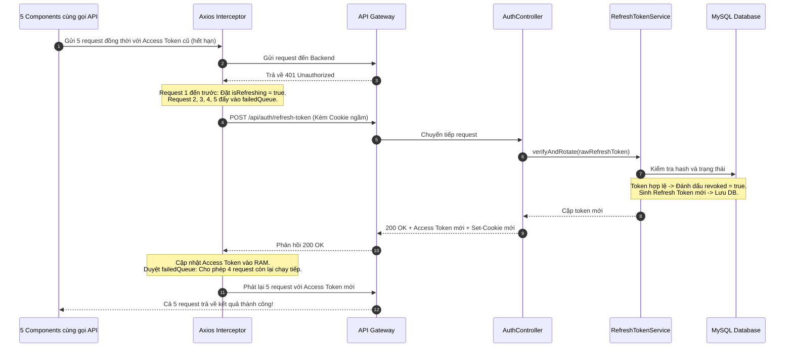
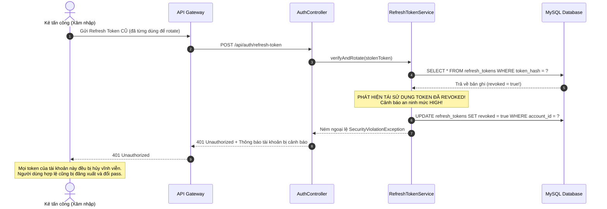

# Specification: Cải Tiến & Khắc Phục Lỗ Hổng Bảo Mật Hệ Thống (System Security Hardening)

> **Mã tài liệu:** `TM-32-SYSTEM-SECURITY-HARDENING-SPEC`  
> **Trạng thái:** APPROVED / READY_FOR_IMPLEMENTATION  
> **Lưu trữ tại:** `InternHub/docs/specs/TM-32-system-security-hardening-spec.md`  
> **Dự án:** InternHub (Microservices Backend & React Frontend)  
> **Áp dụng quy tắc:** [Persistent Spec & Change Rationale](file:///d:/codegym_final_project/InternHub/AGENTS.md) (Quy tắc 26 & 30)  
> **Tiêu chuẩn tuân thủ:** OWASP ASVS v4.0, NIST SP 800-63B, OAuth 2.1, RFC 7009

---

## 0. Nhật Ký Thay Đổi & Giải Trình Kỹ Thuật (Revision History & Change Rationale)

> [!IMPORTANT]
> **BẮT BUỘC ĐIỀN ĐẦY ĐỦ**: Bất kể khi nào Lập trình viên hay AI Agent thay đổi mã nguồn ảnh hưởng đến logic, API, validation hay database (từ cấp độ L2 trở lên), **bắt buộc** phải ghi thêm một dòng vào bảng này để giải trình lý do trước khi coi nhiệm vụ là hoàn tất.

| Phiên bản | Ngày | Người thực hiện | Task / Jira | Loại thay đổi | Lý do & Giải trình kỹ thuật (Rationale) |
| :---: | :---: | :---: | :---: | :---: | :--- |
| **v1.0** | 2026-10-01 | Tech Lead / Security Auditor | `TM-32` | Tạo mới (Draft) | Lập danh mục lỗ hổng bảo mật sơ bộ (SEC-01 đến SEC-05) và giải pháp khắc phục. |
| **v2.0** | 2026-10-01 | Senior Backend AI Agent | `TM-32` | Chuẩn hóa 13 phần Spec-Driven | Nâng cấp toàn diện tài liệu lên chuẩn 13 phần theo `spec-template.md`: Chuẩn hóa Entity `RefreshToken` kế thừa `BaseEntity` (Rule 15), bổ sung đặc tả Gateway CORS `allow-credentials: true` (chống lỗi CORS khi truyền cookie), làm rõ 5 Edge Cases (Replay Attack, Race Condition 401, Session Cookie), thiết lập Mermaid Flow và phân định ranh giới Frontend Impact Report (Rule 7). |
| **v2.1** | 2026-10-01 | Senior Backend AI Agent | `TM-32` | Bổ sung chi tiết Frontend Spec | Bổ sung toàn diện đặc tả kỹ thuật chi tiết cho Frontend (`InternHub-Frontend`), bao gồm cấu hình Axios `withCredentials`, In-Memory Access Token, thuật toán Mutex Queue xử lý Silent Refresh, cơ chế Silent Restoration khi tải trang, và giao diện checkbox "Ghi nhớ đăng nhập". |

---

## 1. Feature Overview (Tổng Quan Tính Năng)

- **Feature Name:** Cải tiến & Khắc phục Lỗ hổng Bảo mật Hệ thống (System Security Hardening)
- **Jira Ticket:** [TM-32](https://robluccibn9935.atlassian.net/browse/TM-32)
- **Target Microservices:**
  - `identity-and-access-service` (Port 8081): Quản lý vòng đời Token, Session, cơ chế xoay vòng Refresh Token và thu hồi Token.
  - `api-gateway` (Port 8080): Định tuyến bảo mật, xử lý CORS với Credentials cho Cookie `HttpOnly`.
- **Target Users & Roles:** Tất cả người dùng hệ thống (`ADMIN`, `HR`, `MENTOR`, `INTERN`, `GUEST`).
- **Change Level:** **L3** (Thay đổi kiến trúc xác thực, tác động Cơ sở dữ liệu và Cơ chế Session).

---

## 2. Business Goal & Core Objectives (Mục Tiêu Nghiệp Vụ)

1. **Triệt tiêu nguy cơ rò rỉ Token qua lỗ hổng XSS:** Xóa bỏ hoàn toàn việc lưu Access Token trong `localStorage`; chuyển sang lưu trữ trong In-Memory RAM của trình duyệt kết hợp với Refresh Token lưu trong `HttpOnly`, `SameSite=Lax` Cookie.
2. **Khắc phục lỗi Zombie Token (Đăng xuất ảo):** Cung cấp cơ chế thu hồi token thực sự tại máy chủ (Server-side Token Revocation) qua bảng MySQL `refresh_tokens`, đảm bảo khi người dùng bấm Đăng xuất thì Refresh Token bị hủy hoàn toàn.
3. **Phát hiện và ngăn chặn tấn công phát lại (Replay Attack Detection):** Triển khai cơ chế Refresh Token Rotation (RTR). Nếu một Refresh Token đã bị thu hồi/sử dụng trước đó được tái sử dụng, hệ thống lập tức phát hiện xâm nhập và thu hồi toàn bộ phiên làm việc của tài khoản đó.
4. **Bảo vệ an toàn trên thiết bị dùng chung:** Phân biệt rõ giữa Cookie Session (tự động xóa khi tắt trình duyệt) và Persistent Cookie (duy trì 7 ngày khi người dùng tích chọn "Ghi nhớ đăng nhập").
5. **Đảm bảo trải nghiệm liền mạch (Silent Refresh không gián đoạn):** Client tự động gia hạn Access Token ngầm qua Interceptor, áp dụng cơ chế Mutex Queue ngăn chặn xung đột (Race Condition) khi nhiều API nhận lỗi 401 đồng thời.

---

## 3. Scope of Work (Phạm Vi Tính Năng)

### 3.1. Trong phạm vi (In Scope)
- **Cấu hình thời gian sống Token:** Thu ngắn Access Token xuống 15 phút (900.000 ms); Refresh Token sống 7 ngày (604.800.000 ms).
- **Cơ sở dữ liệu:** Tạo bảng `refresh_tokens` trong MySQL, liên kết Foreign Key `account_id` với bảng `accounts`.
- **Backend Service & Entity:**
  - Entity `RefreshToken.java` kế thừa [BaseEntity](file:///d:/codegym_final_project/InternHub/identity-and-access-service/src/main/java/org/example/employeeservice/common/entity/BaseEntity.java).
  - Tách riêng Service [RefreshTokenService](file:///d:/codegym_final_project/InternHub/identity-and-access-service) và `RefreshTokenServiceImpl` độc lập nhằm tuân thủ nguyên tắc Anti-God-Class.
  - Băm SHA-256 đối với Refresh Token trước khi lưu vào cơ sở dữ liệu.
- **REST Endpoints (`AuthController.java`):**
  - Cập nhật `POST /api/auth/login`: Nhận `rememberMe`, tạo Refresh Token, trả về Cookie `internhub_refresh_token` (`HttpOnly`, `SameSite=Lax`, `Path=/api/auth`).
  - Bổ sung `POST /api/auth/refresh-token`: Nhận Cookie ngầm (hoặc Request Body), xác thực, xoay vòng token, trả về Access Token mới và Cookie mới.
  - Bổ sung `POST /api/auth/logout`: Thu hồi token trong database, gửi header xóa Cookie (`maxAge(0)`).
- **Cấu hình API Gateway:** Bổ sung cấu hình CORS cho phép `allowCredentials: true` với danh sách allowed origins cụ thể (`http://localhost:5173`, `http://localhost:3000`).
- **Đặc tả & Báo cáo tác động Frontend:** Lập hướng dẫn chi tiết cho đội ngũ Frontend cập nhật `api.ts`, `authService.ts`, `AuthContext.tsx`, `LoginModal.tsx`.

### 3.2. Ngoài phạm vi (Out of Scope - *Ngăn chặn suy diễn sai*)
- **Xác thực đa yếu tố (MFA / 2FA qua SMS hoặc TOTP):** Không triển khai trong ticket này (thuộc ticket riêng).
- **Đăng nhập không mật khẩu (WebAuthn / Passkey):** Không thuộc phạm vi TM-32.
- **Tự ý sửa đổi mã nguồn Frontend (`InternHub-Frontend/`):** AI Backend Agent tuyệt đối không can thiệp trực tiếp vào mã nguồn Frontend (tuân thủ Rule 7 Boundary Isolation).

---

## 4. Potential Logic Loopholes & Mitigations (Tối thiểu 5 Edge Cases Cốt Lõi)

### 4.1. Case 1: Tấn công phát lại Refresh Token (Token Replay / Reuse Attack)
- **Vấn đề:** Kẻ tấn công đánh cắp được Refresh Token cũ đã từng được người dùng hợp lệ sử dụng để đổi Access Token. Kẻ tấn công cố tình gửi lại Refresh Token cũ này lên endpoint `/api/auth/refresh-token`.
- **Giải pháp:** Khi hệ thống tìm thấy token hash trong DB nhưng bản ghi có `revoked == true`, hệ thống xác định đây là hành vi xâm nhập. Lập tức kích hoạt lệnh thu hồi toàn bộ Refresh Tokens thuộc sở hữu của `account_id` đó (`revokeAllAccountTokens`), buộc tất cả phiên làm việc phải đăng nhập lại, đồng thời ghi log Audit bảo mật cảnh báo mức HIGH.

### 4.2. Case 2: Xung đột hàng đợi khi nhiều API đồng thời gặp lỗi 401 (Race Condition trên Client)
- **Vấn đề:** Khi Access Token hết hạn (sau 15 phút), người dùng mở Dashboard khiến 5 request API nghiệp vụ được gửi đi đồng thời. Cả 5 request cùng nhận 401 và cùng lúc gửi 5 request `/api/auth/refresh-token`. Do token rotation làm vô hiệu hóa token ngay sau lần dùng đầu tiên, 4 request sau sẽ bị coi là token reuse và vô tình khóa tài khoản của người dùng!
- **Giải pháp:** Phía Frontend cài đặt cơ chế **Mutex Queue** trong Axios Response Interceptor. Chỉ có duy nhất 1 request đầu tiên được phép gọi `refresh-token` (với cờ `isRefreshing = true`). 4 request còn lại được giữ lại trong hàng đợi `failedQueue` (dưới dạng các `Promise`). Sau khi request đầu tiên nhận Access Token mới thành công, toàn bộ hàng đợi được giải phóng và tự động phát lại với token mới.

### 4.3. Case 3: Đóng trình duyệt máy tính dùng chung (Session Cookie vs Persistent Cookie)
- **Vấn đề:** Người dùng đăng nhập tại quán net hoặc máy tính công cộng, không tích "Ghi nhớ đăng nhập". Sau khi dùng xong, họ tắt trình duyệt mà không bấm Đăng xuất. Người dùng tiếp theo mở lại máy có thể tiếp tục sử dụng phiên làm việc.
- **Giải pháp:** Nếu `rememberMe == false`, Backend thiết lập thuộc tính Cookie `maxAge(-1)` (Session Cookie). Trình duyệt sẽ tự động hủy cookie ngay khi toàn bộ cửa sổ trình duyệt bị đóng. Nếu `rememberMe == true`, Cookie mới được cấp `maxAge(604800)` (sống 7 ngày).

### 4.4. Case 4: Lỗi cạn kiệt tài nguyên / Phình to bảng `refresh_tokens` trong MySQL
- **Vấn đề:** Mỗi lần người dùng đăng nhập hoặc refresh xoay vòng token, một bản ghi mới được tạo. Bảng `refresh_tokens` sau thời gian dài sẽ chứa hàng triệu dòng dữ liệu rác đã hết hạn (`expiry_date < NOW()`).
- **Giải pháp:** Đánh chỉ mục Index tối ưu trên `(token_hash)` và `(account_id, expiry_date)`. Bổ sung một Scheduled Task định kỳ (`@Scheduled(cron = "0 0 2 * * ?")`) chạy vào lúc 2h sáng để dọn dẹp các token đã hết hạn hoặc đã thu hồi quá 14 ngày.

### 4.5. Case 5: Trình duyệt chặn Cookie do xung đột CORS với Credentials
- **Vấn đề:** Frontend chạy tại `http://localhost:5173`, Gateway chạy tại `http://localhost:8080`. Trình duyệt gửi request với `withCredentials: true`. Nếu Gateway cấu hình `allowedOrigins: "*"` hoặc thiếu header `Access-Control-Allow-Credentials: true`, trình duyệt sẽ từ chối nhận Cookie `Set-Cookie` và chặn đứng luồng xác thực.
- **Giải pháp:** Cấu hình chuẩn hóa tại `api-gateway.yml` sử dụng Spring Cloud Gateway `globalcors` với danh sách origin cụ thể (`http://localhost:5173`) và bật `allowCredentials: true`.

---

## 5. Functional Requirements (Yêu Cầu Chức Năng)

- **FR-1:** Khi người dùng gửi yêu cầu đăng nhập hợp lệ qua `POST /api/auth/login`, hệ thống trả về Access Token (thời hạn 15 phút) trong JSON payload và đính kèm Refresh Token bọc trong Header `Set-Cookie` với cờ `HttpOnly`, `SameSite=Lax`, `Path=/api/auth`.
- **FR-2:** Nếu trường `rememberMe` trong `LoginRequest` là `true`, Cookie Refresh Token có thời hạn sống 7 ngày (`maxAge = 604800`). Nếu `false` hoặc không truyền, Cookie là Session Cookie (`maxAge = -1`).
- **FR-3:** Hệ thống cung cấp endpoint `POST /api/auth/refresh-token` cho phép cấp mới Access Token. Endpoint tự động đọc Refresh Token từ Cookie `internhub_refresh_token` (hoặc body JSON nếu client không hỗ trợ cookie).
- **FR-4:** Khi thực hiện refresh thành công, hệ thống thực hiện xoay vòng token (Rotation): Đánh dấu token cũ là `revoked = true`, sinh cặp token mới (Access Token + Refresh Token mới), cập nhật `replaced_by_token_hash`, và gửi Cookie mới đè lên Cookie cũ.
- **FR-5:** Khi người dùng gọi `POST /api/auth/logout`, hệ thống đánh dấu Refresh Token hiện tại là `revoked = true`, xóa `revoked_at = NOW()`, và trả về Header `Set-Cookie` với `maxAge = 0` để trình duyệt xóa sạch Cookie.
- **FR-6:** Khi phát hiện token đã thu hồi bị tái sử dụng, hệ thống lập tức thu hồi toàn bộ chuỗi token của tài khoản tương ứng và trả về mã lỗi HTTP `401 Unauthorized` kèm thông báo bảo mật.

---

## 6. Business Rules (Quy Tắc Nghiệp Vụ)

- **BR-1 (Băm Token An Toàn):** Tuyệt đối không lưu Refresh Token thô (plaintext) trong Database. Token thô sinh ra từ `SecureRandom` (hoặc UUID không gạch nối kết hợp random entropy), sau đó được băm một chiều bằng thuật toán **SHA-256** tạo thành chuỗi 64 ký tự hex (`token_hash`) để lưu vào Database.
- **BR-2 (Thời Gian Hiệu Lực Cố Định):**
  - Access Token: 15 phút ($900.000\text{ ms}$).
  - Refresh Token: 7 ngày ($604.800.000\text{ ms}$).
- **BR-3 (Ràng Buộc Phạm Vi Cookie):** Cookie Refresh Token bắt buộc phải có thuộc tính:
  - `HttpOnly = true` (Chống XSS đánh cắp qua JavaScript `document.cookie`).
  - `SameSite = Lax` (Chống tấn công CSRF).
  - `Path = /api/auth` (Chỉ gửi cookie khi gọi các endpoint xác thực, tránh làm phình header của các API nghiệp vụ khác).
  - `Secure = false` trong môi trường dev localhost, `Secure = true` trên môi trường Production HTTPS.
- **BR-4 (Cascade Revocation Khi Bị Tấn Công):** Một khi phát hiện tái sử dụng token đã revoked, hành vi thu hồi toàn bộ token của tài khoản (`account_id`) là bắt buộc và không có ngoại lệ.

---

## 7. Data Model (Mô Hình Dữ Liệu)

### 7.1. Cấu Trúc Bảng MySQL (`refresh_tokens`)

Bảng `refresh_tokens` được lưu trữ tại cơ sở dữ liệu `internhub_db`:

```sql
CREATE TABLE IF NOT EXISTS refresh_tokens (
    id BIGINT AUTO_INCREMENT PRIMARY KEY,
    account_id BIGINT NOT NULL,
    token_hash VARCHAR(64) NOT NULL UNIQUE,
    expiry_date DATETIME NOT NULL,
    revoked BOOLEAN NOT NULL DEFAULT FALSE,
    revoked_at DATETIME NULL,
    replaced_by_token_hash VARCHAR(64) NULL,
    created_at DATETIME NOT NULL DEFAULT CURRENT_TIMESTAMP,
    updated_at DATETIME NULL DEFAULT CURRENT_TIMESTAMP ON UPDATE CURRENT_TIMESTAMP,
    CONSTRAINT fk_refresh_token_account FOREIGN KEY (account_id) REFERENCES accounts(id) ON DELETE CASCADE,
    INDEX idx_token_hash (token_hash),
    INDEX idx_account_id (account_id),
    INDEX idx_expiry_revoked (expiry_date, revoked)
) ENGINE=InnoDB DEFAULT CHARSET=utf8mb4 COLLATE=utf8mb4_unicode_ci;
```

### 7.2. JPA Entity Mapping (`RefreshToken.java`)

* Kế thừa từ class chuẩn dùng chung: `org.example.employeeservice.common.entity.BaseEntity` (đã có sẵn `id`, `createdAt`, `updatedAt`, `@PrePersist`, `@PreUpdate`).
* Quan hệ: `@ManyToOne(fetch = FetchType.LAZY)` liên kết với Entity `Account`.

```java
package org.example.employeeservice.entity;

import jakarta.persistence.*;
import lombok.*;
import org.example.employeeservice.common.entity.BaseEntity;

import java.time.LocalDateTime;

@Entity
@Table(name = "refresh_tokens", indexes = {
    @Index(name = "idx_token_hash", columnList = "token_hash", unique = true),
    @Index(name = "idx_account_id", columnList = "account_id")
})
@Getter
@Setter
@NoArgsConstructor
@AllArgsConstructor
@Builder
public class RefreshToken extends BaseEntity {

    @ManyToOne(fetch = FetchType.LAZY)
    @JoinColumn(name = "account_id", nullable = false)
    private Account account;

    @Column(name = "token_hash", nullable = false, unique = true, length = 64)
    private String tokenHash;

    @Column(name = "expiry_date", nullable = false)
    private LocalDateTime expiryDate;

    @Column(name = "revoked", nullable = false)
    @Builder.Default
    private boolean revoked = false;

    @Column(name = "revoked_at")
    private LocalDateTime revokedAt;

    @Column(name = "replaced_by_token_hash", length = 64)
    private String replacedByTokenHash;

    public boolean isExpired() {
        return LocalDateTime.now().isAfter(this.expiryDate);
    }

    public boolean isActive() {
        return !this.revoked && !isExpired();
    }
}
```

---

## 8. API Contract (Đặc Tả Giao Tiếp REST API)

### 8.1. Endpoint: `POST /api/auth/login` (Cập nhật)
- **Mô tả:** Đăng nhập người dùng bằng username/email và mật khẩu, cấp Access Token và HttpOnly Cookie Refresh Token.
- **Authentication:** Public (`permitAll()`).

#### Request Body JSON (`LoginRequest.java`):
```json
{
  "username": "intern_user",
  "password": "Password@123",
  "rememberMe": true
}
```

#### Response Success (200 OK):
* **Set-Cookie Header:**
  ```http
  Set-Cookie: internhub_refresh_token=d9f4e2...; Path=/api/auth; Max-Age=604800; HttpOnly; SameSite=Lax
  ```
* **Response Body JSON:**
  ```json
  {
    "success": true,
    "message": "Đăng nhập thành công",
    "data": {
      "accessToken": "eyJhbGciOiJIUzI1NiIsIn...",
      "tokenType": "Bearer",
      "expiresIn": 900,
      "username": "intern_user",
      "fullName": "Nguyễn Văn A",
      "email": "intern@example.com",
      "role": "INTERN",
      "userId": 10
    },
    "timestamp": "2026-10-01T14:30:00"
  }
  ```

---

### 8.2. Endpoint: `POST /api/auth/refresh-token` (Mới)
- **Mô tả:** Làm mới Access Token ngầm (Silent Refresh) và xoay vòng Refresh Token.
- **Authentication:** Public (`permitAll()`). Trình duyệt tự gửi Cookie `internhub_refresh_token`. Hỗ trợ fallback nhận `{ "refreshToken": "..." }` trong Body cho thiết bị Mobile/Postman.

#### Request Headers:
```http
Content-Type: application/json
Cookie: internhub_refresh_token=raw_refresh_token_here
```

#### Request Body JSON (Tùy chọn - chỉ dùng khi không có Cookie):
```json
{
  "refreshToken": "optional_raw_token_if_cookie_unavailable"
}
```

#### Response Success (200 OK):
* **Set-Cookie Header:** (Cấp mới Refresh Token đã xoay vòng)
  ```http
  Set-Cookie: internhub_refresh_token=new_raw_refresh_token_here; Path=/api/auth; Max-Age=604800; HttpOnly; SameSite=Lax
  ```
* **Response Body JSON:**
  ```json
  {
    "success": true,
    "message": "Cấp mới Access Token thành công",
    "data": {
      "accessToken": "eyJhbGciOiJIUzI1NiIsIn...",
      "tokenType": "Bearer",
      "expiresIn": 900
    },
    "timestamp": "2026-10-01T14:45:00"
  }
  ```

#### Response Error (401 Unauthorized - Hết hạn hoặc không hợp lệ):
```json
{
  "success": false,
  "message": "Phiên làm việc đã hết hạn. Vui lòng đăng nhập lại.",
  "errors": ["Refresh Token không hợp lệ hoặc đã hết hạn"],
  "timestamp": "2026-10-01T14:45:00"
}
```

---

### 8.3. Endpoint: `POST /api/auth/logout` (Mới)
- **Mô tả:** Đăng xuất người dùng, vô hiệu hóa Refresh Token tại Server và xóa Cookie phía Client.
- **Authentication:** Public / Authenticated.

#### Request Headers:
```http
Cookie: internhub_refresh_token=raw_refresh_token_here
```

#### Response Success (200 OK):
* **Set-Cookie Header:** (Xóa Cookie trình duyệt ngay lập tức)
  ```http
  Set-Cookie: internhub_refresh_token=; Path=/api/auth; Max-Age=0; HttpOnly; SameSite=Lax
  ```
* **Response Body JSON:**
  ```json
  {
    "success": true,
    "message": "Đăng xuất thành công",
    "data": null,
    "timestamp": "2026-10-01T15:00:00"
  }
  ```

---

## 9. Core Flow / Enforcement Flow (Luồng Xử Lý Cốt Lõi)

### 9.1. Luồng Đăng Nhập & Cấp Token Kép (Dual-Token Issuance)



### 9.2. Luồng Silent Refresh & Axios Mutex Queue Chống Race Condition



### 9.3. Luồng Phát Hiện & Xử Lý Tấn Công Phát Lại (Replay Attack Detection)



---

## 10. Non-Functional Requirements & Constraints

- **Bảo mật OWASP ASVS v4.0:**
  - Tiêu chí 3.2.1: Quản lý phiên bằng Token ngẫu nhiên có độ dài tối thiểu 128 bits entropy.
  - Tiêu chí 3.5.2: Cookie chứa cờ `HttpOnly`, `SameSite`, và `Path` hạn chế.
- **Hiệu năng (Performance):** Tốc độ kiểm tra và băm SHA-256 cho Refresh Token tại tầng Service < 10ms; tổng thời gian phản hồi API `/api/auth/refresh-token` qua Gateway < 50ms (95th percentile).
- **Anti-God-Class (Rule 17):** Các class [RefreshTokenService](file:///d:/codegym_final_project/InternHub/identity-and-access-service) và `RefreshTokenServiceImpl` không được vượt quá 200 dòng.
- **Constructor Injection (Rule 21):** Bắt buộc 100% inject dependency qua `@RequiredArgsConstructor` với các thuộc tính `private final`. Cấm sử dụng `@Autowired`.
- **Giao dịch Database (Rule 23):** Sử dụng `@Transactional` rõ ràng trên các hàm tạo/thu hồi token; `@Transactional(readOnly = true)` trên các hàm tìm kiếm.

---

## 11. Acceptance Criteria Checklist (Tiêu Chí Chấp Nhận)

- [ ] **AC-1:** Mở tab DevTools > Application > `localStorage` và `sessionStorage` không thấy bất kỳ JWT Token nào.
- [ ] **AC-2:** Cookie `internhub_refresh_token` hiển thị đầy đủ cờ `HttpOnly = true`, `SameSite = Lax`. Lệnh `document.cookie` trên Console không đọc được cookie này.
- [ ] **AC-3:** Access Token hết hạn sau 15 phút. Người dùng tiếp tục thao tác trên giao diện, các request tự động thành công (Silent Refresh) mà không bị văng ra hay báo lỗi 401.
- [ ] **AC-4:** Đăng nhập không tích "Ghi nhớ đăng nhập" $\rightarrow$ Đóng trình duyệt và mở lại trang web $\rightarrow$ Hệ thống yêu cầu đăng nhập lại (Session Cookie đã tự xóa).
- [ ] **AC-5:** Đăng nhập có tích "Ghi nhớ đăng nhập" $\rightarrow$ Đóng trình duyệt và mở lại trang web $\rightarrow$ Tự động vào hệ thống bình thường qua Cookie 7 ngày.
- [ ] **AC-6:** Bấm "Đăng xuất" $\rightarrow$ Backend đánh dấu token đã `revoked = true` trong database; Cookie bị xóa; Token cũ không thể tiếp tục dùng để refresh.
- [ ] **AC-7:** Khi nhiều component cùng lúc gọi API khi Access Token vừa hết hạn, hệ thống không xảy ra xung đột Race Condition (chỉ gửi duy nhất 1 request refresh token).
- [ ] **AC-8:** Sử dụng lại một Refresh Token cũ đã bị xoay vòng để gọi refresh $\rightarrow$ Hệ thống lập tức thu hồi toàn bộ token của tài khoản đó.

---

## 12. Unit & Integration Test Cases Checklist

- [ ] **UT-BE-01:** `givenValidAccount_whenCreateRefreshToken_thenReturnValidRawTokenAndSaveHashInDb()`
- [ ] **UT-BE-02:** `givenValidRawToken_whenVerifyAndRotate_thenRevokeOldTokenAndIssueNewPair()`
- [ ] **UT-BE-03:** `givenExpiredToken_whenVerifyAndRotate_thenThrowUnauthorizedException()`
- [ ] **UT-BE-04:** `givenRevokedToken_whenVerifyAndRotate_thenDetectReplayAndRevokeAllAccountTokens()`
- [ ] **UT-BE-05:** `givenValidToken_whenRevokeToken_thenMarkRevokedSuccessfully()`
- [ ] **IT-BE-01:** Kiểm thử luồng đăng nhập `POST /api/auth/login` kiểm tra header `Set-Cookie` và format JSON qua MockMvc.
- [ ] **IT-BE-02:** Kiểm thử luồng refresh `POST /api/auth/refresh-token` đọc từ Cookie và cấp mới qua MockMvc.

---

## 13. Implementation Checklist & Frontend Impact Report

### 13.1. Danh Sách Tác Vụ Backend Cần Triển Khai (`identity-and-access-service` & `api-gateway`)
- [ ] **Cấu hình:** Cập nhật [JwtProperties.java](file:///d:/codegym_final_project/InternHub/identity-and-access-service/src/main/java/org/example/employeeservice/config/JwtProperties.java) (`expiration = 900000L`, `refreshExpiration = 604800000L`).
- [ ] **Entity:** Tạo Entity `RefreshToken.java` kế thừa [BaseEntity](file:///d:/codegym_final_project/InternHub/identity-and-access-service/src/main/java/org/example/employeeservice/common/entity/BaseEntity.java).
- [ ] **Repository:** Tạo Interface `RefreshTokenRepository.java` với các method truy vấn `findByTokenHash`, `revokeAllByAccountId`.
- [ ] **Service:** Tạo Interface `RefreshTokenService.java` và class `RefreshTokenServiceImpl.java`.
- [ ] **DTO:** Bổ sung trường `Boolean rememberMe` vào `LoginRequest.java`; tạo `RefreshTokenResponse.java`.
- [ ] **Controller:** Bổ sung logic Cookie và các endpoint mới trong [AuthController.java](file:///d:/codegym_final_project/InternHub/identity-and-access-service/src/main/java/org/example/employeeservice/controller/AuthController.java).
- [ ] **Gateway:** Cấu hình CORS `allowCredentials: true` trong [api-gateway.yml](file:///d:/codegym_final_project/InternHub/config-repo-local/api-gateway.yml).
- [ ] **Kiểm tra biên dịch:** Chạy `.\gradlew :identity-and-access-service:compileJava` và `.\gradlew :identity-and-access-service:test`.

### 13.2. Báo Cáo Tác Động & Đặc Tả Kỹ Thuật Chi Tiết Cho Frontend (`InternHub-Frontend`)

> [!CAUTION]
> **Ranh giới cô lập (Boundary Isolation - Rule 7 trong AGENTS.md)**: AI Backend Agent **tuyệt đối không trực tiếp sửa file mã nguồn trong thư mục `InternHub-Frontend/`**. Dưới đây là đặc tả kỹ thuật chi tiết, thuật toán và mã nguồn mẫu chuẩn hóa để lập trình viên Frontend triển khai:

#### 13.2.1. Cập nhật `src/types/index.ts`
Bổ sung trường `rememberMe` vào interface đăng nhập:
```typescript
export interface LoginRequest {
  username: string;
  password?: string;
  rememberMe?: boolean; // true: Persistent Cookie (7 ngày), false: Session Cookie (tắt trình duyệt là xóa)
}
```

#### 13.2.2. Đặc tả cài đặt `src/services/api.ts`
Chuyển đổi toàn diện cơ chế lưu trữ token từ `localStorage` sang **In-Memory RAM** và triển khai **Mutex Queue Interceptor** chống Race Condition khi xử lý lỗi 401:

```typescript
import axios, { AxiosError, InternalAxiosRequestConfig } from 'axios';

// 1. Quản lý Access Token trong In-Memory RAM (Không lộ trên Application tab / localStorage)
let inMemoryAccessToken: string | null = null;

export const setInMemoryAccessToken = (token: string | null): void => {
  inMemoryAccessToken = token;
};

export const getInMemoryAccessToken = (): string | null => inMemoryAccessToken;

// 2. Khởi tạo Axios Client với withCredentials = true để truyền nhận HttpOnly Cookie
const API_BASE_URL = import.meta.env.VITE_API_BASE_URL ?? '';

export const apiClient = axios.create({
  baseURL: API_BASE_URL,
  headers: {
    'Content-Type': 'application/json',
  },
  timeout: 10000,
  withCredentials: true, // BẮT BUỘC: Cho phép gửi và nhận Cookie HttpOnly từ Gateway
});

// 3. Request Interceptor: Tự động đính kèm Access Token từ RAM
apiClient.interceptors.request.use(
  (config: InternalAxiosRequestConfig) => {
    if (inMemoryAccessToken && config.headers) {
      config.headers.Authorization = `Bearer ${inMemoryAccessToken}`;
    }
    return config;
  },
  (error) => Promise.reject(error)
);

// 4. Cơ chế Mutex Queue giải quyết Race Condition khi gặp nhiều 401 đồng thời
let isRefreshing = false;
let failedQueue: Array<{
  resolve: (token: string) => void;
  reject: (error: unknown) => void;
}> = [];

const processQueue = (error: unknown, token: string | null = null) => {
  failedQueue.forEach((prom) => {
    if (error) {
      prom.reject(error);
    } else if (token) {
      prom.resolve(token);
    }
  });
  failedQueue = [];
};

// 5. Response Interceptor: Bắt lỗi 401 và kích hoạt Silent Refresh ngầm
apiClient.interceptors.response.use(
  (response) => response,
  async (error: AxiosError<any>) => {
    const originalRequest = error.config as InternalAxiosRequestConfig & { _retry?: boolean };
    const status = error.response?.status;

    // Không kích hoạt refresh nếu API đang gọi là các endpoint xác thực cơ bản
    const isAuthUrl =
      originalRequest?.url?.includes('/api/auth/login') ||
      originalRequest?.url?.includes('/api/auth/refresh-token') ||
      originalRequest?.url?.includes('/api/auth/logout');

    if (status === 401 && !originalRequest?._retry && !isAuthUrl) {
      // Nếu đã có 1 request đang refresh, xếp các request sau vào hàng đợi Mutex
      if (isRefreshing) {
        return new Promise<string>((resolve, reject) => {
          failedQueue.push({ resolve, reject });
        })
          .then((token) => {
            if (originalRequest.headers) {
              originalRequest.headers.Authorization = `Bearer ${token}`;
            }
            return apiClient(originalRequest);
          })
          .catch((err) => Promise.reject(err));
      }

      originalRequest._retry = true;
      isRefreshing = true;

      try {
        // Gọi API cấp mới token. Trình duyệt tự động đính kèm Cookie internhub_refresh_token
        const refreshResponse = await axios.post(
          `${API_BASE_URL}/api/auth/refresh-token`,
          {},
          { withCredentials: true }
        );

        const newAccessToken = refreshResponse.data?.data?.accessToken;
        if (!newAccessToken) {
          throw new Error('Không nhận được Access Token hợp lệ từ máy chủ');
        }

        // Cập nhật Access Token mới vào RAM
        setInMemoryAccessToken(newAccessToken);

        // Giải phóng hàng đợi: Cho phép các request đang đợi phát lại với token mới
        processQueue(null, newAccessToken);

        // Phát lại request ban đầu
        if (originalRequest.headers) {
          originalRequest.headers.Authorization = `Bearer ${newAccessToken}`;
        }
        return apiClient(originalRequest);
      } catch (refreshError) {
        // Refresh thất bại (Refresh Token cũng hết hạn hoặc bị thu hồi)
        processQueue(refreshError, null);
        setInMemoryAccessToken(null);
        localStorage.removeItem('internhub_user');

        // Điều hướng an toàn về trang chủ và kích hoạt modal đăng nhập
        const currentPath = window.location.pathname;
        if (currentPath !== '/' && currentPath !== '/apply') {
          window.location.href = '/?expired=true&login=true';
        }
        return Promise.reject(refreshError);
      } finally {
        isRefreshing = false;
      }
    }

    return Promise.reject(error);
  }
);
```

#### 13.2.3. Đặc tả cài đặt `src/services/authService.ts`
Loại bỏ lưu trữ Token vào `localStorage`, bổ sung hàm `refreshToken()` và chuyển `logout()` thành hàm async:

```typescript
import { apiClient, setInMemoryAccessToken } from './api';
import { API_ENDPOINTS } from '../constants/endpoints';
import type { AuthUser, LoginRequest } from '../types';

export const authService = {
  async login(username: string, password: string, rememberMe = false): Promise<AuthUser> {
    const response = await apiClient.post(API_ENDPOINTS.AUTH.LOGIN, {
      username,
      password,
      rememberMe,
    });
    const data = response.data?.data;
    
    // Lưu Access Token vào RAM (In-Memory)
    setInMemoryAccessToken(data.accessToken);

    const authUser: AuthUser = {
      userId: data.userId,
      username: data.username,
      fullName: data.fullName,
      email: data.email,
      role: data.role?.toUpperCase().replace('ROLE_', '') || 'INTERN',
      permissions: [], // Sẽ được nạp qua getMyPermissions()
      accessToken: data.accessToken,
      tokenType: data.tokenType || 'Bearer',
      expiresIn: data.expiresIn,
    };

    // Chỉ lưu thông tin profile không nhạy cảm để hiển thị giao diện ban đầu (KHÔNG lưu Token)
    localStorage.setItem('internhub_user', JSON.stringify(authUser));
    return authUser;
  },

  async refreshToken(): Promise<string> {
    const response = await apiClient.post(API_ENDPOINTS.AUTH.REFRESH_TOKEN, {});
    const newAccessToken = response.data?.data?.accessToken;
    if (newAccessToken) {
      setInMemoryAccessToken(newAccessToken);
    }
    return newAccessToken;
  },

  async logout(): Promise<void> {
    try {
      // Gửi request hủy session lên Backend (xóa refresh token DB + xóa Cookie)
      await apiClient.post(API_ENDPOINTS.AUTH.LOGOUT, {});
    } catch (err) {
      console.warn('Lỗi khi gọi API đăng xuất máy chủ:', err);
    } finally {
      // Xóa Access Token trong RAM và thông tin người dùng
      setInMemoryAccessToken(null);
      localStorage.removeItem('internhub_user');
      window.location.href = '/';
    }
  },
};
```

#### 13.2.4. Đặc tả cài đặt `src/contexts/AuthContext.tsx`
Khôi phục phiên ngầm (Silent Restoration) khi mở tab hoặc F5 mà không phụ thuộc vào `localStorage`:

```typescript
export const AuthProvider: React.FC<{ children: React.ReactNode }> = ({ children }) => {
  const [user, setUser] = useState<AuthUser | null>(null);
  const [isInitializing, setIsInitializing] = useState<boolean>(true);

  // Khôi phục phiên ngầm lúc ứng dụng khởi chạy
  useEffect(() => {
    const restoreSession = async () => {
      try {
        // Thử cấp Access Token mới qua Cookie HttpOnly có sẵn
        const token = await authService.refreshToken();
        if (token) {
          const profile = await authService.getMe();
          if (profile) {
            // Đồng bộ dữ liệu người dùng
            const stored = localStorage.getItem('internhub_user');
            const parsed = stored ? JSON.parse(stored) : {};
            setUser({ ...parsed, username: profile.username });
          }
        }
      } catch {
        // Cookie không tồn tại hoặc hết hạn -> Người dùng là Khách (chưa đăng nhập)
        setUser(null);
      } finally {
        setIsInitializing(false);
      }
    };

    void restoreSession();
  }, []);

  // Tránh flash giao diện hoặc chuyển hướng nhầm trang khi đang kiểm tra phiên ngầm
  if (isInitializing) {
    return (
      <div className="flex items-center justify-center min-h-screen bg-slate-900 text-white">
        <div className="animate-spin rounded-full h-10 w-10 border-t-2 border-b-2 border-blue-500"></div>
      </div>
    );
  }

  return (
    <AuthContext.Provider value={{ user, isAuthenticated: !!user, ... }}>
      {children}
    </AuthContext.Provider>
  );
};
```

#### 13.2.5. Đặc tả cài đặt `src/components/auth/LoginModal.tsx`
Bổ sung Checkbox UI "Ghi nhớ đăng nhập trên thiết bị này":

```tsx
const [rememberMe, setRememberMe] = useState<boolean>(false);

// Trong form đăng nhập:
<div className="flex items-center justify-between text-sm">
  <label className="flex items-center gap-2 cursor-pointer select-none text-slate-300 hover:text-white">
    <input
      type="checkbox"
      checked={rememberMe}
      onChange={(e) => setRememberMe(e.target.checked)}
      className="w-4 h-4 rounded border-slate-600 bg-slate-800 text-blue-600 focus:ring-blue-500 focus:ring-offset-slate-900"
    />
    <span>Ghi nhớ đăng nhập trên thiết bị này</span>
  </label>
</div>

// Khi submit:
await login(username, password, rememberMe);
```
