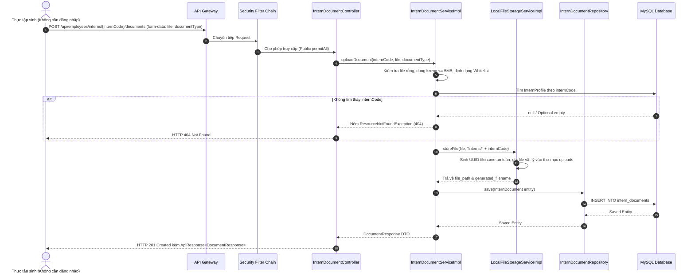

# Specification: Tải Lên CV và Đơn Xin Thực Tập (Upload CV & Application Letter)

---

## 1. Feature Overview (Tổng Quan Tính Năng)
- **Feature Name:** Tải lên CV và đơn xin thực tập để hoàn thiện hồ sơ (Upload CV & Application Letter)
- **Jira Ticket:** [TM-4](https://robluccibn9935.atlassian.net/browse/TM-4)
- **Target Subsystems:** `employee-service` (Backend Microservice), `api-gateway` (Routing & Multipart Forwarding)
- **Target Users:** Thực tập sinh / Ứng viên (chưa cần đăng nhập), HR (Nhân sự)
- **Phân loại thay đổi (Change Level):** **L3** (Thêm Entity/Bảng `intern_documents`, Service xử lý File I/O `FileStorageService`, REST API Multipart Upload, Cấu hình Public Access trong Security)

---

## 2. Business Goal & Core Objectives (Mục Tiêu Nghiệp Vụ)
Cho phép thực tập sinh nộp các tài liệu bắt buộc gồm **CV** và **Đơn xin thực tập (Application Letter)** để hoàn thiện hồ sơ ứng tuyển:
1. **Tiếp cận không rào cản (Zero Barrier Access):**
   - Đúng theo mô tả Jira Ticket: *"Thực tập sinh, không cần đăng nhập vẫn có thể nộp được CV"*. Endpoint upload tài liệu được công khai (`permitAll()`) để ứng viên dễ dàng nộp tài liệu mà không cần trải qua bước đăng nhập phức tạp.
2. **Liên kết định danh chính xác:**
   - Tài liệu tải lên được liên kết chặt chẽ với hồ sơ thực tập sinh thông qua Mã thực tập sinh (`internCode`) hoặc ID hồ sơ đã tồn tại trên hệ thống.
3. **Phân loại tài liệu minh bạch:**
   - Hỗ trợ rõ ràng 2 loại tài liệu nghiệp vụ: `CV` (Curriculum Vitae) và `APPLICATION_LETTER` (Đơn xin thực tập).
4. **Kiểm soát tính toàn vẹn và bảo mật tệp tin (File Integrity & Security):**
   - Giới hạn định dạng tệp tin an toàn (PDF, DOCX, DOC), ngăn chặn upload các file thực thi nguy hiểm (`.exe`, `.sh`, `.bat`, `.js`).
   - Giới hạn dung lượng tệp tin tối đa (tối đa **5MB / file**) tránh cạn kiệt tài nguyên đĩa và tấn công DoS.
5. **Kiến trúc lưu trữ mở rộng (Pluggable Storage Architecture):**
   - Thiết kế Interface trừu tượng `FileStorageService` tách rời tầng lưu trữ vật lý khỏi nghiệp vụ. Giai đoạn 1 lưu trữ tệp tin trên hệ thống thư mục cục bộ của server, sẵn sàng chuyển đổi sang AWS S3 / MinIO trong tương lai.
6. **Tiền đề cho quy trình duyệt tài liệu (Foundation for TM-5):**
   - Khởi tạo trạng thái tài liệu ban đầu là `PENDING_REVIEW` (Chờ xét duyệt), tạo tiền đề trực tiếp cho Ticket tiếp theo: [TM-5: Xem và duyệt tài liệu của thực tập sinh](https://robluccibn9935.atlassian.net/browse/TM-5).

---

## 3. Scope of Work (Phạm Vi Tính Năng)

### 3.1. Trong phạm vi (In Scope)
- Cung cấp RESTful API Multipart `POST /api/employees/interns/{internCode}/documents` tiếp nhận tải lên tệp tin tài liệu.
- Cấu hình phân quyền Spring Security cho phép Public Endpoint: Không yêu cầu Bearer Token khi gọi API upload tài liệu theo mã thực tập sinh.
- Kiểm tra tính hợp lệ của mã thực tập sinh (`internCode`): Nếu không tìm thấy hồ sơ thực tập sinh tương ứng, ném `ResourceNotFoundException` $\rightarrow$ HTTP `404 Not Found`.
- Kiểm tra tệp tin (File Validation):
  - Tệp tin không được rỗng (`!file.isEmpty()`).
  - Kiểm tra đuôi file (Extension) và Content-Type: Chỉ chấp nhận `.pdf`, `.docx`, `.doc` (MIME: `application/pdf`, `application/vnd.openxmlformats-officedocument.wordprocessingml.document`, `application/msword`).
  - Kiểm tra dung lượng tệp tin $\le$ 5MB.
- Lưu trữ file vật lý trên máy chủ với tên file ngẫu nhiên (UUID) kết hợp extension gốc để chống trùng tên và Directory Traversal Attack.
- Lưu trữ thông tin tài liệu vào cơ sở dữ liệu (Bảng `intern_documents`): `intern_id`, `document_type`, `original_file_name`, `file_path`, `file_size`, `content_type`, `status`.
- Trả về HTTP `201 Created` kèm dữ liệu `DocumentResponse`.

### 3.2. Ngoài phạm vi (Out of Scope)
- **Không xử lý duyệt/từ chối tài liệu (Approve/Reject):** Chức năng này thuộc Ticket riêng [TM-5](https://robluccibn9935.atlassian.net/browse/TM-5).
- **Không tích hợp dịch vụ lưu trữ đám mây ngoài (Cloud S3/GCS):** Chưa cấu hình Cloud Storage, sử dụng lưu trữ cục bộ (Local Storage).
- **Không quét virus tệp tin chuyên sâu (Antivirus Engine):** Chỉ xác thực đuôi file, MIME type và sanitize tên file.

---

## 4. Potential Logic Loopholes & Mitigations (6 Edge Cases Cốt Lõi)

### 4.1. Case 1: Tấn công Directory Traversal (Đường dẫn độc hại qua File Name)
- **Vấn đề:** Kẻ tấn công đặt tên file tải lên chứa các ký tự `../../../../etc/passwd` hoặc `..\..\windows\system32\cmd.exe` nhằm ghi đè tệp tin hệ thống.
- **Khắc phục:** Hệ thống không dùng trực tiếp tên file gốc để lưu vào ổ đĩa. Tên file vật lý được sinh mới hoàn toàn bằng `UUID.randomUUID().toString() + extension`. Tên gốc chỉ lưu vào cột `original_file_name` trong DB và được làm sạch qua `StringUtils.cleanPath(...)`.

### 4.2. Case 2: Tấn công giả mạo đuôi file (File Extension Spoofing)
- **Vấn đề:** Đổi tên file mã độc `malware.exe` thành `malware.pdf` để vượt qua kiểm tra đuôi file.
- **Khắc phục:** Kiểm tra đa tầng (Dual-layer check): Kiểm tra cả đuôi file mở rộng (Extension) và MIME Content-Type do MultipartFile cung cấp. Chỉ chấp nhận khi cả 2 cùng thuộc danh sách trắng (Whitelist).

### 4.3. Case 3: Nộp trùng lặp loại tài liệu (Re-upload / Document Replacement)
- **Vấn đề:** Thực tập sinh đã nộp CV lần 1, sau đó nộp lại bản CV cập nhật mới hơn.
- **Khắc phục:** Nếu thực tập sinh nộp lại cùng một `documentType` (ví dụ `CV`):
  - Đánh dấu bản ghi cũ hoặc lưu tài liệu mới nhất kèm thời gian ghi nhận.
  - Cập nhật liên kết file mới nhất cho hồ sơ để HR luôn xem được bản cập nhật nhất.

### 4.4. Case 4: Lỗi I/O khi ghi đĩa hoặc ổ đĩa đầy (Disk Full / Storage Failure)
- **Vấn đề:** Ổ cứng đầy hoặc mất quyền ghi thư mục dẫn đến exception khi ghi file dở dang, nhưng DB đã lưu bản ghi rác.
- **Khắc phục:** Quản lý theo cơ chế bọc Transaction: Ghi file vật lý trước; nếu ghi file thất bại $\rightarrow$ ném ngoại lệ ngay lập tức và không tạo record DB. Nếu DB ghi lỗi $\rightarrow$ tự động xóa tệp tin vật lý vừa lưu (Rollback Cleanup).

### 4.5. Case 5: Tải lên tệp rỗng hoặc tệp vượt quá dung lượng trần
- **Vấn đề:** Tệp tin 0 bytes hoặc tệp tin $> 5MB$ làm nghẽn băng thông.
- **Khắc phục:** Kiểm tra `file.isEmpty()` và `file.getSize() > MAX_FILE_SIZE (5 * 1024 * 1024)`. Nếu vi phạm, lập tức trả về lỗi HTTP `400 Bad Request` kèm thông báo tiếng Việt rõ ràng.

### 4.6. Case 6: Mã thực tập sinh không tồn tại hoặc đã bị khóa/hoàn thành
- **Vấn đề:** Ứng viên nhập sai mã `internCode`, hoặc hồ sơ đã chuyển sang trạng thái `COMPLETED` / `REJECTED`.
- **Khắc phục:** Kiểm tra tồn tại qua `internProfileRepository.findByInternCode(internCode)`. Nếu không thấy $\rightarrow$ ném `ResourceNotFoundException` (HTTP 404). Nếu trạng thái hồ sơ không cho phép nộp thêm $\rightarrow$ trả về HTTP 400.

---

## 5. Functional Requirements (Yêu Cầu Chức Năng)

- **FR-1 (Public Upload Endpoint):** Cung cấp API tải lên tài liệu mà không yêu cầu xác thực đăng nhập.
- **FR-2 (Intern Code Validation):** Xác thực mã thực tập sinh tồn tại trước khi cho phép nộp tài liệu.
- **FR-3 (Document Type Classification):** Phân loại tài liệu thành `CV` và `APPLICATION_LETTER`.
- **FR-4 (File Validation):** Kiểm tra dung lượng ($\le 5MB$), tệp không rỗng, định dạng thuộc Whitelist (`.pdf`, `.docx`, `.doc`).
- **FR-5 (Physical Storage):** Lưu trữ tệp tin an toàn vào thư mục cấu hình trên server với định danh UUID duy nhất.
- **FR-6 (Metadata Persistence):** Lưu vết đầy đủ metadata tài liệu vào cơ sở dữ liệu với trạng thái khởi tạo `PENDING_REVIEW`.
- **FR-7 (Response Delivery):** Trả về `ApiResponse<DocumentResponse>` với HTTP Status `201 Created`.

---

## 6. Business Rules (Quy Tắc Nghiệp Vụ)

- **BR-1 (Allowed File Formats):** Danh sách định dạng cho phép: `.pdf`, `.docx`, `.doc`. Các định dạng khác đều bị từ chối với lỗi 400.
- **BR-2 (Maximum File Size):** Dung lượng tối đa là `5,242,880 bytes` (5MB).
- **BR-3 (Public Upload Access):** Không yêu cầu người dùng đăng nhập để upload tài liệu ứng tuyển.
- **BR-4 (Default Document Status):** Mọi tài liệu mới được tải lên đều có trạng thái xét duyệt mặc định là `PENDING_REVIEW`.
- **BR-5 (Unique Physical Filename):** Tên file vật lý lưu trên đĩa luôn tuân thủ định dạng: `<UUID>.<extension>`.

---

## 7. Data Model (Mô Hình Dữ Liệu)

### 7.1. Bảng `intern_documents`
```sql
CREATE TABLE intern_documents (
    id BIGINT AUTO_INCREMENT PRIMARY KEY,
    intern_id BIGINT NOT NULL,
    document_type VARCHAR(50) NOT NULL, -- CV, APPLICATION_LETTER
    original_file_name VARCHAR(255) NOT NULL,
    file_name VARCHAR(255) NOT NULL UNIQUE,
    file_path VARCHAR(500) NOT NULL,
    file_size BIGINT NOT NULL,
    content_type VARCHAR(100) NOT NULL,
    status VARCHAR(30) NOT NULL DEFAULT 'PENDING_REVIEW', -- PENDING_REVIEW, APPROVED, REJECTED
    rejection_reason TEXT,
    created_at TIMESTAMP DEFAULT CURRENT_TIMESTAMP,
    updated_at TIMESTAMP DEFAULT CURRENT_TIMESTAMP ON UPDATE CURRENT_TIMESTAMP,
    CONSTRAINT fk_document_intern FOREIGN KEY (intern_id) REFERENCES intern_profiles(id) ON DELETE CASCADE
);

CREATE INDEX idx_document_intern ON intern_documents(intern_id);
CREATE INDEX idx_document_status ON intern_documents(status);
```

### 7.2. Java Enum: `DocumentType`
```java
package org.example.employeeservice.intern.entity.enums;

public enum DocumentType {
    CV,
    APPLICATION_LETTER
}
```

### 7.3. Java Enum: `DocumentStatus`
```java
package org.example.employeeservice.intern.entity.enums;

public enum DocumentStatus {
    PENDING_REVIEW,
    APPROVED,
    REJECTED
}
```

---

## 8. API Contract (Đặc Tả Giao Tiếp REST API)

### 8.1. Endpoint Tải Lên Tài Liệu Thực Tập Sinh
- **HTTP Method:** `POST`
- **Endpoint URL:** `/api/employees/interns/{internCode}/documents`
- **Content-Type:** `multipart/form-data`
- **Quyền truy cập:** `Public (permitAll())`

#### Request Parameters:
| Tên tham số | Kiểu | Bắt buộc | Vị trí | Mô tả |
| :--- | :---: | :---: | :---: | :--- |
| `internCode` | String | Có | Path Variable | Mã thực tập sinh (ví dụ `INT-202609-0001`) |
| `file` | MultipartFile | Có | Form Data | Tệp tin tải lên (PDF, DOCX, DOC $\le$ 5MB) |
| `documentType` | String | Có | Form Data | Loại tài liệu (`CV`, `APPLICATION_LETTER`) |

#### Response 201 Created:
```json
{
  "code": 201,
  "message": "Tải lên tài liệu thành công",
  "data": {
    "id": 1,
    "internCode": "INT-202609-0001",
    "documentType": "CV",
    "originalFileName": "NguyenVanA_CV.pdf",
    "fileSize": 1048576,
    "contentType": "application/pdf",
    "status": "PENDING_REVIEW",
    "createdAt": "2026-09-18T10:30:00"
  }
}
```

#### Response 400 Bad Request (File không đúng định dạng):
```json
{
  "code": 400,
  "message": "Định dạng tệp tin không hợp lệ. Chỉ chấp nhận các định dạng: .pdf, .docx, .doc",
  "data": null
}
```

#### Response 404 Not Found (Mã thực tập sinh không tồn tại):
```json
{
  "code": 404,
  "message": "Không tìm thấy hồ sơ thực tập sinh với mã: INT-999999-0001",
  "data": null
}
```

---

## 9. Core Flow / Enforcement Flow (Luồng Xử Lý Cốt Lõi)



---

## 10. Non-Functional Requirements & Constraints

1. **Hiệu năng & Tài nguyên:**
   - Sử dụng Stream I/O với buffer chuẩn khi lưu trữ file để tránh nạp toàn bộ file vào heap memory gây tràn RAM.
   - Thư mục uploads được cấu hình linh hoạt qua biến môi trường hoặc `application.yml` (`file.upload-dir=uploads`).
2. **Bảo mật:**
   - Whitelist MIME-type và file extension.
   - Sanitize path để chống Directory Traversal.
   - Endpoint upload được cấu hình tường minh trong `SecurityConfig.java`: `.requestMatchers(HttpMethod.POST, "/api/employees/interns/*/documents").permitAll()`.
3. **Clean Code & Architecture:**
   - Phân tách Interface `FileStorageService` và Implementation `LocalFileStorageServiceImpl`.
   - Entity `InternDocument` kế thừa `BaseEntity`.
   - Trả về `DocumentResponse`, không trả JPA Entity trực tiếp.

---

## 11. Acceptance Criteria Checklist (Tiêu Chí Chấp Nhận)

- [ ] **AC-1 (Public Upload):** Thực tập sinh có thể nộp CV/đơn mà không cần đăng nhập/truyền Authorization header (HTTP 201).
- [ ] **AC-2 (Liên kết Intern Code):** Tải lên thành công gắn với `internCode` hợp lệ; trả về HTTP 404 nếu `internCode` không tồn tại.
- [ ] **AC-3 (Phân loại tài liệu):** Tiếp nhận chính xác `documentType` (`CV`, `APPLICATION_LETTER`); báo lỗi 400 nếu truyền loại không hợp lệ.
- [ ] **AC-4 (Xác thực định dạng):** Chỉ cho phép upload file có định dạng `.pdf`, `.docx`, `.doc`. Từ chối các định dạng khác với HTTP 400.
- [ ] **AC-5 (Giới hạn dung lượng):** Từ chối các file có dung lượng vượt quá 5MB với HTTP 400.
- [ ] **AC-6 (Lưu trữ an toàn):** File được lưu vào thư mục đĩa với tên UUID ngẫu nhiên; metadata được lưu đầy đủ vào MySQL.
- [ ] **AC-7 (Trạng thái mặc định):** Tài liệu lưu mới có trạng thái xét duyệt ban đầu là `PENDING_REVIEW`.

---

## 12. Unit & Integration Test Cases Checklist

### 12.1. Backend Unit Tests (`InternDocumentServiceTest.java`)
- [ ] `UT-BE-01: uploadDocument_validCvPdf_shouldStoreFileAndSaveMetadata()`
- [ ] `UT-BE-02: uploadDocument_validApplicationLetterDocx_shouldSuccess()`
- [ ] `UT-BE-03: uploadDocument_whenInternCodeNotFound_shouldThrowResourceNotFoundException()`
- [ ] `UT-BE-04: uploadDocument_whenFileIsEmpty_shouldThrowBadRequestException()`
- [ ] `UT-BE-05: uploadDocument_whenFileSizeExceedsLimit_shouldThrowBadRequestException()`
- [ ] `UT-BE-06: uploadDocument_whenInvalidFileExtension_shouldThrowBadRequestException()`
- [ ] `UT-BE-07: uploadDocument_whenStorageFails_shouldNotPersistMetadata()`

### 12.2. Backend Controller WebMvc Tests (`InternDocumentControllerTest.java`)
- [ ] `IT-BE-01: POST /api/employees/interns/{code}/documents without Auth -> should return 201 Created`
- [ ] `IT-BE-02: POST /api/employees/interns/{code}/documents with invalid extension -> should return 400 Bad Request`
- [ ] `IT-BE-03: POST /api/employees/interns/{code}/documents non-existing code -> should return 404 Not Found`

---

## 13. Implementation Checklist (Danh Sách Hạng Mục Triển Khai)

- [ ] Tạo Enum `DocumentType` và `DocumentStatus` trong `intern/entity/enums/`.
- [ ] Tạo Entity `InternDocument` kế thừa `BaseEntity` trong `intern/entity/InternDocument.java`.
- [ ] Tạo Repository `InternDocumentRepository` trong `intern/repository/InternDocumentRepository.java`.
- [ ] Tạo DTO `DocumentResponse` trong `intern/dto/response/DocumentResponse.java`.
- [ ] Tạo Service `FileStorageService` và `LocalFileStorageServiceImpl` trong `common/storage/`.
- [ ] Tạo Service `InternDocumentService` và `InternDocumentServiceImpl` trong `intern/service/`.
- [ ] Tạo REST Controller `InternDocumentController` trong `intern/controller/`.
- [ ] Cấu hình `SecurityConfig.java` cho phép Public access endpoint upload.
- [ ] Cấu hình thư mục upload trong `application.yml`.
- [ ] Viết Unit Test và Controller Test.
- [ ] Chạy `compileJava`, `test`, `bootJar` kiểm tra xác thực.
