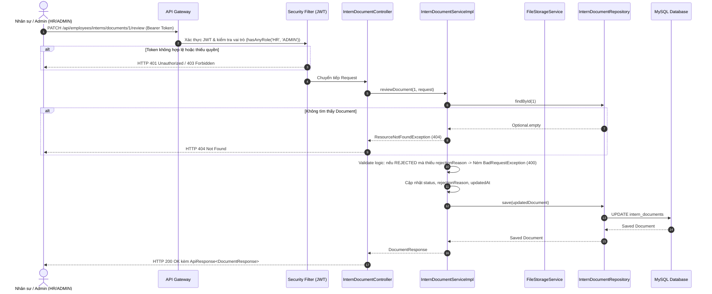

# Specification: Xem và Duyệt Tài Liệu của Thực Tập Sinh (View & Review Intern Documents)

---

## 1. Feature Overview (Tổng Quan Tính Năng)
- **Feature Name:** Xem và xét duyệt tài liệu của thực tập sinh (View & Review Intern Documents)
- **Jira Ticket:** [TM-5](https://robluccibn9935.atlassian.net/browse/TM-5)
- **Target Subsystems:** `employee-service` (Backend Microservice), `api-gateway` (Routing & Security Verification)
- **Target Users:** HR (Nhân sự), Admin (Quản trị viên), Mentor (Người hướng dẫn)
- **Phân loại thay đổi (Change Level):** **L3** (REST API tải file/xem file nhị phân, API cập nhật trạng thái xét duyệt tài liệu, phân quyền truy cập theo vai trò Role-based Security `HR`/`ADMIN`/`MENTOR`)

---

## 2. Business Goal & Core Objectives (Mục Tiêu Nghiệp Vụ)
Tiếp nối [TM-4: Tải lên CV và đơn xin thực tập](https://robluccibn9935.atlassian.net/browse/TM-4), tính năng **TM-5** cung cấp công cụ cho bộ phận Nhân sự (HR) và Quản trị viên để quản lý, kiểm tra nội dung và đưa ra quyết định xét duyệt tài liệu ứng tuyển:
1. **Tra cứu danh sách tài liệu minh bạch:**
   - Cho phép HR/Admin xem toàn bộ danh sách tài liệu (`CV`, `APPLICATION_LETTER`) của một thực tập sinh cụ thể theo `internCode` hoặc `id`, bao gồm trạng thái xét duyệt, ngày nộp, tên file gốc và dung lượng.
2. **Xem trước và tải về tài liệu an toàn (Preview & Download):**
   - Hỗ trợ tải về file gốc hoặc xem trực tiếp trên trình duyệt (inline preview cho PDF) thông qua luồng byte stream được kiểm soát quyền chặt chẽ, không để lộ đường dẫn đĩa vật lý trực tiếp ra bên ngoài.
3. **Quyết định xét duyệt chuẩn hóa (Approve / Reject Workflow):**
   - **Phê duyệt (`APPROVED`):** Đánh dấu tài liệu hợp lệ, đáp ứng đủ điều kiện hồ sơ ứng tuyển.
   - **Từ chối (`REJECTED`):** Yêu cầu bắt buộc phải cung cấp **lý do từ chối** (`rejectionReason`, ví dụ: *"CV bị lỗi font chữ"*, *"Đơn thiếu chữ ký xác nhận của trường"*...) để phản hồi cho ứng viên nộp lại.
4. **Kiểm soát bảo mật và phân quyền vai trò (Role-Based Access Control):**
   - Khác với TM-4 là Public upload, tính năng TM-5 **bắt buộc phải đăng nhập** và có vai trò phù hợp (`ROLE_HR`, `ROLE_ADMIN`, hoặc `ROLE_MENTOR`). Người dùng không xác thực hoặc role không đủ quyền sẽ bị chặn bằng `401 Unauthorized` / `403 Forbidden`.

---

## 3. Scope of Work (Phạm Vi Tính Năng)

### 3.1. Trong phạm vi (In Scope)
1. **API Lấy danh sách tài liệu theo mã thực tập sinh:**
   - `GET /api/employees/interns/{internCode}/documents` (Trả về danh sách `List<DocumentResponse>` xếp theo thời gian nộp mới nhất trước).
2. **API Xem chi tiết / Tải về tệp tin tài liệu:**
   - `GET /api/employees/interns/documents/{documentId}/download` (Trả về `Resource` nhị phân kèm Content-Type và Header `Content-Disposition` phù hợp để tải về hoặc preview).
3. **API Xét duyệt tài liệu (Approve / Reject):**
   - `PATCH /api/employees/interns/documents/{documentId}/review` (Request Body gồm `status`: `APPROVED` / `REJECTED`, `rejectionReason`).
4. **Kiểm soát phân quyền:**
   - Cấu hình Spring Security: Các endpoint của TM-5 yêu cầu JWT Token hợp lệ và có quyền `ROLE_HR`, `ROLE_ADMIN` (hoặc `ROLE_MENTOR` cho quyền xem).
5. **Validation nghiệp vụ:**
   - Nếu từ chối (`REJECTED`) mà không có `rejectionReason` (hoặc chuỗi rỗng) $\rightarrow$ Báo lỗi `400 Bad Request`.
   - Nếu duyệt (`APPROVED`) thì tự động xóa `rejectionReason` cũ (nếu có).
   - Kiểm tra tồn tại của `documentId` $\rightarrow$ Ném `ResourceNotFoundException` (404).

### 3.2. Ngoài phạm vi (Out of Scope)
- **Không gửi email tự động:** Gửi mail thông báo kết quả duyệt cho ứng viên sẽ được tích hợp ở notification-service hoặc ticket riêng.
- **Không chỉnh sửa trực tiếp nội dung file:** Không chỉnh sửa văn bản bên trong file PDF/DOCX.

---

## 4. Potential Logic Loopholes & Mitigations (Các Lỗ Hổng Logic & Edge Cases)

### 4.1. Case 1: Tải về file không tồn tại trên ổ cứng vật lý (File Missing on Disk)
- **Vấn đề:** Bản ghi metadata vẫn còn trong DB nhưng file vật lý trên đĩa bị xóa thủ công hoặc di chuyển mất.
- **Khắc phục:** Trước khi mở Stream đọc file, gọi `fileStorageService.loadFileAsResource(...)`. Nếu file không tồn tại hoặc không thể đọc $\rightarrow$ ném `ResourceNotFoundException("Tệp tin vật lý không tồn tại trên hệ thống máy chủ")` (HTTP 404), tránh sinh ra `NullPointerException` hoặc `500`.

### 4.2. Case 2: Từ chối tài liệu nhưng bỏ trống lý do từ chối (Empty Rejection Reason)
- **Vấn đề:** HR bấm từ chối nhưng không nhập lý do khiến ứng viên không biết tại sao bị từ chối để bổ sung.
- **Khắc phục:** Validation chặt chẽ: Khi `status == REJECTED`, trường `rejectionReason` bắt buộc phải có ít nhất 5 ký tự sau khi `trim()`. Nếu thiếu $\rightarrow$ ném `BadRequestException("Lý do từ chối không được để trống khi từ chối tài liệu")`.

### 4.3. Case 3: Xét duyệt lại tài liệu đã duyệt hoặc đã từ chối (Re-reviewing)
- **Vấn đề:** HR duyệt nhầm tài liệu và muốn duyệt lại, hoặc ứng viên nộp bản mới đè lên.
- **Khắc phục:** Cho phép HR cập nhật lại quyết định xét duyệt kèm cập nhật thời gian `updated_at`. Lịch sử trạng thái được phản ánh tức thời.

### 4.4. Case 4: Lỗ hổng rò rỉ đường dẫn file qua Download Endpoint (Insecure Direct Object Reference - IDOR)
- **Vấn đề:** Kẻ xấu đoán các ID tài liệu để tải trộm file của thực tập sinh khác khi chưa đăng nhập.
- **Khắc phục:** Endpoint download bắt buộc phải xác thực Bearer JWT Token. Đường dẫn trả về client là binary stream chứ tuyệt đối không bao giờ trả về absolute path ổ đĩa (như `C:/uploads/...` hay `/var/lib/...`).

### 4.5. Case 5: Content-Disposition & MIME Type khi tải về
- **Vấn đề:** Tên file gốc tiếng Việt có dấu (ví dụ: `Đơn_xin_thực_tập_Nguyễn_Văn_A.pdf`) bị lỗi mã hóa font hoặc hỏng tên file khi tải về trình duyệt.
- **Khắc phục:** Encode tên file theo chuẩn RFC 5987 / UTF-8: `Content-Disposition: attachment; filename="..."; filename*=UTF-8''...`.

---

## 5. Functional Requirements (Yêu Cầu Chức Năng)

- **FR-1 (List Documents):** Cung cấp API cho phép HR/Admin tra cứu toàn bộ danh sách tài liệu của một thực tập sinh theo `internCode`.
- **FR-2 (Download / View File):** Cung cấp API tải về hoặc xem nội dung tệp tin tài liệu thông qua `documentId`.
- **FR-3 (Review Document):** Cung cấp API cập nhật trạng thái xét duyệt tài liệu (`APPROVED`, `REJECTED`).
- **FR-4 (Mandatory Rejection Reason):** Bắt buộc nhập lý do khi từ chối tài liệu.
- **FR-5 (Role-Based Access Control):** Bảo vệ các API bằng Spring Security JWT, chỉ cho phép các Role: `ADMIN`, `HR`, `MENTOR`.

---

## 6. Business Rules (Quy Tắc Nghiệp Vụ)

- **BR-1 (Authorized Access Only):** Tất cả các thao tác xem danh sách, tải về và xét duyệt tài liệu bắt buộc phải có JWT Token hợp lệ với vai trò `ROLE_ADMIN` hoặc `ROLE_HR` (hoặc `ROLE_MENTOR`).
- **BR-2 (Valid Status Transitions):** Trạng thái xét duyệt hợp lệ chỉ bao gồm: `APPROVED`, `REJECTED`, `PENDING_REVIEW`.
- **BR-3 (Rejection Reason Constraint):** Nếu trạng thái mới là `REJECTED`, `rejectionReason` phải có độ dài từ 5 đến 1000 ký tự. Nếu trạng thái mới là `APPROVED`, `rejectionReason` được reset về `null`.
- **BR-4 (Download File Header):** Header trả về khi tải file phải đúng MIME type gốc của file và tên file gốc hiển thị chuẩn Unicode UTF-8.

---

## 7. Data Model (Mô Hình Dữ Liệu)
*Kế thừa mô hình dữ liệu bảng `intern_documents` đã tạo ở TM-4:*

```sql
-- Đã tồn tại từ TM-4, bổ sung logic cập nhật trạng thái và lý do từ chối:
-- status: VARCHAR(30) ('PENDING_REVIEW', 'APPROVED', 'REJECTED')
-- rejection_reason: TEXT
-- updated_at: TIMESTAMP
```

### DTO Yêu Cầu Xét Duyệt: `ReviewDocumentRequest`
```java
package org.example.employeeservice.intern.dto.request;

import jakarta.validation.constraints.NotNull;
import lombok.Data;
import org.example.employeeservice.intern.entity.enums.DocumentStatus;

@Data
public class ReviewDocumentRequest {

    @NotNull(message = "Trạng thái xét duyệt không được để trống")
    private DocumentStatus status; // APPROVED, REJECTED

    private String rejectionReason; // Bắt buộc nếu status == REJECTED
}
```

---

## 8. API Contract (Đặc Tả Giao Tiếp REST API)

### 8.1. API Lấy Danh Sách Tài Liệu Của Thực Tập Sinh
- **HTTP Method:** `GET`
- **Endpoint URL:** `/api/employees/interns/{internCode}/documents`
- **Authorization:** `Bearer <JWT_TOKEN>` (Roles: `HR`, `ADMIN`, `MENTOR`)
- **Response 200 OK:**
```json
{
  "code": 200,
  "message": "Lấy danh sách tài liệu thành công",
  "data": [
    {
      "id": 1,
      "internCode": "INT-202609-0001",
      "documentType": "CV",
      "originalFileName": "NguyenVanA_CV.pdf",
      "fileSize": 1048576,
      "contentType": "application/pdf",
      "status": "PENDING_REVIEW",
      "rejectionReason": null,
      "createdAt": "2026-09-18T10:30:00",
      "updatedAt": "2026-09-18T10:30:00"
    }
  ]
}
```

### 8.2. API Tải Về / Xem Tệp Tin Tài Liệu
- **HTTP Method:** `GET`
- **Endpoint URL:** `/api/employees/interns/documents/{documentId}/download`
- **Authorization:** `Bearer <JWT_TOKEN>` (Roles: `HR`, `ADMIN`, `MENTOR`)
- **Response Headers:**
  - `Content-Type: application/pdf` (hoặc MIME type tương ứng của file)
  - `Content-Disposition: inline; filename="NguyenVanA_CV.pdf"` (hoặc `attachment; ...`)
- **Response Body:** Binary Stream của tệp tin.

### 8.3. API Xét Duyệt Tài Liệu (Phê Duyệt / Từ Chối)
- **HTTP Method:** `PATCH`
- **Endpoint URL:** `/api/employees/interns/documents/{documentId}/review`
- **Authorization:** `Bearer <JWT_TOKEN>` (Roles: `HR`, `ADMIN`)
- **Request Body (Phê duyệt):**
```json
{
  "status": "APPROVED"
}
```
- **Request Body (Từ chối):**
```json
{
  "status": "REJECTED",
  "rejectionReason": "CV thiếu thông tin số điện thoại liên hệ và người giới thiệu"
}
```
- **Response 200 OK:**
```json
{
  "code": 200,
  "message": "Cập nhật trạng thái xét duyệt tài liệu thành công",
  "data": {
    "id": 1,
    "internCode": "INT-202609-0001",
    "documentType": "CV",
    "originalFileName": "NguyenVanA_CV.pdf",
    "fileSize": 1048576,
    "contentType": "application/pdf",
    "status": "REJECTED",
    "rejectionReason": "CV thiếu thông tin số điện thoại liên hệ và người giới thiệu",
    "createdAt": "2026-09-18T10:30:00",
    "updatedAt": "2026-09-18T16:15:00"
  }
}
```

---

## 9. Core Flow / Enforcement Flow (Luồng Xử Lý Cốt Lõi)



---

## 10. Non-Functional Requirements & Constraints

1. **Bảo mật phân quyền (RBAC):**
   - Không cho phép người dùng ẩn danh (Anonymous) truy cập xem hoặc duyệt tài liệu.
   - Chỉ `ADMIN` và `HR` được quyền gọi API xét duyệt (`PATCH .../review`).
   - `MENTOR` chỉ được quyền xem danh sách và xem file.
2. **Hiệu năng & Streaming:**
   - Khi tải file, sử dụng `org.springframework.core.io.Resource` và streaming byte, không đọc toàn bộ file vào bộ nhớ mảng `byte[]` để tránh OutOfMemoryError.
3. **Tuân thủ Clean Code:**
   - Dùng Constructor Injection với `@RequiredArgsConstructor`.
   - Phân tách DTO Request / Response riêng biệt.

---

## 11. Acceptance Criteria Checklist (Tiêu Chí Chấp Nhận)

- [ ] **AC-1 (List Documents):** HR/Admin đăng nhập có thể lấy danh sách tài liệu của thực tập sinh theo `internCode` thành công (HTTP 200).
- [ ] **AC-2 (Download File):** HR/Admin có thể tải về file tài liệu với đúng tên file gốc và MIME type (HTTP 200).
- [ ] **AC-3 (Missing Physical File):** Nếu DB có record nhưng ổ cứng mất file vật lý $\rightarrow$ trả về HTTP 404 với thông báo lỗi rõ ràng.
- [ ] **AC-4 (Approve Document):** Duyệt tài liệu thành công với status `APPROVED`, `rejectionReason` được làm sạch thành null (HTTP 200).
- [ ] **AC-5 (Reject Document with Reason):** Từ chối tài liệu thành công khi có lý do từ chối hợp lệ (HTTP 200).
- [ ] **AC-6 (Reject Document without Reason):** Từ chối tài liệu nhưng bỏ trống lý do $\rightarrow$ Báo lỗi HTTP 400 Bad Request.
- [ ] **AC-7 (Security Guard):** Người dùng chưa đăng nhập hoặc token không hợp lệ bị từ chối với HTTP 401/403.

---

## 12. Unit & Integration Test Cases Checklist

### 12.1. Service Unit Tests (`InternDocumentServiceReviewTest.java`)
- [ ] `UT-BE-09: getDocumentsByInternCode_whenValid_shouldReturnList()`
- [ ] `UT-BE-10: downloadDocument_whenFileExists_shouldReturnResource()`
- [ ] `UT-BE-11: downloadDocument_whenFileNotFoundOnDisk_shouldThrowResourceNotFoundException()`
- [ ] `UT-BE-12: reviewDocument_approve_shouldUpdateStatusAndClearReason()`
- [ ] `UT-BE-13: reviewDocument_rejectWithReason_shouldUpdateStatusAndReason()`
- [ ] `UT-BE-14: reviewDocument_rejectWithoutReason_shouldThrowBadRequestException()`
- [ ] `UT-BE-15: reviewDocument_whenDocumentNotFound_shouldThrowResourceNotFoundException()`

### 12.2. WebMvc Security Tests
- [ ] `IT-BE-04: GET /api/employees/interns/{code}/documents without token -> 401 Unauthorized`
- [ ] `IT-BE-05: PATCH /api/employees/interns/documents/{id}/review with HR role -> 200 OK`
- [ ] `IT-BE-06: PATCH /api/employees/interns/documents/{id}/review with Intern role -> 403 Forbidden`

---

## 13. Implementation Checklist (Danh Sách Hạng Mục Triển Khai)

- [ ] Bổ sung hàm `loadFileAsResource(String relativeFilePath)` vào `FileStorageService` và `LocalFileStorageServiceImpl`.
- [ ] Tạo DTO `ReviewDocumentRequest` trong `intern/dto/request/ReviewDocumentRequest.java`.
- [ ] Cập nhật `DocumentResponse` bổ sung trường `rejectionReason` và `updatedAt`.
- [ ] Bổ sung các phương thức nghiệp vụ trong `InternDocumentService` và `InternDocumentServiceImpl`:
  - `List<DocumentResponse> getDocumentsByInternCode(String internCode);`
  - `Resource loadDocumentAsResource(Long documentId);`
  - `DocumentResponse reviewDocument(Long documentId, ReviewDocumentRequest request);`
- [ ] Bổ sung các endpoint trong `InternDocumentController`:
  - `GET /{internCode}/documents`
  - `GET /documents/{documentId}/download`
  - `PATCH /documents/{documentId}/review`
- [ ] Cấu hình phân quyền `@PreAuthorize` hoặc trong `SecurityConfig.java` cho các endpoint mới.
- [ ] Viết bộ Unit Test kiểm thử các luồng xem, tải file và duyệt tài liệu.
- [ ] Chạy build đóng gói JAR và kiểm tra trên Docker.
